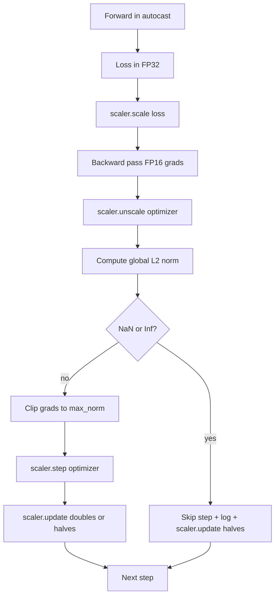

# Gradient Clipping and Mixed Precision

> 上一课的 optimizer 和 schedule 假设 gradients 是正常的。它们通常不是。一个坏 batch 就能让 gradient norm 暴涨三个数量级。Mixed-precision training 还会在 loss 侧引入 FP16 overflow。本课构建生产训练不可缺少的两条安全带：按配置的 global L2 norm 做 gradient clipping，以及带 autocast 和 GradScaler 的 mixed-precision loop；它能检测 NaN 和 Inf，干净地跳过 step，并记录 scaling factor 以便事后取证。

**Type:** Build
**Languages:** Python
**Prerequisites:** Phase 19 lessons 30-37
**Time:** ~90 minutes

## Learning Objectives

- 计算所有参数 gradients 的 global L2 norm，并在超过配置阈值时原地裁剪。
- 用 autocast 加 GradScaler 包住 training step，让 FP16 forward 和 backward 在 overflow 下仍可恢复。
- 检测 loss 或 gradient 中的 NaN 和 Inf，跳过 optimizer step，并记录 skip。
- 每步报告 GradScaler 的 scaling factor，让连续 skip 立即可见。

## The Problem

昨天干净运行的训练，在 step 8,217 的 loss curve 突然垂直上升。罪魁祸首是一个 gradient norm 为 4,200 的 batch，是此前峰值的二十倍。没有 clipping，optimizer 会应用一次把前一小时学习几乎清零的 step。用 global L2 clip at norm 1.0，同一个 batch 只贡献 unit-norm update；loss 保持趋势线；run 存活。

Mixed-precision training 通过用 FP16 计算 forward pass 和大部分 backward pass，把吞吐提升 2-3x。代价是 FP16 的指数范围很窄。一个在 FP16 中 overflow 的典型 gradient 会变成 Inf，随后在层间传播成 NaN，并在下一次 optimizer step 把所有权重设成 NaN。PyTorch 的 GradScaler 通过 backward 前把 loss 乘以大的 scaling factor、optimizer step 前再把 gradients 除以同一 factor 来解决。如果 unscale 时任意 gradient 是 Inf 或 NaN，scaler 会跳过 step 并把 factor 减半；如果前 N 步干净，scaler 会把 factor 翻倍。训练过程中，factor 会找到 FP16 范围允许的最高值。

构建问题是正确接线。clip before unscale，threshold 作用在 scaled gradients 上；clip after unscale，则 GradScaler 操作顺序很重要。正确顺序是：`scaler.scale(loss).backward()`，然后 `scaler.unscale_(optimizer)`，然后 `clip_grad_norm_`，然后 `scaler.step(optimizer)`，最后 `scaler.update()`。其他顺序都会产生静默损坏的 loop。

## The Concept



### Global L2 norm

global L2 norm 是拼接后的 gradient vector 的 Euclidean norm，不是逐参数 norm。PyTorch 用 `torch.nn.utils.clip_grad_norm_(parameters, max_norm)` 实现。该函数返回 pre-clip norm，因此本课能同时记录自然值和裁剪后的值，这对诊断 “we are clipping at every step” 很必要。

### autocast and GradScaler

`torch.amp.autocast(device_type)` 是 context manager，会选择性地让符合条件的操作，主要是 matmul 类操作，在 FP16 中运行。`torch.amp.GradScaler(device_type)` 是 backward 前缩放 loss、optimizer step 前反缩放 gradients 的 helper。两者是配套设计；只用一个不用另一个是测试应捕捉的配置错误。

本课使用 CPU autocast，因为 CI 能运行它；同一模式只需把 `device_type="cpu"` 改为 `device_type="cuda"` 就能迁移到 CUDA。CPU 上的 GradScaler 是 stub，CPU autocast 默认用 BF16，通常不需要 loss scaling；但本课保留 call sites，使 wiring 与 GPU loop 完全一致。

### NaN and Inf detection

检测发生在两处。第一，backward 前用 `torch.isfinite` 检查 loss 本身；Inf 或 NaN loss 不会产生有用 gradients，应跳过且不进入 optimizer。第二，`scaler.unscale_(optimizer)` 之后，本课用 `has_non_finite_grad(...)` 扫描 unscaled gradients，任意 Inf 或 NaN 都视为 skip。两个检查覆盖 forward-pass 和 backward-pass 两类失败。

### Scaling factor diagnostics

scaling factor 是 GradScaler 的内部状态。本课每步读取 `scaler.get_scale()`，并与 learning rate 和 gradient norm 一起记录。健康 run 会看到 factor 以 2 的幂上升，直到在 `2^17` 或 `2^18` 附近饱和。异常 run 会看到 factor 在高低值之间震荡，这表示模型 gradients 有时在范围内、有时不在。没有日志时这个诊断不可见。

## Build It

`code/main.py` 实现：

- `clip_global_l2_norm`：包住 `torch.nn.utils.clip_grad_norm_`，返回 pre-clip 和 post-clip norm。
- `has_non_finite_grad`：扫描 gradients 中的 NaN 和 Inf。
- `AmpTrainState`：封装 model、`AdamW` optimizer、GradScaler 和 autocast device。暴露 `step(inputs, targets)`，运行完整 clipping、scaling 和 skip-on-NaN pipeline。
- `StepLog` 和 `SkipLog`：结构化 per-step records。
- 一个 demo：训练小型 `nn.Linear` model 20 steps，在 step 5 向 gradient 注入 Inf 以触发 skip path，并打印 log。

Run it:

```bash
python3 code/main.py
```

脚本以 0 退出，并打印逐步 log，每行标注 `STEP` 或 `SKIP`；至少一行是 `SKIP`。

## Production Patterns

**Skip counter as an alert, not a log line.** 每个 training run 有少量 skipped steps 是健康的。每 epoch 数百个 skips 是硬告警：模型处在 FP16 无法承载的区域，loop 正在静默失败。本课跟踪 1,000-step rolling skip rate；生产中会在超过 5 percent 时 paging。

**Clip threshold lives in the config.** `max_norm = 1.0` 是语言模型训练的现代默认值。先在小模型上 sweep；更大阈值让模型能从真正困难 batch 中恢复，更小阈值约束最坏情况但让 loss curve 更嘈杂。threshold 应与第 44 课 schedule 放在同一个 YAML 或 JSON config 中。

**Norm log goes to a CSV with the schedule.** CSV columns 是 `step, lr, grad_l2_pre_clip, grad_l2_post_clip, loss, skipped, skip_reason, scaler_scale`。评审打开文件即可在一行里看到 schedule、gradient story、scaling factor 和 skip outcome 及原因。把 columns 分到不同文件会导致分析错位。

**`scaler.update()` runs every step, even on skip.** 干净 step 上 scaler 读取 no-inf counter、递增并可能翻倍 factor。skipped step 上 scaler 减半 factor 并重置 counter。skip path 忘记 `update()` 会产生 “the scaling factor never changed” 的 bug。

## Use It

- **Autocast device matches optimizer device.** GPU training 用 `torch.amp.autocast(device_type="cuda")`；CPU 用 `torch.amp.autocast(device_type="cpu")`。混用 devices 会产生静默 type error，表现为 loss curve 看似正常但模型没学到。
- **Loss check before backward.** `torch.isfinite(loss).all()` 是一次 tensor reduction，成本可忽略，却能在 NaN loss 时省掉整个 training step。始终运行它。
- **`set_to_none=True` in `zero_grad`.** 把 gradients 设为 `None` 而不是 zero，让 optimizer 跳过未受影响 parameter groups 的计算。这是免费的吞吐提升，也略微减少 bug surface。

## Ship It

`outputs/skill-clip-amp.md` 在真实项目中会说明 training step 使用哪个 clip threshold 和 autocast device、per-step CSV 在版本控制中的位置，以及生产 skip-rate alert threshold。本课交付 engine。

## Exercises

1. 用真实 loss spike 替换 synthetic Inf injection，比如把某个 batch target 乘以 1e8，并验证 skip path 触发。
2. 添加 `--bf16` 模式，把 autocast 切到 BF16 而不是 FP16。BF16 exponent range 更宽，几乎不需要 loss scaling；验证同一 demo 上 skip rate 降为零。
3. 添加 unit test，验证 gradient-clip wrapper 在不发生 clipping 时正确返回 pre-clip 和 post-clip norm。
4. 添加 rolling-window skip-rate 计算，以及当 rate 在 100 consecutive steps 超过配置阈值时让 run 失败的 CLI flag。
5. 把 loop 接入 canonical CSV 写出，并确认每行 flush 后即使 Ctrl-C 文件也能保留。

## Key Terms

| Term | What people say | What it actually means |
|------|-----------------|------------------------|
| Global L2 norm | “Clip target” | 所有 trainable parameters 的拼接 gradient vector 的 Euclidean norm |
| autocast | “Mixed precision” | `with` block 内对 eligible operations 选择性执行 FP16 或 BF16 |
| GradScaler | “Loss scaler” | backward 前乘 loss、optimizer step 前反缩放 gradients 的 helper |
| Skip | “Bad step” | 因 gradient 或 loss 非有限而拒绝的 optimizer step；scaler 会把 factor 减半 |
| Scaling factor | “Scaler state” | GradScaler 当前 multiplier；干净区间后翻倍，每次 skip 减半 |

## Further Reading

- [Micikevicius et al., Mixed Precision Training (arXiv 1710.03740)](https://arxiv.org/abs/1710.03740)：原始 loss-scaling 提案。
- [Pascanu, Mikolov, Bengio, On the difficulty of training recurrent neural networks (arXiv 1211.5063)](https://arxiv.org/abs/1211.5063)：gradient-clipping reference paper。
- [PyTorch torch.amp.GradScaler](https://docs.pytorch.org/docs/stable/amp.html)：本课包装的 scaler API。
- [PyTorch torch.nn.utils.clip_grad_norm_](https://docs.pytorch.org/docs/stable/generated/torch.nn.utils.clip_grad_norm_.html)：本课使用的 clipping primitive。
- Phase 19 · 42：输入 loop 的 downloader corpus。
- Phase 19 · 43：loop 消费的 dataloader。
- Phase 19 · 44：与本 loop 组合的 schedule。
