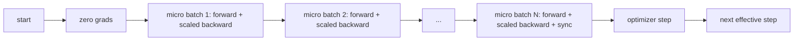
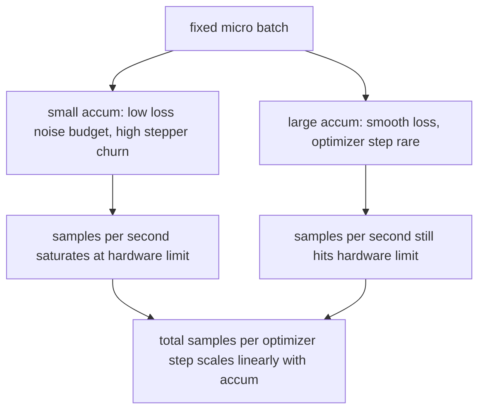

# Gradient Accumulation

> 用你负担不起的 effective batch 训练，一次只跑一个 micro-batch。缩放 loss，暂缓 optimizer step，让 gradients 累积起来。

**Type:** Build
**Languages:** Python
**Prerequisites:** Phase 19 lessons 42 to 45
**Time:** ~90 minutes

## Learning Objectives

- 推导 effective batch 恒等式：`effective_batch = micro_batch * accum_steps`。
- 实现每个 micro-batch 的 loss scaling，使累积 gradient 匹配一次 full-batch backward。
- 直到最后一个 micro-batch 才同步 optimizer，也就是 sync-on-last-step。
- 读懂 effective batch 对 throughput 的曲线，并解释收益递减。

## The Problem

你想用 effective batch 512 训练，因为 loss curve 更平滑，optimizer step 在这个尺度上更合理。桌上的 accelerator 只能装下 32 个 examples，再多就 out of memory。不能加倍 batch，不能减半模型。业界从 2017 年起一直使用的技巧是运行 16 次 backward pass，让 gradients 在 parameter buffers 中累积，直到计数达到目标时才 step optimizer。

风险是 loss 不再等于大 batch 时的数值。16 个 mini-batches 的 cross entropy 如果朴素相加，会是一个 full batch loss 的 16 倍。没有 scaling 时，gradient 方向正确但幅度错误，optimizer step 会大 16 倍。修复只是一除；也很容易忘。

## The Concept



契约很短：

- 每个 micro-batch 的 loss 在 `backward()` 前除以 `accum_steps`。PyTorch 默认把 gradients 累加到 `param.grad`；这个除法把 running sum 拉回正确尺度。
- optimizer step 每个 effective batch 只触发一次，在最后一个 micro-batch backward 后。累积中途 step 会扭曲后续运行依赖的所有参数。
- optimizer state，也就是 momentum buffers 和 Adam moments，每个 effective step 前进一次，不是每个 micro-batch 前进一次。否则 exponential moving averages 会看到错误频率并消耗错误 schedule。
- 单设备上这是 bookkeeping。多 rank cluster 上，同一模式把非最终 micro-batches 包进 `no_sync` context，跳过 gradient all-reduce；最后一个 micro-batch 一次性 reduce 完整累积 gradient，避免支付 N 次网络成本。

### The equivalence proof in code

```python
loss = criterion(model(x_full), y_full)
loss.backward()
opt.step()
```

等价于

```python
for x, y in chunks(x_full, y_full, n):
    scaled = criterion(model(x), y) / n
    scaled.backward()
opt.step()
```

除 floating point summation order 外，两者相同。循环结束时的 accumulated gradient buffer 与一次 full-batch backward 产生的是同一个 tensor。本课代码在 `equivalence_check` 中用 max-abs difference 小于 1e-4 断言这一点。

### Where the cost goes

每个 micro-batch 都要一次 forward 和一次 backward。使用 accumulation 是用时间换内存。`outputs/accum-curve.json` 中的 throughput curve 展示了 fixed micro-batch 下 effective batch 增大时的变化：



没有免费午餐。`accum_steps` 翻倍会让每个 optimizer step 的 wall time 翻倍。变化的是 gradient estimate 的方差：同样 wall budget 下 optimizer steps 更少，但每步平均了更多 samples。文献把大 batch 和小 batch 视为不同优化问题；本课关注机械结构，不讨论统计取舍。

## Build It

`code/main.py` 是可运行 artifact，完成三件事。

### Step 1: equivalence check

`equivalence_check()` 用同一 seed 构建两个相同网络副本。一个一次看 16-sample batch；另一个看四个 4-sample chunks，loss 除以四。函数在 optimizer step 前比较 gradient buffers，在 step 后比较 parameters。断言是 `max_abs_diff < 1e-4`。

### Step 2: sync-on-last-step pattern

`train_one_optimizer_step` 遍历 micro-batches。除最后一个外，每个 micro-batch 都进入 `no_sync_context(model)`。单进程中 context 是 no-op；DDP 中这里会跳过 gradient all-reduce。bookkeeping 不变。`sync_counter` 记录离开 no_sync scope 的次数；对 N 个 micro-batches，计数是每个 effective step 一次，不是 N 次。

### Step 3: the throughput curve

`sweep_effective_batches` 用 fixed micro-batch 和一组 accumulation steps 跑同一个模型。每种设置记录：

- `samples_per_sec`：总 samples 除以 wall time。
- `median_step_ms`：per effective step 的 50th percentile。
- `sync_calls`：触发的 collective points。
- `avg_loss`：sweep 中 optimizer steps 的平均 loss。

输出写到 `outputs/accum-curve.json`，可被 notebook 复用。

Run it:

```bash
python3 code/main.py
```

脚本打印 equivalence diff、sweep table 和 JSON path，退出码为 0。

## Use It

生产训练中，gradient accumulation 通常藏在一个旋钮后面。PyTorch 模式是 `accumulation_steps = effective_batch // (micro_batch * world_size)`。本课不允许使用的框架会包装同一循环，但步骤相同：scale loss，非最终 micros 跳过 sync，累积，step once。

三种常见模式：

- micro-batch size 选择为能填满设备内存的最大值。更小浪费 accelerator cycles，更大崩溃。
- effective batch 从 learning rate schedule 中选择。大的 effective batches 需要 scaled learning rates 和 warmup；这就是 2017 年以来常说的 linear scaling rule。
- accumulation count 是两者之间的桥，也是运行时不用重写 data loader 就能调的唯一旋钮。

## Ship It

`outputs/skill-gradient-accumulation.md` 捕获这个 recipe，方便同伴放进新 repo：按 `accum_steps` 缩放 loss，在非最终 micros 跳过 optimizer sync，每个 effective batch 只 step 一次 optimizer，并把 throughput against effective batch 记录为 JSON，使取舍可见。

## Exercises

1. 用 `--num-steps 100` 重新运行 sweep，画出 samples per second 与 effective batch 的关系。曲线在哪里变平？
2. 添加错误 scaling variant，不做除法，并展示 step 1 时相对 reference 的 parameter diff。
3. 把 SGD 换成 AdamW，确认 optimizer state 每个 effective step 前进一次，而不是每个 micro-batch。
4. 引入真实 `DistributedDataParallel` wrapper，并把 `no_sync_context` 路由到它的方法。确认每个 effective batch 的 sync_calls 降低 N-1。
5. 修改 equivalence check，比较两种不同 micro splits，2 by 8 与 4 by 4，并解释需要放宽的 tolerance。

## Key Terms

| Term | What people say | What it actually means |
|------|-----------------|------------------------|
| Micro batch | The batch you forward | 单次 forward pass 中能放进内存的切片 |
| Accum steps | Backward passes per step | 一次 optimizer step 前累加的 backward 次数 |
| Effective batch | The batch | Micro batch 乘 accum steps 再乘 data parallel world size |
| Loss scaling | Divide by N | 对每个 micro-batch 做除法，使累加 gradients 匹配 full batch |
| Sync on last | Skip the rest | 只在窗口里最后一次 backward 运行 gradient collective |

## Further Reading

- PyTorch docs on `DistributedDataParallel.no_sync`：sync-on-last-step 技巧的生产版本。
- Goyal et al., 2017：关于 large batch training 的 linear scaling，是关心 effective batch 的经典原因。
- PyTorch issue tracker：gradient accumulation 与 mixed precision unscaling 的交互。
- Phase 19 lessons 42 to 45 覆盖本课假设的 model、data loader、optimizer 和 trainer scaffolding。
- Phase 19 lesson 47 覆盖 checkpoint and resume，使长 accumulation run 能跨 wallclock cap 存活。
