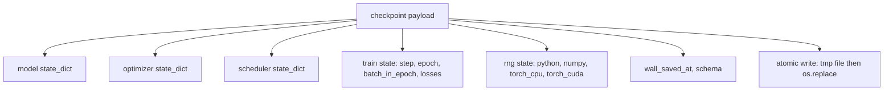
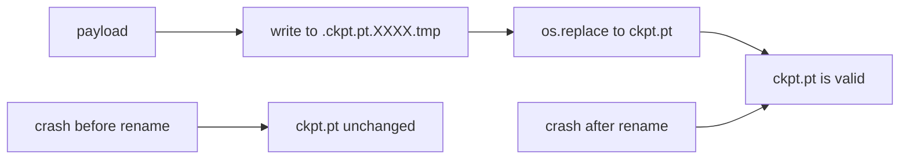
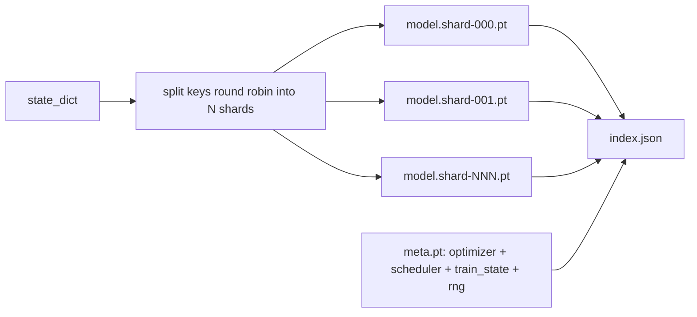

# Checkpoint Save and Resume

> 训练中断会杀死 run；checkpoints 让它们继续。以原子方式保存 model、optimizer、scheduler、loss history、step counter 和 RNG state，让任意时刻被 kill 后磁盘上仍留下有效文件。

**Type:** Build
**Languages:** Python
**Prerequisites:** Phase 19 lessons 42 to 45
**Time:** ~90 minutes

## Learning Objectives

- 把完整 training state 捕获到一个 payload，使 fresh process 可以重新加载。
- 实现 write-to-temp 然后 rename 的 atomic save，保证 crash 不会留下半写文件。
- 恢复 Python、NumPy 和 PyTorch 的 RNG state，使 resume 后 loss 匹配不中断 baseline。
- 为单文件放不下的模型构建 sharded checkpoint layout，包含 hash-verified shards 和 JSON index。

## The Problem

你提交一个 18 小时训练任务。wallclock cap 是 4 小时。集群在第 11 小时因为内核升级重启。没有 checkpoints 就从头开始。没有 resume，即使模型权重幸存，optimizer state 也丢了，AdamW moments 这 11 小时学到的轨迹消失，下一步会朝训练早已越过的方向猛跳。

正确 artifact 是一个保存继续训练所需一切的文件：model parameters、optimizer state、scheduler state、绘图所需 loss history、当前 step、epoch、batch-in-epoch counter，以及每个 randomness 来源的 RNG state。没有 RNG state，resume 后的 loss curve 是另一条曲线：同一个模型、同一份数据，但 shuffle、dropout mask 和 dashboard 数字都变了。

Atomic save 是契约另一半。直接写最终文件名时，mid-write crash 会留下 corrupt file，resume 读到垃圾。写到同目录临时文件再 rename，则 crash mid-write 只会留下旧的好文件。POSIX 文件系统上的 rename 是 atomic。

## The Concept



### The five state buckets

| Bucket | Why it matters |
|--------|----------------|
| Model | Weights and buffers；定义模型是什么。 |
| Optimizer | Momentum 和 adaptive moments；没有它们，下一步就是另一个优化问题。 |
| Scheduler | learning rate 在曲线中的位置；cosine schedules 尤其依赖它。 |
| Train counters | Step、epoch、batch-in-epoch，以及画 dashboard 的 loss history。 |
| RNG state | dropout、data shuffling 和模型内部 sampling 的确定性。 |

### Atomic save



两条规则。第一，temporary file 必须与 target 在同一目录，这样 rename 留在同一个 file system；cross-device renames 不是 atomic。第二，temporary name 每次尝试都唯一，避免两个 writers 互相踩踏。

### Sharded checkpoints

模型变大后，单文件 payload 会太大：加载慢、检查困难、网络 share 读到一半抖动时很痛苦。修复是把 parameter state 拆成 shards，并写一个小 index 把它们绑在一起。



index 记录 shard count、每个 shard 的 sha256 和 meta file 的 sha256。loader 在任何 hash mismatch 时 loudly fail。shards 可以落在不同物理磁盘；meta 很小，会先读取。

### Resume continues mid epoch

resume 如果跳到下一个 epoch 开头，可能浪费几分钟到一天。修复是 `(epoch, batch_in_epoch)` 加 RNG state。加载后，training loop 快进 random number generator 越过当前 epoch 已消费 batches，然后从 `batch_in_epoch` 继续。本课代码精确执行这一点；断言是 resume 后 loss trajectory 与不中断 baseline 在 1e-4 内匹配。

## Build It

`code/main.py` 提供四个 primitives 和一个 demo driver。

### Step 1: capture and restore RNG state

`capture_rng_state` 返回包含 Python `random.getstate`、NumPy `np.random.get_state`、PyTorch CPU 和 CUDA RNG bytes 的 dict。`restore_rng_state` 反向恢复。CPU tensor 是 PyTorch RNG 能消费的 uint8 byte buffer。

### Step 2: atomic save

`atomic_save` 把 payload 写到 target directory 中的 temp file，再用 `os.replace` 交换到最终名称。`atomic_write_json` 对 sharded index 做同样事情。

### Step 3: full checkpoint round trip

`save_checkpoint` 把 model、optimizer、scheduler、train state 和 RNG 打包进一个 dict。`load_checkpoint` 反向加载并返回 `TrainState`。schema field 是 upgrade hook：未来格式变更 bump version string，loader 分派处理。

### Step 4: sharded variant

`save_sharded_checkpoint` round-robin 拆分 parameter keys 到 N 个 shards，以 atomic save 写每个 shard，写带 optimizer、scheduler、train state 的 meta file，并写带 shard sha256s 的 JSON index。`load_sharded_checkpoint` 先验证每个 shard 再 merge。

### Step 5: resume demo

`run_resume_demo` 训练小模型 `total_steps`，在 `interrupt_at` 保存 checkpoint，然后继续。第二个 process 恢复 checkpoint 并跑剩余 steps。函数返回 interruption point 后两条 loss trajectories 的 max absolute difference。恢复 RNG 后，差异为零或 floating-point noise。

Run it:

```bash
python3 code/main.py
```

single-file 和 sharded demos 都断言 max-diff 小于 1e-4。summary 写入 `outputs/resume-demo.json`。

## Use It

生产 training stacks 会把 checkpointing 作为 trainer 一部分。形状相同：model + optimizer + scheduler + counters + RNG，原子写入，用 step 命名方便找到 latest。sharded layouts 用 parallel reads 支持大模型加载；`index.json` 让这件事成立。

三条模式必须执行：

- **Schema is a string in the payload.** migrations 依赖它分支。没有 schema 就无法演进格式而不破坏旧 runs。
- **Sha256 every shard.** 静默截断下载是最坏 bug；loader 要么 fail fast，要么 fail late。
- **Keep checkpoint cadence honest.** 每 N steps 和每 wallclock-minute 保存，取较短者。否则 crash 的长 step 会浪费一整段窗口。

## Ship It

`outputs/skill-checkpoint-save-resume.md` 是任何新 training script 的 recipe：payload shape、atomic write、RNG capture、sharded index。把 skill 放进 repo，在 periodic save 点接 `save_checkpoint`，启动时接 `load_checkpoint`，run 就能从 kill 中恢复。

## Exercises

1. 用按 parameter group 分片替换 round-robin sharding，例如 `.weight` 与 `.bias`。什么时候各自更合适？
2. 扩展 save loop，保留最近 K 个 checkpoints 并 prune 更旧的。磁盘小时正确 K 是多少？
3. 添加 `--ckpt-every-seconds` flag，按 wallclock interval 而非 step count 触发保存。
4. 添加 startup checksum verification，扫描目录中每个 checkpoint 并报告哪些 corrupt。
5. 实现 `migrate_v1_to_v2`，为 payload 添加新字段并 bump schema string。让 load 同时容忍两个版本。

## Key Terms

| Term | What people say | What it actually means |
|------|-----------------|------------------------|
| Atomic save | “Write and pray” | 写到同目录 temp file，再 `os.replace` 到 target name |
| State dict | “The weights” | 以 parameter name 为 key 的模型 parameters 和 buffers |
| Sharded checkpoint | “Big model file” | 多文件，每个 shard 一个，加 meta file 和带 sha256s 的 JSON index |
| RNG state | “Random seed” | python random、numpy、torch CPU、torch CUDA 的捕获状态；不只是 seed |
| Mid-epoch resume | “Restart” | 快进 RNG 并从同一 epoch 的下一个 batch 继续 |

## Further Reading

- POSIX `rename` semantics：`os.replace` atomicity 依赖的语义。
- PyTorch documentation on `torch.save` and `torch.load`，包括 cross-device restores 的 `map_location`。
- Phase 19 lesson 46 覆盖本课 checkpoint payload 需要跨越的 gradient accumulation。
- Phase 19 lesson 48 覆盖本方案兼容的 distributed wrappers state dict 格式。
- Linux kernel `fsync` documentation：atomic rename 背后的 durability guarantee。
