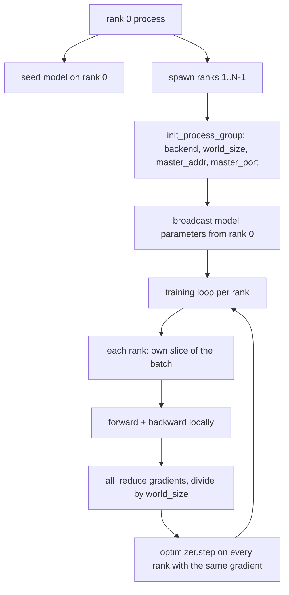
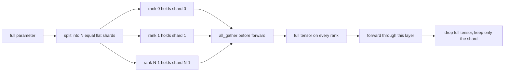

# Distributed Data Parallel and FSDP from Scratch

> Multi-rank training 是两个 collectives 和一条规则。启动时 broadcast parameters，backward 后 average gradients，永远不要让 ranks 对自己处于哪一步产生分歧。

**Type:** Build
**Languages:** Python
**Prerequisites:** Phase 19 lessons 42 to 45
**Time:** ~90 minutes

## Learning Objectives

- 用 `gloo` backend 在 N 个 ranks 上启动 process group，无需特殊硬件。
- 实现 minimal DDP wrapper：构造时 broadcast parameters，backward 后 all-reduce gradients。
- 证明 per-rank gradients 的 all-reduce 匹配 concatenated input 上的 single-process gradient。
- 勾勒 FSDP parameter sharding：每个 rank 持有一个 slice，forward pass 前 gather full tensor，用完丢弃。

## The Problem

模型能放进一台设备，数据放不下。优化预算要求你每 wallclock second 看到 N 倍 examples。第一根杠杆是 data parallel：每个 rank 在 batch 的不同切片上跑同一模型，然后在 optimizer step 前平均 gradients。第二根杠杆是 FSDP：模型也放不进单设备，于是每个 rank 持有每个 parameter 的一部分，并在 forward pass 中逐层重构完整 tensors。

痛点是 bookkeeping。如果 parameters 在 ranks 间漂移，run 会静默损坏。如果 average gradients 但不 average loss，dashboard 会撒谎。如果 collective backend 无法就 topology 达成一致，run 会永远 hang。修复是手写一次 collectives，从此不信任无法复现的 wrapper。

本课在 CPU 上运行，不假设 CUDA。`gloo` backend 随每个 PyTorch build 发布，接受 `torch.multiprocessing` workers；同一代码在 multi-GPU node 上切换到 `nccl`，结构不变。

## The Concept



### The two collectives that matter

| Collective | What it does | When |
|------------|--------------|------|
| `broadcast` | 从一个 rank 复制 tensor 到所有其他 ranks | Parameter init、scheduler state、任意 one-to-all sync |
| `all_reduce` | 跨所有 ranks sum、mean 或 max 一个 tensor，每个 rank 都拿到结果 | backward 后 gradient averaging |
| `all_gather` | 每个 rank 贡献 tensor，每个 rank 拿到 concatenation | Logits collection、FSDP parameter unshard |

DDP 契约是构造时 `broadcast`，backward 后 `all_reduce`。FSDP sketch 在每层 forward 前添加 `all_gather`。

### Gradient averaging matches single-process gradient

跨 N 个 ranks、每个 rank batch B 的模型，必须产出与单进程 batch N*B 相同的 gradient。技巧是对 per-rank gradients 求和再除以 N，得到 average loss gradient，也就是 full batch 上 mean reduction cross entropy 会产生的结果。本课代码用 `max-abs-diff < 1e-3` 断言 manual all-reduce gradient 与 reference single-process gradient 一致。

### FSDP sketch



memory win 是精确的：每 rank parameter memory 降到 1/N。成本是每次 forward pass 都要 gather。生产 FSDP 会把 gather 与上一层 compute overlap，所以 wallclock 成本远小于朴素估计。本课对每个 parameter 做 round-trip，并断言 reconstruction 与 original bit-equal。

### CPU and the gloo backend

CUDA 是生产目标，但同样 code paths 存在于 CPU。`gloo` 是 CPU collective backend。在 GPU 上它比 `nccl` 慢几个数量级，但 API surface 一样。本课用 `backend="gloo"` 初始化 process group，用 `torch.multiprocessing` spawn ranks，而不是 `torchrun`；两者最终调用相同 `torch.distributed`。在 multi-GPU node 上，唯一变化是 `backend="nccl"`、device tensors 和用 `torchrun` 启动。

## Build It

`code/main.py` 是可运行 artifact。

### Step 1: bring up the process group

```python
os.environ["MASTER_ADDR"] = "127.0.0.1"
os.environ["MASTER_PORT"] = str(port)
dist.init_process_group(backend="gloo", rank=rank, world_size=world_size)
```

`MASTER_ADDR` 和 `MASTER_PORT` 是 rendezvous：每个 rank 都拨同一 host 上的同一 port。本课通过 bind-and-close 技巧选择 free port，避免同机多个 runs 冲突。

### Step 2: broadcast at construction

`MinimalDDP.__init__` 遍历每个 parameter 和 buffer，调用 `dist.broadcast(tensor, src=0)`。rank 0 的值成为 canonical init。否则每个 rank 用自己的 seed 初始化，step one 起就 diverge。

### Step 3: all-reduce gradients after backward

```python
def all_reduce_grads_(module, world_size):
    for p in module.parameters():
        if p.grad is None:
            p.grad = torch.zeros_like(p.data)
        dist.all_reduce(p.grad.data, op=dist.ReduceOp.SUM)
        p.grad.data.div_(world_size)
```

每个 rank 最终得到相同 averaged gradient。optimizer step 现在是每个 rank 上同一输入的函数，这就是 parameters 在整个 run 中保持同步的原因。

### Step 4: prove the equivalence

`manual_all_reduce_matches_single_process` 在 rank 0 构建同一模型，并比较 post-all-reduce gradient 与单进程在 concatenated input 上计算的 gradient。max-abs-diff 约为 1e-8。

### Step 5: FSDP round trip

`fsdp_round_trip_sketch` flatten 每个 parameter，pad 到 `world_size` 的倍数，slice、all-gather、unpad。每个 rank 的 reconstruction 都等于 original。这是 unshard step；反向过程，也就是 forward 后 re-shard，是从 gathered tensor 上取一个 slice。

Run it:

```bash
python3 code/main.py
```

默认 world size 是 2。两个 CPU processes spawn，通过 `gloo` 互相通信并以 0 退出。输出 `outputs/ddp-demo.json` 捕获每个 rank 的 parameter sums、all-reduce 后 gradient norm、FSDP round-trip result 和 manual-vs-reference gradient diff。

## Use It

生产 training stacks 调用同样 primitives。PyTorch `DistributedDataParallel` 额外提供：与 backward overlap 的 post-backward gradient hooks、把小 gradients 合并成一个 collective 的 bucketed all-reduce，以及第 46 课使用的 `no_sync` context。

PyTorch FSDP 额外提供：每层一个 flat parameter view，让每个 rank 持有 contiguous buffer；把下一层 unshard 与当前层 compute overlap；以及可选 CPU offload for shards。

形状不变：startup broadcast，backward 后 reduce，parameters 放不下时 shard。

## Ship It

`outputs/skill-distributed-fsdp-ddp.md` 携带新 training script 的 recipe：用 `gloo` 启动 CPU process group、用 `nccl` 启动 GPU；把 model 包进 DDP shell，构造时 broadcast、backward 后 reduce；可选用 FSDP sketch 中的 all_gather pattern 分片 parameters。

## Exercises

1. 用 `--world-size 4` 运行，并确认整个 run 中 param spread 低于 1e-3。
2. 把 manual averaging 替换为 `dist.all_reduce(op=dist.ReduceOp.AVG)`，计时差异。
3. 给 DDP wrapper 添加 post-backward hook，让 all-reduce 与剩余 backward overlap；测量 wallclock improvement。
4. 实现 FSDP re-shard step：forward pass 后，把 full tensor 重新替换成本地 shard。确认 per-rank memory 下降。
5. 在 CUDA 机器上把 backend 切换为 `nccl`。记录哪些 environment variables 变化，哪些保持不变。

## Key Terms

| Term | What people say | What it actually means |
|------|-----------------|------------------------|
| Backend | “gloo or nccl” | 实现 collective ops 的库；gloo 是 CPU，nccl 是 GPU |
| World size | “Total ranks” | group 中的进程数；group 是 collectives 操作的单位 |
| Rank | “Worker id” | group 内的进程标识，zero indexed |
| All-reduce | “Sum the grads” | 跨所有 ranks 求和 tensor，每个 rank 结束时拿到同一结果 |
| Unshard | “Gather the params” | 通过 all_gather 从 per-rank slices 重构完整 tensor |

## Further Reading

- PyTorch `torch.distributed` documentation：本课依赖的 collective semantics。
- `gloo` library 的 collective list，其形状与 CUDA-backed `nccl` primitives 相同。
- Phase 19 lesson 46：用 `no_sync` 包住 DDP all-reduce 的 gradient accumulation pattern。
- Phase 19 lesson 47：支持 DDP 和 FSDP runs 的 checkpoint layout。
- PyTorch FSDP documentation：本课 sketched parameter sharding 的生产实现。
