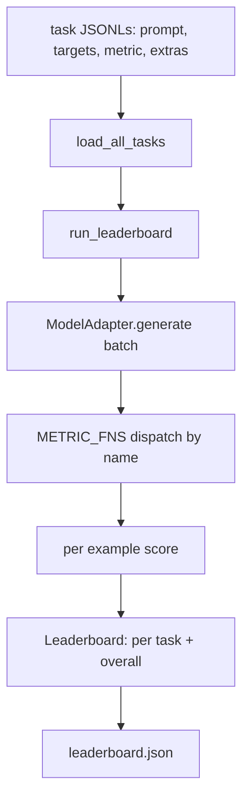
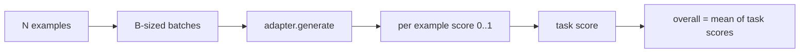

# Language Model Evaluation Harness

> 一个模型如果在你无法定义的任务上表现好，那只是偶然表现好。harness 把 task definition、metric、runner 和 leaderboard 放进一个短小、可替换的形状里。

**Type:** Build
**Languages:** Python
**Prerequisites:** Phase 19 lessons 42 to 45
**Time:** ~90 minutes

## Learning Objectives

- 把 task 定义为 JSONL 文件，每个 example 包含 `prompt`、`targets`、`metric` 和可选 `extras`。
- 实现五个 metrics：exact match、rouge-l F1、executable check、multiple choice 和 substring contains。
- 构建按 task 批处理 examples 并分派给可替换 model adapter 的 runner。
- 输出可复现的 leaderboard JSON，包含 per-task scores、latency 和 overall average。

## The Problem

每周都有新的语言模型出现。营销说它表现好。诚实的问题是：在哪些任务上好？诚实答案是你自己写的 leaderboard，因为 vendor 的 leaderboard 是他们调优过的那一个。

没有 repo 内 harness，你只能凭感觉比较两个模型。有了 harness，你可以在固定 task set、固定 metric 和可 diff 的 JSON output 上按 score 比较。harness 是昨天 run 和今天 run 之间的契约。没有它，regressions 就会发货。

陷阱是把 harness 过拟合到一个模型。修复是反过来利用同一陷阱：harness 小到十五分钟能读完，tasks 小到可以随 repo 交付，metrics 从零实现以便同事审计，adapter 是唯一放 model-specific code 的地方。换 adapter，leaderboard 变化；换 tasks，leaderboard 变化；其他部分不应变化。

## The Concept



### Task spec

每个 example 是一行 JSONL：

```json
{"id": "arith-00", "prompt": "compute: 2 + 2", "targets": ["4"], "metric": "exact_match"}
```

需要 scoring helpers 的 metrics 用 `extras` 携带附加 payload：

```json
{
  "id": "code-00",
  "prompt": "python: write a function f that doubles its input",
  "targets": ["ok"],
  "metric": "code_exec",
  "extras": {"io_pairs": [[1, 2], [3, 6]]}
}
```

一个 task 是 `outputs/tasks/` 下的 `.jsonl` 文件。文件名就是 task name。文件中的所有 examples 共享一个 metric。

### The five fixture tasks

| Task | Metric | What it tests |
|------|--------|---------------|
| arithmetic | exact_match | 确定答案上的 token-level correctness |
| summary | rouge_l | 相对一行 reference summary 的 longest common subsequence F1 |
| code-exec | code_exec | 可执行测试：预测函数必须满足一组 input-output pairs |
| multiple-choice | multiple_choice | prediction 的首字母必须匹配允许 letter |
| generation | substring_contains | free-form text 必须包含至少一个 target substring |

### The metric contract

每个 metric 都是从 `(prediction, targets, extras) -> float in [0.0, 1.0]` 的函数。harness 对 per-example scores 求平均得到 task score，再对 task scores 求平均得到 overall。metric functions 很小：

- `exact_match`：lowercase、collapse whitespace、比较相等。
- `substring_contains`：相同 normalization，做 substring test。
- `multiple_choice`：首字符转大写。
- `rouge_l`：LCS length 除以 prediction 与 reference 长度，计算 precision 和 recall 的 F1。
- `code_exec`：在受限 namespace 执行 prediction，在每个 input-output pair 上调用 `f(x)`，统计匹配。

`code_exec` metric 在剥离后的 builtins namespace 中运行 prediction。本课测试断言 `import os` 会失败，因为 namespace 中没有 `os`；code prediction 不能访问 filesystem。

### The model adapter

```python
class ModelAdapter(Protocol):
    def generate(self, prompts: Sequence[str]) -> List[str]: ...
    @property
    def name(self) -> str: ...
```

adapter 是接缝。本课交付 `ToyAdapter`，它是 deterministic pattern matcher，会对五个 fixture tasks 的每个 prompt 返回正确答案。真实 adapter 调用模型并返回输出。harness 不关心是哪一种。

### The runner

`run_task` 每次按 `batch_size` 批处理 prompts 并分派给 metric function。`run_leaderboard` 遍历每个 task 并求平均。`write_leaderboard` 输出带 schema string 的 JSON，使未来格式变更不会静默破坏 dashboards。



```figure
eval-harness-matrix
```

## Build It

`code/main.py` 是可运行 artifact。

### Step 1: seed fixture tasks

`seed_fixture_tasks(target_dir)` 写入五个 `.jsonl` 文件。`main.py` 第一次运行时，如果目录为空就 seed 它们。

### Step 2: load tasks

`load_all_tasks(task_dir)` 读取每个 `.jsonl`，返回从 task name 到 `Example` records 列表的 dict。以 `#` 开头的 comment lines 和空行会跳过，方便 contributors 注释文件。

### Step 3: implement metrics

每个 metric 都是带 unit test 的小函数。测试套件包含 13 个 cases，覆盖 normalization、partial overlap、code execution 和 unsafe code rejection。

### Step 4: write the runner

`run_task` 迭代 batches，并生成包含 score、correct count、total count 和 latency 的 `TaskResult`。`run_leaderboard` 遍历所有 tasks，生成带 overall average 的 `Leaderboard`。

### Step 5: emit JSON

`write_leaderboard` 序列化 board。`--include-per-example` flag 会 dump per-example records，方便 score 变化时 diff predictions 与上次 run。

Run it:

```bash
python3 code/main.py
```

脚本首次运行会 seed fixtures，用 toy adapter 评分，toy adapter 会答对所有 fixtures，并写 `outputs/leaderboard.json`。toy adapter 的 overall score 是 1.0；`test_main.py` 中 stub adapter test 展示了同一个 harness 在 adapter 无法回答时会产生 0.0。

## Use It

要接入真实模型，写一个 adapter。形状如下：

```python
class HttpAdapter:
    name = "vendor.v1"

    def __init__(self, endpoint, api_key):
        self.endpoint = endpoint
        self.api_key = api_key

    def generate(self, prompts):
        out = []
        for prompt in prompts:
            response = http_post(self.endpoint, prompt, self.api_key)
            out.append(response["text"])
        return out
```

在 `main()` 顶部把 `ToyAdapter` 换成 `HttpAdapter`。harness、tasks、metrics 和 leaderboard 都保持不变。

真实项目中应执行三条模式：

- **Pin the task files.** `leaderboard.json` 要么携带 hash-pinned task content，要么携带 JSONLs；否则 task file 变化时 score 也变化，你无法判断原因。
- **Diff predictions, not just scores.** `--include-per-example` 让你看到 score 下降那天模型说了什么。
- **Cap the batch size.** 真实 adapters 有 rate limits。小 batch size 让 harness 能跨 vendors 兼容。

## Ship It

`outputs/skill-lm-eval-harness.md` 携带 recipe：JSONL task spec、五个 metrics、可替换 adapter、batched runner，以及带 schema string 的 leaderboard JSON。`outputs/tasks/` 中的 task files 是 fixtures，可复制到真实项目作为起点。

## Exercises

1. 添加第六个 task，使用你从零编写的 custom metric，比如 BLEU-like overlap、BLEURT-like reference scoring，或任何有清晰契约的指标。
2. 扩展 `code_exec`，捕获 stdout 并接受 expected stdouts 列表作为 targets。
3. 添加 leaderboard diff command：给定两个 `leaderboard.json` 文件，打印哪些 tasks 变化以及变化量。
4. 限制每个 example 的 latency。用 timeout 包住 adapter call，并在 leaderboard 中暴露单独的 `timeouts` column。
5. 在 leaderboard 中用 sha256 pin task content，让未来读者验证他们评分的是同一批 tasks。

## Key Terms

| Term | What people say | What it actually means |
|------|-----------------|------------------------|
| Task spec | “The eval format” | 每个 example 包含 prompt、targets、metric、optional extras 的 JSONL 文件 |
| Metric | “How you score” | 从 (prediction, targets, extras) 到 [0, 1] float 的函数 |
| Adapter | “The model client” | 拥有 generate(prompts) -> list[str] 方法的对象；唯一 model-specific code |
| Leaderboard | “The scoreboard” | 带 per-task scores、total counts、latency 和 overall average 的 JSON |
| Code exec metric | “Run it and check” | 在受限 namespace 执行 prediction，并与 input-output pairs 比较 |

## Further Reading

- 原始 lm-evaluation-harness：生产 reference，更大但形状相同。
- HuggingFace lighteval：同一契约的另一种实现。
- Phase 19 lesson 46：harness 评分的 training stack 中使用的 gradient accumulation patterns。
- Phase 19 lesson 47：你评分的 checkpoint format；leaderboard 中应 pin checkpoint hash。
- Phase 19 lesson 48：生成待测模型的 distributed training stack。
