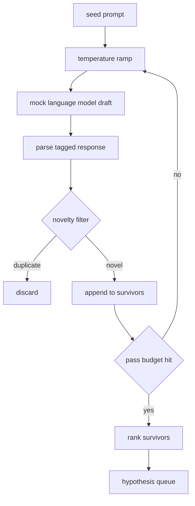

# Hypothesis Generator

> 一个 research agent 如果把同一个问题问两遍，就是在浪费 tokens。关键是强迫每个 draft 落到新的位置。

**Type:** Build
**Languages:** Python
**Prerequisites:** Phase 19 Track A lessons 20-29
**Time:** ~90 minutes

## Learning Objectives
- 从 seed prompt 驱动 sampler，并把输出转成 typed hypothesis records。
- 每轮提升 sampler temperature，让下一份 draft 比上一份漂得更远。
- 用小型 embedding model 和 cosine distance threshold 过滤近重复。
- 用混合 novelty、specificity、testability 的 scoring function 排序幸存项。
- 保持每一步确定性，使同一 seed 总能产出同一 queue。

## Why generate, then filter

只问一个模型一次的 planner 只得到一个 hypothesis。对 worked example 够用，但对 research loop 形状错误。loop 需要一个有深度的 ranked queue，这样第一个 hypothesis 失败时，runner 不必再付一次完整 sampling pass，就有下一个可用。

两个想法组合出该 queue。第一是 temperature ramping：每次 sampler pass 都稍微提高 temperature，鼓励后续 drafts 游走。第二是 novelty filtering：每份 draft 后，generator 测量它与所有 prior survivors 的 embedding distance，并拒绝落入已有 cluster 的内容。

本课交付 mock language model，它对固定 prompts 返回 scripted token sequences。mock 足以覆盖完整路径：seed prompt 进入，temperature ramp 应用，candidates parsed，novelty filter 执行，ranked queue 输出。

## The Hypothesis shape

```text
Hypothesis
  id             : int           (monotonic within a run)
  text           : str           (the claim)
  variables      : list[str]     (what changes between conditions)
  metric         : str           (what the runner will measure)
  baseline_ref   : str | None    (which paper or run the comparison cites)
  draft_pass     : int           (which sampler pass produced this)
  temperature    : float         (the sampler setting at draft time)
  novelty_score  : float         (distance from prior survivors, 0..1)
  rank_score     : float         (weighted sum used for ordering)
```

`variables` 和 `metric` 不是自由文本。parser 从 tagged response 中提取它们。第 52 课的 runner 会在构建 experiment config 时直接读取这些字段。`baseline_ref` 可选但推荐；第 53 课 evaluator 需要 baseline 做比较。如果 hypothesis 省略它，evaluator 会退回到同一 metric 上的 previous run。

## Architecture



loop 很直接。有趣的是每个 box 都有硬契约。

## Temperature ramp

从 `t_min` 开始，到 `t_max` 结束，步长为 `(t_max - t_min) / (n_passes - 1)`。每个 pass 以当前 temperature 调用 sampler，`GeneratorConfig.schedule()` 产出 `n_passes` 个均匀分布值。mock model 根据 `(prompt, temp_bucket)` 在少量 scripted responses 间切换来尊重 temperature。buckets 是 open intervals，因此 temperature 小变动会选到不同 bucket 并产出不同 draft。生产中 sampler 会是真模型，直接传入 `temperature=t`。

默认 schedule 是从 `0.2` 到 `1.2` 的六个 passes。六次足以填充 queue，又不会为 novelty filter 反正会拒绝的样本付费。低于 `0.2` 模型会鹦鹉学舌 seed；高于 `1.2` response 往往漂离主题并 parser 失败。

## Novelty filter

每份 draft 解析后，generator embedding text，并与每个 accepted hypothesis 比较。embedding 是小型 hashed bag of word tokens，归一化到 unit length。两个 unit vectors 的 cosine distance 是 `1 - dot(a, b)`。如果 draft 到任意 prior survivor 的最小距离高于 `novelty_threshold`，它就通过。默认是 `0.25`。

hashed embedding 不花哨。它确定性、零依赖，足以抓住明显场景：两份 drafts 共享大多数 nouns。生产部署会换成小型 sentence model。接口不变。

## Rank score

```text
rank_score = w_novelty * novelty_score
           + w_specificity * specificity_score
           + w_testability * testability_score
```

三个 sub scores。`novelty_score` 是到 prior survivors 的最小 embedding distance。`specificity_score` 是 hypothesis 中 concrete variables 数量除以 target count。`testability_score` 在 hypothesis 同时指定 metric 和 baseline 时为一，只指定 metric 时为半，否则为零。

默认权重是 `0.4`、`0.3`、`0.3`。权重在 generator config 中，方便下游 lesson 不 fork code 就调整它们。

## Mock language model

```python
class MockLLM:
    def sample(self, prompt: str, temperature: float, seed: int) -> str:
        ...
```

sampler 在 `(prompt, temperature, seed)` triple 给定时确定性。mock 维护以 `(prompt_signature, temperature_bucket)` 为 key 的 scripted response table。如果 table 没有对应 entry，sampler 返回会让 parser 失败的 fallback。测试覆盖 fallback path。seed 会混入 response，因此同一 `(prompt, temperature)` 与不同 seeds 会产出不同 drafts。测试中固定 seed 保持可复现；真实部署中 seed 可来自 system clock 或 counter。

## Output queue

输出是按 `rank_score` 降序排序的 `Hypothesis` records 列表。第 52 课 runner 弹出队首、运行实验，第 53 课 evaluator 写回 verdict。如果 verdict 表示 hypothesis 错误，runner 弹出下一个。queue 是有限的；耗尽时 orchestrator 可以放宽 seed prompt 再运行 generator，或停止并报告 budget exhausted。

## How to read the code

`code/main.py` 定义 `Hypothesis`、`MockLLM`、`HypothesisGenerator` 和 deterministic demo。generator 暴露单个 `run(seed_prompt)` 方法，返回 sorted queue；pass count 来自 `GeneratorConfig.n_passes`，而不是作为参数传入。embedding 是 hashed bag of tokens。novelty filter 和 rank score 都是单个函数。没有依赖 `numpy`；embedding math 是纯 stdlib，课程保持 portable。

`code/tests/test_generator.py` 覆盖 linear path、duplicate rejection path、parser failure path、temperature ramp boundaries 和 rank ordering。

## Where this slots in

第 50 课产出 queue。第 51 课取 queue head 并执行 literature search 来确认或反驳它。第 52 课取同一个 head 运行真实实验。第 53 课读取两者输出并写 verdict。四课组合成无人值守 research loop；人类可以在任意边界介入。
