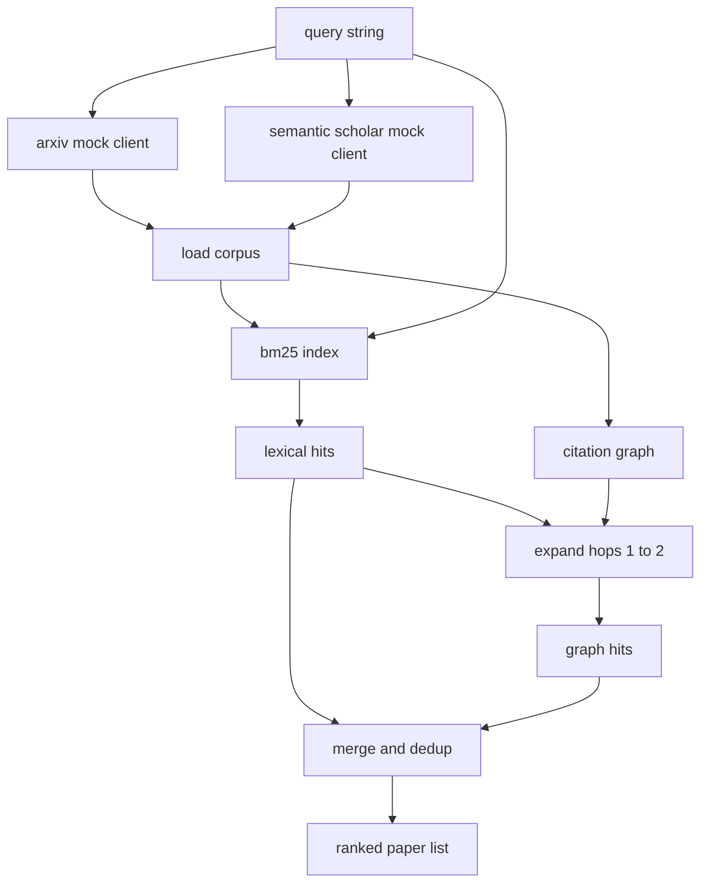

# Literature Retrieval

> Hypothesis 很便宜。知道是否有人已经证明它才昂贵。在 runner 启动 sandbox 前，构建回答这个问题的 retrieval layer。

**Type:** Build
**Languages:** Python
**Prerequisites:** Phase 19 Track A lessons 20-29
**Time:** ~90 minutes

## Learning Objectives
- 用下游 loop 会读取的字段建模小型 paper record。
- 只用 stdlib data structures 在 abstracts 上构建 BM25 index。
- 遍历 citation graph，暴露 lexical search 漏掉的 papers。
- 通过稳定 paper id 对 lexical 和 graph passes 的 hits 去重。
- 把两个 mock external APIs 包到单个 client 后面，让上游调用点在真实 endpoints 接入后保持不变。

## Why two retrieval passes

abstract keyword search 返回与 query 共享词汇的 papers，覆盖大部分表面情况。它漏掉两类。第一，foundational paper 用了不同 vocabulary，例如 “sparse attention” query 漏掉题为 “block selection in transformer routing” 的 paper。第二，相关 paper 是引用已知 anchor 的 follow-up；找到 anchor 后向前遍历比 brute force abstract pool 更高效。

本课构建两类 passes。abstract 上的 BM25 抓 lexical hits。citation graph traversal 从 seed set 向前和向后扩展一到两跳。union 按 paper id 去重，并用小型 combined score 排序。

## The Paper shape

```text
Paper
  id          : str           (stable identifier, "p001" for the mock corpus)
  title       : str
  abstract    : str
  year        : int
  authors     : list[str]
  references  : list[str]     (paper ids this paper cites)
  citations   : list[str]     (paper ids that cite this paper)
  source      : str           (which mock api supplied it, "arxiv" or "s2")
```

references 和 citations 字段组成 directed citation graph。两个 mock APIs 返回重叠但不完全相同的字段，因此 corpus loader 通过 `id` union 它们。

## Architecture



retrieval client 拥有两个 passes 和 merge。caller 给 query，拿回 ranked list；每个 entry 携带 per paper score fields，即 `bm25_score`、`graph_distance`、`recency_score`、`final_score`，用于解释排序。

## BM25 from scratch

实现是标准 Okapi BM25，默认参数 `k1=1.5`、`b=0.75`。index 是两个 dictionaries：`term -> doc_frequency` 和 `term -> list of (doc_id, term_count)`。document length 是 abstract 的 token count。average document length 在 index build time 计算一次。query scoring 是对 query terms 求和 `idf * tf_norm`，其中 `tf_norm` 是标准 BM25 length normalised term frequency。

tokeniser 是 `lower` 后按 non alphanumeric split，不做 stemming。生产系统会换入小 stemmer。接口保持不变。

```text
idf(t)      = log((N - df + 0.5) / (df + 0.5) + 1.0)
tf_norm(t)  = (f * (k1 + 1)) / (f + k1 * (1 - b + b * dl / avgdl))
score(d, q) = sum over t in q of idf(t) * tf_norm(t)
```

## Citation graph traversal

graph 从 corpus 一次性构建。forward edges 从 paper 指向它 references 的 papers。backward edges 从 paper 指向 citations 它的 papers。traversal 是以 top BM25 hits 为 seed 的 breadth first search，最多两跳。

两跳是刻意 ceiling。一跳太浅；agent 常要 immediate ancestor 或 descendant。三跳会在 connected graph 上膨胀结果并偏离主题。本课把 hop limit 暴露为 config knob，让下游 loop 可以收紧它。

## Dedup and ranking

两个 passes 返回重叠集合。merge 以 paper id 为 key。每篇 paper 的 final score 是加权混合：

```text
final_score = w_bm25 * bm25_score_norm
            + w_graph * graph_score
            + w_recency * recency_score
```

`bm25_score_norm` 是 BM25 score 除以 merged set 中最大 BM25 score，因此位于 0 到 1。`graph_score` 对 direct lexical hits 为 1，一跳为 `0.6`，两跳为 `0.3`，否则为零。`recency_score` 是从 corpus 最小 year 的 0 到最大 year 的 1 的 linear ramp。

默认权重为 `0.5`、`0.3`、`0.2`。权重是 config；陈旧主题可降低 recency，快速变化主题可提高它。

## Mock corpus

corpus 是由 `build_corpus()` 生成的一百篇 papers。每篇都有手写 title 和 abstract，主题属于五类：attention sparsity、retrieval augmentation、low rank adapters、dataset distillation 和 evaluation harnesses。references 和 citations 被连线，使每个 topic 形成 connected sub graph，并带少量 cross topic edges。

两个 mock API clients，`ArxivMockClient` 和 `SemanticScholarMockClient`，读取同一 corpus 但暴露不同字段。Arxiv 返回 title、abstract、year、authors。Semantic Scholar 添加 references 和 citations。retrieval client 按 id union；跨 client 字段分歧处理留给后续 lesson。

## What lessons 52 and 53 read

第 52 课 runner 读取 `paper.id`、`paper.title` 和 abstract 的 top three sentences，作为 experiment context。第 53 课 evaluator 读取 `paper.year` 和 `paper.references`，把 baseline 归因到具体 paper。

retrieval client 返回 `RetrievalResult`，包含 ranked list 和 per query metrics：hit count、average score、top score、total wall time。runner 会记录这些，方便下游 observability pass 绘制质量随时间变化。

## How to read the code

`code/main.py` 定义 `Paper`、`ArxivMockClient`、`SemanticScholarMockClient`、`BM25Index`、`CitationGraph`、`RetrievalClient` 和 deterministic demo。mock clients 与 corpus 在同一文件中，保持课程 portable。BM25 实现是一个约六十行的 class。graph traversal 是一个方法。

`code/tests/test_retrieval.py` 覆盖 lexical path、graph path、merge、dedup 和 empty query。

## Where this slots in

第 50 课生成 hypothesis。第 51 课搜索文献，看该 hypothesis 是否已经被解决。若没有，第 52 课运行实验。第 53 课读取 retrieval result 和 experiment metrics，写 verdict。retrieval client 是四个阶段中最便宜的，因此在 orchestrator 中最先运行。
