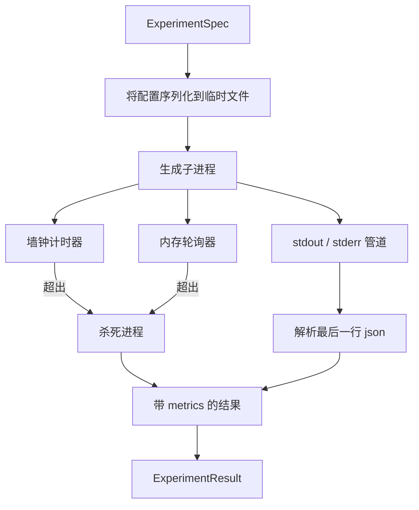

# 实验运行器

> 循环是否可信，取决于它的度量是否诚实。构建一个运行器，接收规格，在隔离的子进程中执行，并输出评估器可以信任的 json 指标块。

**Type:** Build
**Languages:** Python
**Prerequisites:** Phase 19 Track A lessons 20-29
**Time:** ~90 minutes

## 学习目标
- 将实验编码为有类型的规格，让运行器可以把它序列化给子进程。
- 启动带硬性墙钟超时和软性内存上限的子进程，并把二者都暴露为终止条件。
- 将 stdout、stderr 和结构化指标块捕获到一条结果记录中。
- 构建消融表，在固定基础规格上一次只扫描一个配置旋钮。
- 给定种子时保持每个结果确定性，让评估器在多次运行中看到相同数字。

## 为什么使用子进程

研究循环会运行不受信任的代码。假设来自采样器，实验脚本也来自同一路径，把二者当作进程内安全代码，会让一次崩溃拖垮编排器。子进程是语言自带的最简单隔离方式：独立进程、独立地址空间、父进程侧的信号句柄。

这里的运行器没有实现完整沙箱。没有 cgroup，没有 seccomp 过滤器，也没有命名空间重映射。它拥有的是墙钟超时、轮询内存增长的循环，以及在任一限制触发时终止进程的 kill 路径。所有更复杂的沙箱都会扩展这份运行时契约。本课把契约收窄到一次能读完的规模。

## ExperimentSpec 形状

```text
ExperimentSpec
  spec_id        : str            (stable id, "exp_001")
  hypothesis_id  : int            (link back to the queue from lesson 50)
  script_path    : str            (path to the python script to run)
  config         : dict           (passed to the script as one json arg)
  seed           : int            (deterministic seed for the experiment)
  wall_timeout_s : float          (hard timeout, killed on exceed)
  memory_cap_mb  : int            (soft cap, polled; killed on exceed)
  metric_keys    : list[str]      (which fields the evaluator will read)
```

脚本位于磁盘上；运行器把配置写到临时文件路径，脚本读取该路径。脚本预期在 stdout 打印一行 json，其键是 `metric_keys` 的超集。stdout 上的其他内容也会被捕获，但指标解析器会忽略。

## 架构



运行器是一个类，带一个主方法。轮询器是一个小线程，每隔一个轮询间隔唤醒一次，并在可用时从 proc 文件系统读取子进程的 `psutil` 等价信息；如果平台不暴露该信息，则退化为空操作。

## 为什么使用软性内存上限

硬性内存上限需要 `resource.setrlimit`，并且只在 POSIX 上工作。本课提供一个可移植方案：从平台轮询常驻集大小，如果子进程超过上限就杀死它。这个上限是软性的，因为轮询器有非零间隔；进程可能在两次轮询之间短暂冲过上限再降回来。运行器记录观察到的最大 RSS，让评估器能看到这次运行离限制有多近。

在不支持进程检查的系统上，轮询器会记录一次性警告并禁用自身。墙钟超时仍然生效。本课测试覆盖这两条路径。

## 捕获 stdout 和 stderr

运行器在完成时读干两个管道。Stdout 会逐行扫描；最后一行能解析为 json 且包含全部必需 `metric_keys` 的内容会作为指标块。更早的 json 行会保留在结果的 `intermediate_metrics` 中；评估器可以用它们生成学习曲线。

Stderr 会原样捕获进结果。运行器不会因为非零退出码而抛错，而是把退出码记录到结果里。任何非零退出都会标记为 `"crash"`，即使脚本打印了指标，因此评估器默认把部分完成的运行视为失败。

## 消融表

```python
def ablate(base: ExperimentSpec, knob: str, values: list[Any]) -> list[ExperimentSpec]:
    ...
```

给定一个基础规格和一个旋钮名，辅助函数会为每个值返回一个规格，并覆盖 `config[knob]`。每个规格都会得到派生的 `spec_id` (`f"{base.spec_id}_{knob}_{value}"`)。运行器附带一个 `AblationRunner`，它按顺序运行这些规格，并返回按旋钮值索引的 `AblationTable`。

为什么一次只动一个旋钮。完整因子扫描会指数级膨胀，并产生评估器无法解释的结果。一次一个旋钮会给出评估器可以绘制的清晰轴。本课只把多旋钮扫描支持为重复的单旋钮消融，由调用方组合。

## 确定性

每个规格都携带种子。运行器通过配置字典把种子转发给脚本 (`config["__seed"] = spec.seed`)。`code/experiments/` 中的模拟实验脚本会遵守种子，并在多次运行中产生相同指标。第五十三课的评估器依赖这一点；如果没有确定性，一个“回归”可能只是不同的随机初始化。

## 模拟实验脚本

本课附带一个实验脚本：`code/experiments/sparsity_experiment.py`。它是一个真实脚本，会读取配置文件，使用 numpy 随机过程模拟一次小训练运行，并打印 json 指标块。脚本支持 `sleep_s` 旋钮来测试超时，也支持 `allocate_mb` 旋钮来测试内存轮询器。

这个模拟并不训练真实模型。它是一段数值计算，模仿训练循环的形状：损失曲线、最终困惑度、墙钟时间。本课重点是运行器，不是模拟。真实实验脚本会导入模型。

## 结果形状

```text
ExperimentResult
  spec_id              : str
  hypothesis_id        : int
  exit_code            : int
  terminal             : "ok" | "timeout" | "oom" | "crash"
  wall_time_s          : float
  peak_rss_mb          : float | None
  metrics              : dict
  intermediate_metrics : list[dict]
  stdout_tail          : str
  stderr_tail          : str
```

评估器首先读取 `metrics` 和 `terminal`。如果 terminal 不是 `"ok"`，实验就算失败运行，评估器的判定会自动给出。否则，指标会进入显著性检验。

## 如何阅读代码

`code/main.py` 定义 `ExperimentSpec`、`ExperimentResult`、`ExperimentRunner`、`AblationRunner` 和一个确定性演示。子进程管理集中在一个类中。内存轮询器是一个小线程。消融辅助函数是一个单独函数。

`code/experiments/sparsity_experiment.py` 是测试使用的模拟实验。它从 argv 读取配置文件路径，并在完成时写出一行 json 指标。

`code/tests/test_runner.py` 覆盖成功路径、超时路径、崩溃路径、消融表，以及两次运行之间的确定性检查。

## 它接入的位置

第五十课生成假设。第五十一课过滤掉文献已经解决的内容。第五十二课为剩下的内容运行实验。第五十三课读取结果，运行显著性检验，并写出编排器按 hypothesis id 存储的判定。
