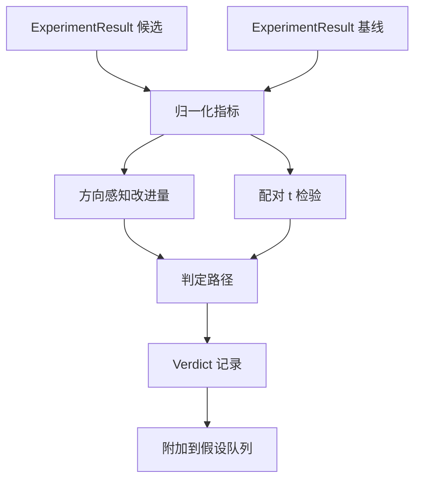

# 结果评估器

> 运行器产出了数字。评估器决定这些数字是改进、回归，还是噪声。构建把指标变成单行结论的判定路径。

**Type:** Build
**Languages:** Python
**Prerequisites:** Phase 19 Track A lessons 20-29
**Time:** ~90 minutes

## 学习目标
- 使用方向感知的改进量和固定阈值，将候选运行与基线比较。
- 从零实现针对每个种子指标的配对 t 检验，并读取得到的 p 值。
- 归一化对数尺度指标，让下游报告可以把它们和线性指标混合。
- 输出每个假设的判定，让编排器可以附加到第五十课的队列上。
- 保持每一步都是纯函数，让相同输入总是产生相同判定。

## 为什么使用配对检验

运行器给出的单个数字无法说明变化是否真实。同一配置换一个种子会得到不同困惑度。变化可能只是噪声。正确的比较是配对的：相同种子、相同数据，候选配置跑一次，基线配置跑一次。每个种子贡献一个差值。这些差值的均值就是效应。这些差值的标准误就是噪声底线。

本课从零实现这个检验。没有 `scipy.stats`。数学小到一屏就能读完。

```text
diffs    = [a_i - b_i for i in seeds]
mean     = sum(diffs) / n
variance = sum((d - mean) ** 2 for d in diffs) / (n - 1)
t_stat   = mean / sqrt(variance / n)
df       = n - 1
p_value  = two_sided_p(t_stat, df)
```

双侧 p 值使用正则化不完全 beta 函数。本课附带一个小实现，使用 Lentz 连分式。整段只有六十行 stdlib math。

## 方向感知的改进量

有些指标越高越好，像准确率和吞吐量。另一些指标越低越好，像损失、困惑度和墙钟时间。评估器在每个指标上携带 `direction` 字段。

```text
if direction == "higher_is_better":
    improvement = (candidate - baseline) / abs(baseline)
elif direction == "lower_is_better":
    improvement = (baseline - candidate) / abs(baseline)
```

改进量带符号。在越高越好的指标上，负改进表示候选更差。判定路径会同时读取符号和幅度。

一个固定阈值 (`improvement_threshold=0.02`，百分之二) 决定变化是否大到值得称为变化。低于阈值时，无论 p 值如何，判定都是 `"noise"`；循环不关心用户无法测量到的变化。

## 架构



评估器运行三个独立计算，并在判定路径中合并它们。每个计算都是纯函数，没有共享状态。

## 对数归一化

困惑度相对于损失是指数关系。损失下降 0.1 会带来大得多的困惑度下降。直接比较两个配置的困惑度没有问题，但如果要在单个报告里把它和线性指标混合，就需要归一化。

本课会对任何 `scale` 字段为 `"log"` 的指标先取自然对数，再计算改进量。阈值随后也在对数空间中应用。困惑度从 32 降到 28 时，越低越好的指标上得到 `log(28) - log(32) = -0.133`，显著高于百分之二阈值。

```text
if scale == "log":
    a = log(candidate)
    b = log(baseline)
else:
    a = candidate
    b = baseline
```

`scale="linear"` 的指标，默认值，会跳过变换。同一代码路径处理两者。

## 每个种子的配对检验

第五十二课的运行器会为每次运行输出一个最终指标块。为了做配对检验，评估器需要候选的一组种子结果和基线的一组种子结果。编排器会在一组种子上用两种配置运行同一实验，并把两组 `ExperimentResult` 记录交给评估器。

评估器按种子配对，种子位于 `result.metrics["seed"]`，并遍历请求的指标。如果两组列表的种子不匹配，评估器会抛出 `PairingError`。编排器应重新运行。

## Verdict 形状

```text
Verdict
  hypothesis_id          : int
  metric                 : str
  direction              : "higher_is_better" | "lower_is_better"
  scale                  : "linear" | "log"
  candidate_mean         : float
  baseline_mean          : float
  improvement            : float       (signed, fraction; see direction rules)
  p_value                : float | None  (None if n < 2)
  significance_threshold : float
  improvement_threshold  : float
  verdict                : "improved" | "regressed" | "noise" | "failed"
  rationale              : str
```

判定路径是一张小决策表：

```text
1. If any candidate result has terminal != "ok": verdict = "failed"
2. else if |improvement| < improvement_threshold:  verdict = "noise"
3. else if p_value is None or p_value > significance: verdict = "noise"
4. else if improvement > 0:                          verdict = "improved"
5. else:                                             verdict = "regressed"
```

Rationale 是一行人类可读的句子，编排器可以把它按 hypothesis id 记入日志。

## 如何阅读代码

`code/main.py` 定义 `MetricSpec`、`Verdict`、`Evaluator`、t 统计量和不完全 beta 辅助函数，以及一个确定性演示。t 检验用纯 stdlib math 实现；numpy 只用于读取指标列表并计算均值和方差。

`code/tests/test_evaluator.py` 覆盖改进路径、回归路径、噪声路径，小改进，噪声路径，低 n，失败终止路径、对数归一化路径、t 检验对照已知参考值，以及配对错误。

## 它接入的位置

第五十课生成假设队列。第五十一课过滤掉文献已经解决的内容。第五十二课跨种子运行候选和基线配置的实验。第五十三课读取这些运行并写出判定。编排器把四者拼起来：

```text
for hypothesis in queue:
    literature = retrieval.search(hypothesis.text)
    if literature_settles(hypothesis, literature):
        attach(hypothesis, verdict="settled")
        continue
    candidates = runner.run_all(specs_for(hypothesis))
    baselines  = runner.run_all(baseline_specs_for(hypothesis))
    metric_spec = MetricSpec("perplexity", direction=LOWER, scale=LOG)
    verdict = evaluator.evaluate(hypothesis.id, metric_spec, candidates, baselines)
    attach(hypothesis, verdict)
```

这个编排器不在本课中；这四课会通过各自定义的 dataclass 自然组合，不需要额外胶水代码。
