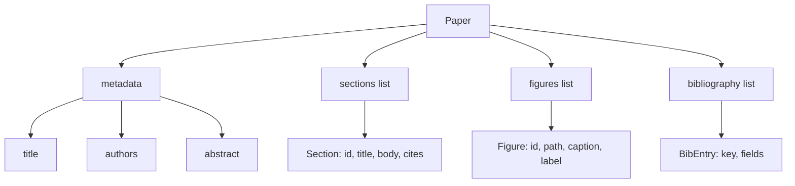
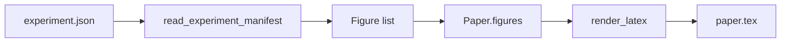
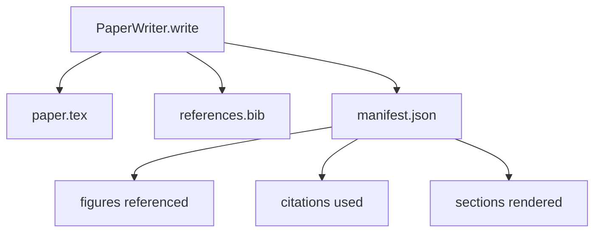

# 论文写作器

> LaTeX 骨架是研究者和排版系统之间的契约。如果契约坏了，文档就不会编译，而且失败会很明显。先构建骨架，再填充内容。

**Type:** Build
**Languages:** Python
**Prerequisites:** Phase 19 lessons 50-53
**Time:** ~90 minutes

## 学习目标

- 把研究论文当作具有已知章节图的结构化产物，而不是自由格式文档。
- 生成 LaTeX 骨架，在写任何正文前声明摘要、章节、图位和参考文献键。
- 通过确定性的槽位机制，把实验输出中的图，路径和标题，注入骨架。
- 接入一个模拟正文生成器，根据结构化大纲填充每个章节，让测试框架不依赖模型也能测试。
- 输出一个 `paper.tex`、一个 `references.bib`，以及一个列出所有引用图和所有使用引用的 manifest。

## 为什么先写骨架

从正文开始的草稿会积累结构债。引言长出三段本该放在相关工作的内容。图在定义之前就被引用。参考文献里为同一篇论文留下三个键。等作者发现时，重写成本已经高过写作成本。

骨架把这个过程反过来。结构先作为数据声明。章节是有名称和顺序的槽位。图是有 id 和标题的槽位。参考文献键在顶部声明，并指向它们的条目。正文会逐个生成到这些槽位中。在任何正文写出之前，测试框架就能验证每个图都有槽位，每个引用都有条目，每个章节都出现在目录中。

这和前面课程对计划、工具调用、trace 使用的纪律相同。结构就是契约。

## Paper 形状

每个字段都是普通 Python 数据。渲染器是从 `Paper` 到 LaTeX 字符串的纯函数。测试框架可以在渲染前内省论文：统计章节、列出缺失的图文件、检查每个 `\cite{key}` 都有匹配的 `BibEntry`。

## 渲染契约

渲染器保证三个性质。第一，每个骨架中的图位都会输出一个 `\begin{figure}` 块，并带有 `fig:<id>` 形式的稳定 label。第二，每个章节都会输出一个 `\section{}`，并带有 `sec:<id>` 形式的稳定 label，让交叉引用可用。第三，参考文献会输出一个 `\bibliography` 块，其中 `references.bib` 恰好包含论文声明的条目，不多也不少。

违反任意一项都是渲染错误，而不是警告。骨架就是契约；渲染时静默丢图就是契约破坏。

## 从实验注入图

本轨道前面的课程把实验输出生成为 JSON manifest。每个 manifest 都携带一个 artifacts 列表，包含路径和短标题。论文写作器读取该 manifest 并生成 `Figure` 记录。

注入是确定性的。图 id 从实验名加单调计数器派生。标题来自 manifest。路径会相对于论文输出目录归一化，因此即使实验输出位于磁盘其他位置，LaTeX 也能编译。

## 模拟正文生成器

本课不调用模型。`MockProseGenerator` 读取大纲形状并确定性地产生正文。大纲形状是每个章节一个短字符串。生成器把该字符串扩展为两段短正文，并把章节标题织入其中。只有当大纲声明图和引用时，生成正文才会提到它们。

这足以测试写作器的每个行为。真实实现会把生成器换成模型调用。外层测试框架不变。这就是把正文生成器声明为 callable 的价值：测试替换为确定性版本，生产替换为模型版本，流水线其余部分完全相同。

## manifest 输出

写作器向输出目录写出三个文件。

manifest 是下游评估器或评论器循环读取的内容。它不解析 LaTeX，而是读取 manifest。下一课评论器循环会把这个 manifest 作为输入并生成反馈列表。因此 manifest 是契约的一部分，LaTeX 不是。

## 验证关卡

写作器在写任何文件前运行四个关卡。

1. 论文内每个图 id 都唯一。
2. 每个章节的 `cites` 字段都引用论文已声明的参考文献键。
3. 摘要非空。
4. 标题非空。

失败的关卡会抛出 `PaperValidationError`，并给出精确原因。测试框架把该原因暴露为失败模式。不存在部分写入：要么三个文件全部输出，要么一个都不输出。

## 如何阅读代码

`code/main.py` 定义 `Paper`、`Section`、`Figure`、`BibEntry`、`PaperValidationError`、`MockProseGenerator`、`PaperWriter` 和 `render_latex` 函数。`write` 方法接收输出目录，并输出 `paper.tex`、`references.bib` 和 `manifest.json`。`read_experiment_manifest` 辅助函数把一组实验 manifest 转成 `Figure` 记录。

`code/tests/test_paper_writer.py` 覆盖：无章节骨架渲染、带两个章节和两张图的完整渲染、缺失引用关卡、重复图 id 关卡、manifest 内容，以及 LaTeX 字符串契约，每个章节输出 `\section{}`，每张图输出 `\begin{figure}`。

## 继续深入

真实实现会想要两个扩展。第一，多格式渲染：同一个 `Paper` 形状可以编译成博客文章用的 Markdown 和预览用的 HTML。渲染器变成 `Paper` 上的策略。第二，引用增强：给定本地 DOI 缓存，写作器从引用键获取 BibTeX 条目。二者都有价值，也都能在不触碰骨架契约的情况下加入。

骨架是赌注。章节、图和引用声明为数据，正文生成进槽位，manifest 和 LaTeX 一起输出。其他每个改进都叠加在它之上。
