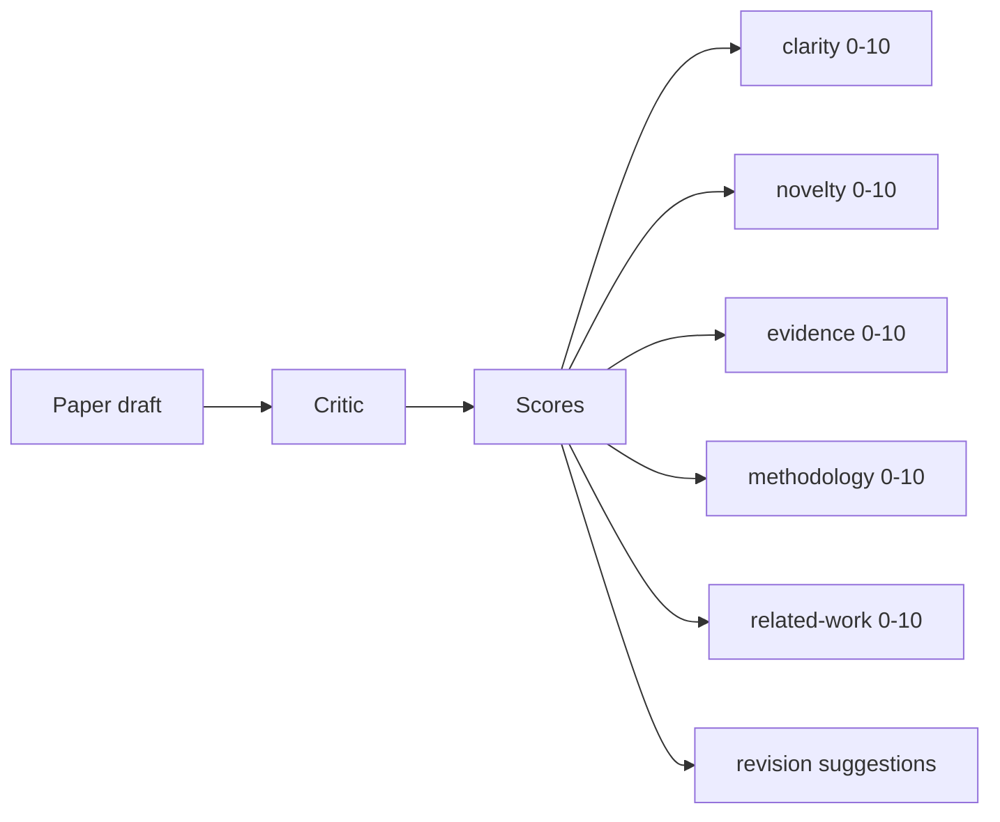
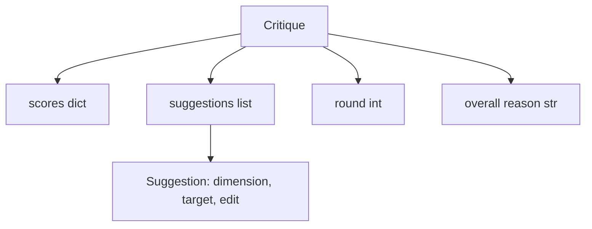
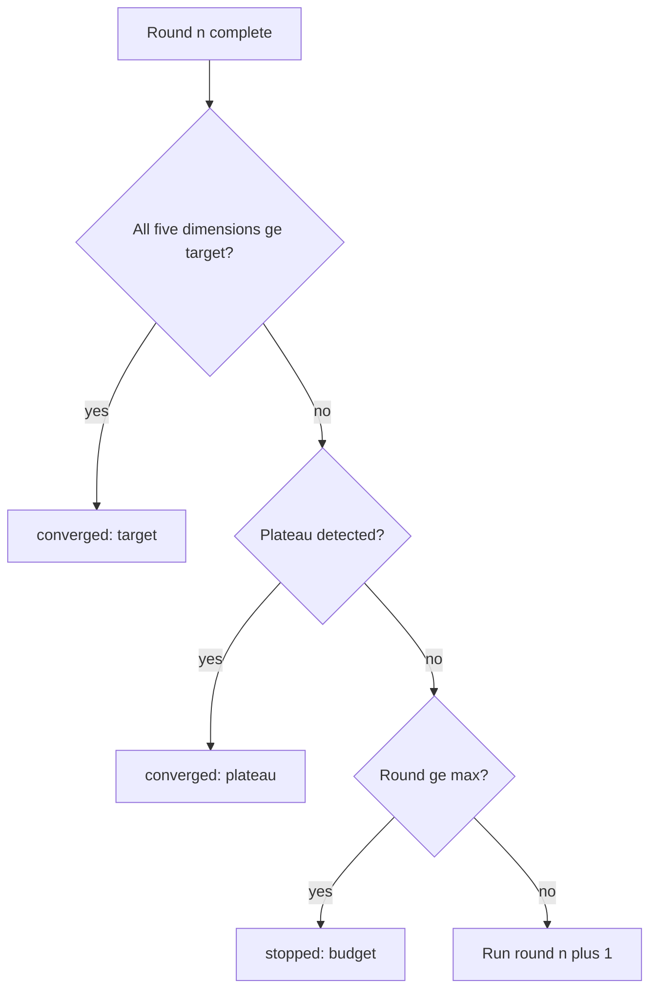
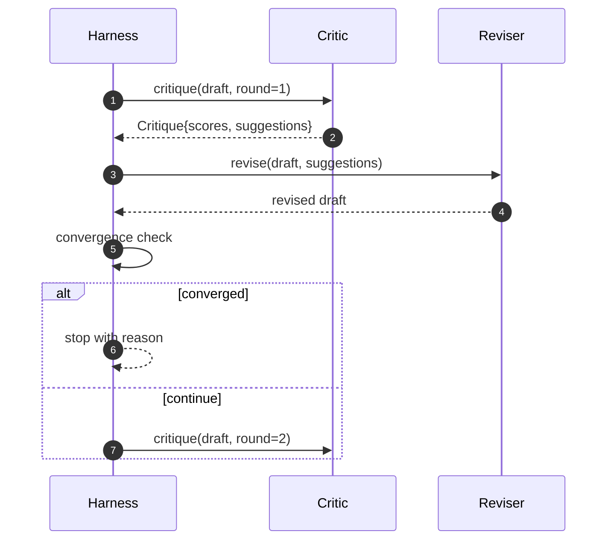

# 评论器循环

> 第一次就返回“看起来不错”的评论器是坏的。永远返回“还需要修改”的评论器也是坏的。有意思的评论器是会收敛的评论器，而你必须工程化这种收敛。

**Type:** Build
**Languages:** Python
**Prerequisites:** Phase 19 lessons 50-53
**Time:** ~90 minutes

## 学习目标

- 按五个固定维度为论文草稿打分：清晰度、新颖性、证据、方法、相关工作。
- 将每轮评论作为结构化修订 diff 应用，而不是自由格式重写。
- 通过比较多轮分数检测收敛；在平台期、达到目标或预算耗尽时停止。
- 用最大迭代预算限制轮数，避免不收敛的评论器永远运行。
- 输出每轮 trace，让仪表盘或下一阶段可以渲染分数轨迹。

## 为什么使用五个固定维度

自由格式评论器是一个返回建议段落的模型。下一轮修订把这段话当作环境上下文。重写是否回应了批评不可验证，因为批评本身从未结构化。

五个维度给测试框架一份契约。



分数是一个向量。测试框架会观察每个维度跨轮变化。一次修订提高了清晰度却破坏了证据，就是证据维度上的回归，收敛检查能看见。纯模型评论器无法提供这种保证。

## Critique 形状



每条建议都携带它改善的维度、目标章节，以及修订器可以应用的 `edit` 指令。修订器也是一个 callable。本课提供一个确定性修订器，把 edit 指令解释为“追加到章节”的操作。模型驱动的修订器会把同一字段解释为提示词。契约不变。

## 收敛规则，按顺序

评论器循环会在三个条件中任意一个触发时终止。



目标是最严格的情况：五个维度，clarity、novelty、evidence、methodology、related_work，全部必须达到 `>= target_score`，默认 `8.0`，循环才会返回成功。均值很高但有一个弱维度还不够。平台期检测比较当前轮均值和上一轮均值。如果连续两轮改进低于 `plateau_epsilon`，默认 `0.1`，循环会以 `plateau` 退出。预算是轮数硬上限，默认 `5`，并以 `budget` 退出。

顺序很重要。目标优先于平台期，平台期优先于预算。如果第三轮达到目标，同时也会触发平台期，结果是 `target`，不是 `plateau`。

## 为什么平台期检测跨两轮运行

一轮平台期只是噪声。真实评论器即使面对固定草稿，每轮也会返回略有不同的分数，因为确定性评分仍然取决于哪些建议被应用以及应用顺序。要求连续两轮平台期可以滤掉这种噪声。如果测试框架报告平台期，说明草稿确实停止改善了。

## 本课的确定性评论器

本课不调用模型。附带的评论器是一个 callable，会根据三个信号为草稿评分：章节正文平均长度，清晰度；图数量和引用数量，证据；论文 metadata 上的 `originality_tag` 字段，新颖性。修订器知道如何把每个分数向上推。

```text
clarity      grows when the average section body length increases
novelty      grows when originality_tag is set to "high"
evidence     grows when a section's figure_refs is non-empty
methodology  grows when a section titled "Method" exists with body
related-work grows when a section titled "Related Work" exists with body
```

修订器把每条建议解释为有目标的追加。第一轮之后，测试框架可以观察到分数上升。测试利用这一性质断言循环缩小差距。

## 完整循环契约



测试框架拥有轮次计数器、trace 和收敛检查。评论器拥有分数。修订器拥有 diff。三者都不触碰彼此的状态。

## Trace 输出

每轮都会输出一个 trace event，包含轮次、分数向量、建议数量和收敛判定。完整 trace 会和最终草稿一起返回。下游仪表盘可以渲染每轮分数图。下一课迭代调度器会读取 trace，决定这个分支是否值得保留。

## 防止坏评论器的预算

如果评论器产生的建议永远无法提升分数，循环会撞上最大迭代上限。trace 会让这一点可见：五轮、分数持平、判定 `budget`。用户会把这理解为评论器 bug，而不是草稿 bug。只暴露最终草稿的替代方案会隐藏诊断。trace 优先设计会把它暴露出来。

## 如何阅读代码

`code/main.py` 定义 `Critique`、`Suggestion`、`Critic` protocol、`Reviser` protocol、`CriticLoop`，以及返回确定性评论器和匹配修订器的 `make_deterministic_critic_pair` 工厂。文件里包含一个最小 `Paper` 形状，让本课可以独立运行。

`code/tests/test_critic_loop.py` 覆盖：第一轮后的单调改进、调好的草稿达到目标收敛、两轮持平后的平台期检测、没有建议改善时的预算耗尽、修订器应用建议，以及 trace 形状。

## 继续深入

真实实现会想要两个扩展。第一，维度权重：workshop 论文更重视新颖性，期刊更重视方法；收敛检查会变成加权均值。第二，成对评论器：一个评论器打分，另一个评论器在修订器看到建议前裁决这些建议。二者都有价值，也都组合在同一个 `Critique` 形状上。

赌注是分数向量。一旦评论结构化，其他所有改进，收敛规则、仪表盘、成对评论器，都能在不改变循环的情况下接入。
