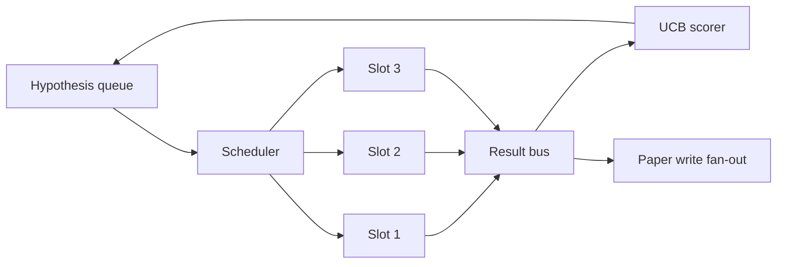
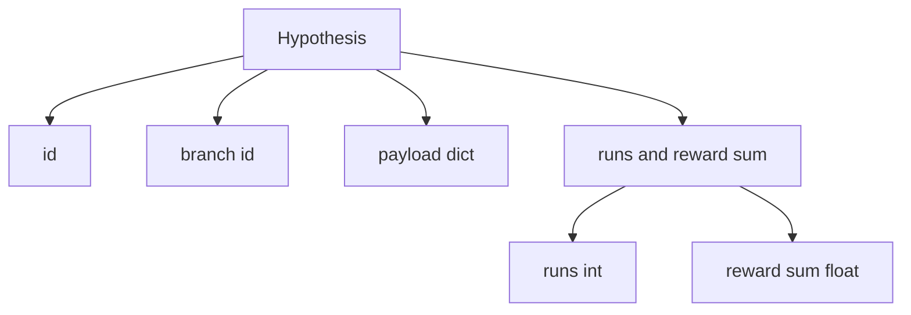
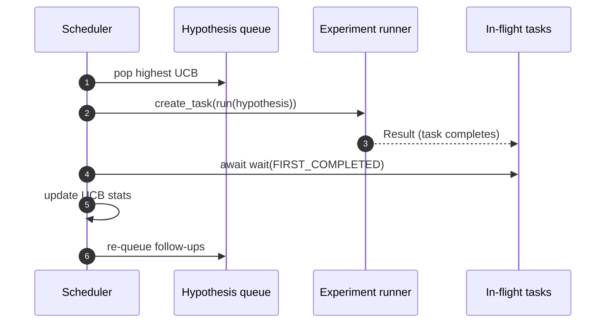

# 迭代调度器

> 没有调度器的研究循环，只是一个自以为是的队列。调度器是循环决定停止探索什么的地方，而这个决定就是整局游戏。

**Type:** Build
**Languages:** Python
**Prerequisites:** Phase 19 lessons 50-53
**Time:** ~90 minutes

## 学习目标

- 将研究工作流建模为假设队列，送入并行实验槽位，结果再扇入回来。
- 使用 asyncio 并发运行多个实验，让调度器保持所有槽位忙碌。
- 用 UCB 为每个假设分支打分，让调度器能剪掉低产出分支，同时不放弃探索。
- 将完成的结果扇出到论文写作阶段和重新入队阶段，让高产出分支生成后续假设。
- 暴露每次迭代的 trace，包含分支分数、槽位占用和剪枝决定。

## 为什么用调度器，而不是工作列表

平铺工作列表按提交顺序运行作业。每个作业独立时，这样没有问题。研究并不独立：第三个实验的发现会改变第四和第五个实验的优先级。读取结果扇入并重新排序队列的调度器，能用同样算力完成更多有用工作。

有意思的设计选择是评分规则。贪心评分器总是选择当前领先者，从不探索。均匀评分器从不利用。UCB，上置信界，是中间路径：利用领先分支，同时为尝试次数较少的分支保留容量。

## 系统形状



队列保存假设。槽位释放时，调度器选择 UCB 最高的假设。每个槽位异步运行一个实验。完成的实验把结果扇入到 bus。bus 更新源分支上的 UCB 统计，并在某个分支的产出跨过阈值时扇出到论文写作阶段。

## Hypothesis 形状



`branch` 是 UCB 统计的键。多个假设可以共享一个 branch，branch 是研究方向，hypothesis 是其中一次试验。`runs` 是该分支已完成实验数量，`reward_sum` 是累计奖励。UCB 会读取二者。

## UCB 评分

本课使用的 UCB 公式是经典 UCB1。

```text
ucb(branch) = mean_reward(branch) + c * sqrt( ln(total_runs) / runs(branch) )
```

`total_runs` 是所有分支上已完成实验总数。`c` 是探索权重；本课默认 `sqrt(2)`。零运行分支得到 `+inf`，因此未尝试分支总会被优先调度。均值奖励高的分支会保持高分，直到其他分支追上；运行很多次但奖励不高的分支会被运行较少的替代分支盖过。

剪枝关卡和选择器是分开的。某个分支在至少 `prune_after_runs` 次试验后，默认 `3`，均值奖励低于绝对下限，默认 `0.2`，剪枝会把它从未来调度中移除。这让队列保持有界。

## 使用 asyncio 的并行槽位

调度器使用 `asyncio.create_task` 驱动实验。每个 task 运行实验运行器，一个返回 `Result` 的 `async def` callable。主循环用 `asyncio.wait(..., return_when=asyncio.FIRST_COMPLETED)` 等待飞行中的任务集合，并在每次完成时触发评分更新。



三个槽位并发运行。主循环永远不会阻塞在单个实验上。只要一个槽位释放，调度器就启动新任务，直到队列为空且没有飞行中任务。

## 扇出：论文触发器

当某个分支的均值奖励跨过 `paper_threshold`，默认 `0.7`，并且该分支尚未产出论文时，调度器会把一个 `paper.trigger` event 扇出到输出列表。下游第五十四课的论文写作器会接收它。在本课中，触发器会被捕获为列表，方便测试断言。

## 扇出：后续假设

当高产出结果到达时，调度器可以调用用户提供的 `expander`，在同一分支上产出一个或多个后续假设。expander 是从 `Result` 到 `list[Hypothesis]` 的纯函数。本课附带一个确定性 expander，会为任何奖励超过论文阈值的结果生成两个后续假设。

## 预算

两个预算保护调度器免于失控循环。

```text
max_experiments    : total count of experiments run across all branches
max_seconds        : wall-clock cap (asyncio time)
```

任一预算触发时，调度器会停止调度新任务，等待飞行中任务完成，然后返回最终 trace。trace 包含 `stop_reason`。

## Trace 和最终报告

每个调度决定，pick、dispatch、result、prune、fan-out，都会输出一个 event。最终报告汇总每个分支的统计、总运行数、总墙钟时间和触发的论文触发器。下一课端到端演示会读取这个报告来驱动论文写作器。

## 如何阅读代码

`code/main.py` 定义 `Hypothesis`、`Result`、`BranchStats`、`IterationScheduler`，以及返回 asyncio 实验运行器的 `make_deterministic_runner` 工厂，该运行器会给出可预测奖励。运行器会 sleep 固定的 `delay_ms`，默认 `5ms`，让并发可观察。

`code/tests/test_scheduler.py` 覆盖：UCB 优先选择未尝试分支、并行槽位占用、跨过阈值时的论文触发器、低产出试验后的分支剪枝、扇出后续假设，以及预算退出，实验数量和墙钟两类预算。

## 继续深入

真实实现会想要三个扩展。第一，跨会话持久化 UCB 统计：当前统计位于内存中；真实调度器会 checkpoint 它们，让重启保留已经花掉的探索预算。第二，多目标评分：每个结果不输出标量奖励，而是输出向量，UCB 变成 Pareto 风格选择器。第三，上下文 bandit：选择器根据假设特征，长度、复杂度，做条件决策，让相似假设共享探索。

调度器让研究不再只是工作列表。一旦 UCB 接好、槽位并行运行，其他每个改进都可以叠加在它之上。
