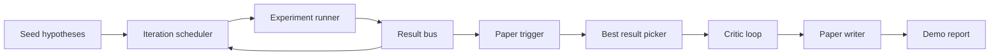
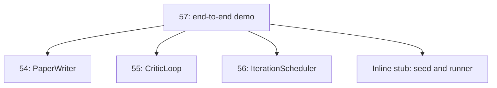
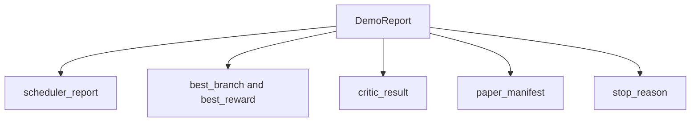

# 端到端研究演示

> 演示是你此前写下的每个契约都必须组合起来的地方。如果其中任何一个泄漏，演示这课就会抓住它。

**Type:** Build
**Languages:** Python
**Prerequisites:** Phase 19 lessons 50-53
**Time:** ~90 minutes

## 学习目标

- 端到端接好自动研究循环：假设种子、实验运行器、调度器、评论器循环、论文写作器。
- 通过普通 Python import 组合前四个 Track D 课程中的原语，而不是通过框架。
- 运行循环直到自终止，并输出一份演示报告，列出每个阶段的输出。
- 保持演示确定性，让测试套件可以断言最终形状。
- 当任一阶段的契约破坏时，暴露清晰失败模式，避免下一阶段带着坏输入运行。

## 这里组合了什么



五个阶段。种子是三个假设的列表。调度器用三个并行槽位在它们上面运行六个实验。bus 报告一个或多个论文触发器。选择器选出单个最佳结果。评论器循环在该结果构建的草稿上迭代。论文写作器输出最终 LaTeX、BibTeX 和 manifest。

## 为什么是 import，而不是复制

前面的每课都提供一个 `main.py`，其中包含公开 dataclass 和函数。演示通过调整 `sys.path` 到每个课程的父目录来导入它们。这不是框架接线；它和前面课程测试文件已经使用的 import 相同。



内联 stub 代替第五十到第五十三课：一个小型种子假设生成器和一个同步奖励函数。用户可以通过调整两个 import，把内联 stub 换成这些课程中的真实原语。

## 确定性保证

演示从构造上就是确定性的。实验运行器使用带种子的 numpy。评论器循环的修订器按固定维度和固定顺序遍历。论文写作器的正文生成器是第五十四课的模拟版本。调度器的 UCB 选择器按迭代顺序打破平局，而不是随机选择。

给定相同种子，演示会输出相同报告。测试通过运行演示两次并比较 manifest 来断言这一性质。

## 演示报告形状



每个字段都原样来自上游阶段。演示不转换任何输出；它只组合它们。这正是演示要测试的内容。

## 失败模式处理

每个阶段要么成功，要么抛出有类型的错误。

```text
Scheduler ........ returns SchedulerReport with stop_reason
                   in {queue_empty, max_experiments, deadline}
Best-result pick . raises NoTriggerError if no paper trigger fired
Critic loop ...... returns LoopResult with status converged or stopped
Paper writer ..... raises PaperValidationError on contract break
```

任一阶段失败都会用有类型异常短路演示。测试固定了这份契约：`test_no_triggers_raises_typed_error` 和 `test_best_picker_raises_when_no_triggers` 断言没有分支触发论文时，选择器会抛出 `NoTriggerError` / `BestResultError`，并且写作器永远不会被调用。

## 最佳结果选择器

调度器按分支输出论文触发器。选择器会从所有触发器中选择均值奖励最高的分支。平局按 branch id 字母序打破，因此演示是确定性的。选择器是一个小型纯函数；测试用固定调度器报告钉住它。

## 接线评论器循环

第五十五课的评论器循环作用于 `MiniPaper`。演示会从选中的分支构建 `MiniPaper`：用 branch id 填充摘要，播种两个章节，Introduction 和 Results，并从分支均值奖励设置 `originality_tag`，`>= 0.8` 为 high，`>= 0.6` 为 medium，否则为 low。

修订器随后迭代草稿直到收敛。输出进入论文写作器。

## 接线论文写作器

第五十四课的论文写作器作用于带图和参考文献的完整 `Paper` 形状。演示通过 `mini_to_full_paper` 升级收敛后的 `MiniPaper`，为选中分支附加一张图，并根据评论器建议的 cite key 并集构造小型合成参考文献。演示添加的每个 cite 也会加入 bibliography 列表，因此验证会通过。

## 如何阅读代码

`code/main.py` 定义 `BestResultError`、`NoTriggerError`、`DemoReport`、`pick_best_branch`、`build_mini_paper`、`mini_to_full_paper` 和 `run_demo`。顶部 import 会一次性调整 `sys.path`，并从各自课程中拉取 `PaperWriter`、`CriticLoop` 和 `IterationScheduler`。

`code/tests/test_e2e.py` 覆盖：演示端到端运行并输出五个字段都填充的报告、两次运行之间的确定性、没有分支跨过阈值时的 NoTriggerError、写作器契约破坏时的 PaperValidationError、paper manifest 包含所选分支的图，以及调度器 stop reason 属于预期值之一。

## 继续深入

演示变绿后值得接入三个扩展。第一，持久状态：每个阶段的结果写入一个小 JSON 存储，让重启无需重跑廉价阶段即可恢复。第二，仪表盘：调度器和评论器循环的 trace events 渲染为一条时间线。第三，真实模型调用：把模拟正文生成器和确定性评论器换成模型驱动版本；接线不变。

演示的职责是证明组合就是架构。五课，四个 import，一份报告。下一次你添加阶段时，接线只会增加一行。
