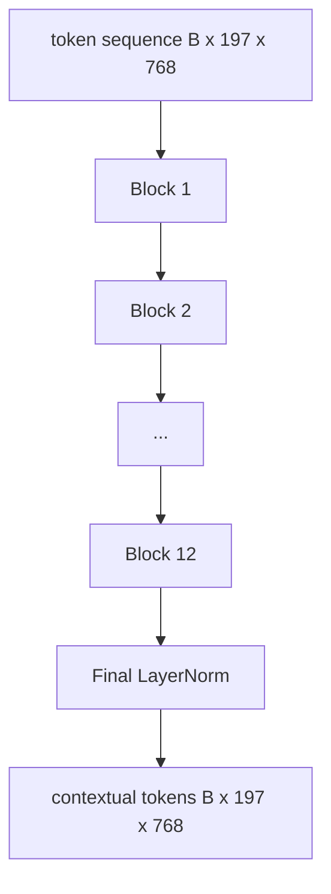

# 视觉 Transformer 编码器

> 仅有 patch 还不会看。一个 12 层、12 个 attention head 的 pre-LN transformer，会把 patch token 序列变成上下文化 token 序列，CLS token 在最终 hidden state 中汇聚整图特征。本课是每个现代视觉语言模型的机房。

**Type:** Build
**Languages:** Python
**Prerequisites:** Phase 19 lessons 30-37 (Track B foundations)
**Time:** ~90 minutes

## 学习目标

- 实现带 multi-head self-attention 和 feed-forward 子层的 pre-LN transformer block。
- 堆叠 12 个 block 和 12 个 head，形成 ViT-Base 编码器。
- 接入第 58 课的 patch 前端到编码器，并运行 forward pass。
- 验证 CLS token 会从每个 patch 聚合信息。

## 问题

Patch embedding 产生一个 197 个 token 的序列，每个 token 都是一个向量，但不知道任何其他 patch。一张猫的图片需要每个 patch 知道哪些 patch 包含胡须，哪些包含背景，哪些包含眼睛。Transformer 就是建立这种感知的机制，一层 attention 一层 attention 地构建。没有它，patch 前端只是一个聪明的 tokenizer，却没有理解能力。

标准配方是十二个 block 深、十二个 head 宽，使用 pre-LayerNorm、GELU 激活，以及 4x 的 feed-forward 扩展。这个配方是 CLIP ViT-L、SigLIP、DINOv2、Qwen-VL 家族、InternVL，以及 2025 到 2026 年其他 open-weight 视觉编码器的主干。配方足够稳定，因此你阅读这些论文时，除非它们明确说明不同，否则可以假设就是这个 block 形状。

## 概念




### Pre-LN 与 post-LN

原始 Transformer 把 LayerNorm 放在 residual 之后。Pre-LN，把 LayerNorm 放在每个子层之前，是每个现代视觉语言模型使用的版本，因为它训练稳定，不需要学习率 warm-up 技巧。差异只是 forward pass 中一行代码，但在 12 层以上深度时，梯度流完全不同。

### Multi-head self-attention

每个 head 都把 token 向量投影到自己的 `(query, key, value)` 三元组，维度为 `head_dim = hidden / num_heads`。当 `hidden = 768` 且 `heads = 12` 时，每个 head 的 `dim = 64`。12 个 head 并行 attention，然后它们的输出 concat 回 768 维并经过输出投影。Multi-head 的意义在于，一个 head 可以学习“关注猫眼”，另一个可以学习“关注背景渐变”，互不干扰。

### 为什么 feed-forward 扩展 4x

FFN 走 `hidden -> 4 * hidden -> hidden`，中间使用 GELU。因子 4 是经验结果，自 2017 年以来在语言和视觉 transformer 中一直成立。更小，2x，容易欠拟合；更大，8x，在固定数据预算下容易过拟合。MLP 是模型存储大部分所学事实的地方，更宽的中间层就是它们存放的位置。

| Component | Parameters at ViT-Base scale |
|-----------|------------------------------|
| qkv projection per block | `3 * 768 * 768 = 1.77M` |
| output projection per block | `768 * 768 = 590K` |
| FFN per block (4x expansion) | `2 * 768 * 4 * 768 = 4.72M` |
| LayerNorm per block | `4 * 768 = 3K` |
| Total per block | about 7.1M |
| 12 blocks | about 85M |
| Plus front end | about 86M total |

ViT-Base 是一个 86M 参数编码器。按 2026 年标准看它很小，SigLIP-So400M 是 400M，Qwen-VL ViT 是 675M，但除了宽度和深度外，架构相同。

### 是否需要 causal mask

Vision Transformer 是 encoder-only 且双向的：任意一对 token 中，token `i` 可以 attend 到 token `j`。没有 mask。第 61 课中的 decoder-side cross-attention 会使用 causal mask，但在视觉编码器内部，attention 是全连接的。

### CLS token 学到了什么

CLS token 一开始是一个学习参数，本身没有 patch 内容，它通过每个 block 的 attention 累积信息。到最终层时，CLS 行是整张图的向量摘要；下游 head 会把这个单个向量投影为分类 logits、对比嵌入，或文本解码器 cross-attention 使用的 key。

## Build It

`code/main.py` 实现：

- `MultiHeadSelfAttention`，包含 `qkv` 和输出投影、scaled-dot-product attention 数学，以及形状断言。
- `FeedForward`，4x 扩展的 GELU MLP。
- `Block`，pre-LN block，把 attention 和 feed-forward 子层与 residual 组合起来。
- `ViT`，12 个 block 的堆叠，并带最终 LayerNorm。
- `VisionEncoder`，把第 58 课的 `VisionFrontEnd` 接到 `ViT` 堆栈，并暴露返回上下文化序列和 pooled CLS 向量的 `forward()`。
- 一个演示，把合成的 224x224 fixture 图像送过完整编码器，并打印输入形状、输出形状、参数量，以及每隔一层的 CLS norm。

运行：

```bash
python3 code/main.py
```

输出：fixture 会被编码为一个 `(1, 197, 768)` tensor。CLS norm 随着层的组合向上漂移，然后在最终 LayerNorm 稳定。总参数量报告约为 86M。

## Use It

这里定义的编码器，除了宽度和深度外，就是 2025 到 2026 年每个 open-weight VLM 内部使用的 block stack。差异位于：

- **Width and depth.** ViT-Large 是 `hidden=1024, depth=24, heads=16`；SigLIP So400M 是 `hidden=1152, depth=27, heads=16`。同一个 block。
- **Pooling head.** CLS pooling，本课，与 average pooling，SigLIP，以及后续 VLM 的 attention pooling。
- **Position handling.** 固定 sinusoidal，第 58 课，与 learned 1D、ALiBi、2D RoPE。Block 数学不变。
- **Register tokens.** DINOv2 前置 4 个额外学习 token。一行代码。

这个 block stack 是基底。后续课程，60 到 63，站在它之上。

## Tests

`code/test_main.py` 覆盖：

- a single block preserves shape and is invariant to input batch size
- attention scores sum to one along the key axis (softmax sanity)
- residual paths are wired (zero input still produces non-zero output via the CLS token)
- a 4-layer stacked forward pass produces the right shape
- gradients flow to the patch projection from the CLS output

运行测试：

```bash
python3 -m unittest code/test_main.py
```

## 练习

1. 添加 register tokens，在 CLS 之后前置 4 个学习向量，并重新运行。通过最后一层 softmax 分布的 entropy 比较 attention map 平滑度。

2. 把 pre-LN 换成 post-LN，并在合成形状分类器上训练一个 epoch。观察哪个版本不需要 LR warm-up 就能稳定训练。

3. 把 causal masking 实现为 `attn_mask` 参数，让同一个 block 可以复用为 decoder block。Mask 形状是 `(seq, seq)`，下三角。

4. 用 `torch.profiler` 在 batch size 1、8、64 下 profile 一次 forward pass。MLP 层主导墙钟时间，而不是 attention。

5. 把一个 attention head 的 q-k-v projection 替换为低秩 LoRA adapter，冻结其余部分，并验证梯度只流向你预期的位置。

## 关键术语

| Term | What it means |
|------|---------------|
| Pre-LN | 在每个子层之前而不是之后应用 LayerNorm |
| Self-attention | 每个 token 关注同一序列中的每个其他 token |
| Multi-head | Hidden dim 被拆分到 `H` 个独立 attention head |
| FFN expansion | Feed-forward 层先扩宽到 `4 * hidden`，再收缩回来 |
| CLS pooling | 使用第一个 token 的最终 hidden state 作为图像摘要 |

## 延伸阅读

- An Image is Worth 16x16 Words (ViT, 2021)，了解编码器配方。
- DINOv2 (2023)，了解 register tokens 和自监督预训练目标。
- SigLIP (2023)，了解 average-pooling 变体和第 62 课使用的 sigmoid contrastive loss。
