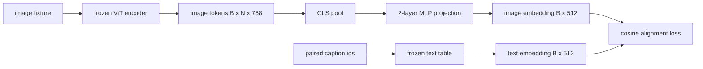

# 模态对齐投影层

> 视觉编码器产生图像 token。文本解码器消费文本 token。二者生活在不同向量空间里。一个小型两层 MLP 把图像 token 投影到文本嵌入空间中，而针对配对 caption 的 cosine alignment loss 会把两个空间拉向一致。这个投影是视觉语言模型中最小的一块，也是最影响迁移的一块。

**Type:** Build
**Languages:** Python
**Prerequisites:** Phase 19 lessons 30-37 (Track B foundations)
**Time:** ~90 minutes

## 学习目标

- 构建一个两层 MLP projection，把图像特征映射到文本嵌入空间。
- 构造一个模拟文本嵌入表，不使用 pretrained tokenizer，也不使用真实语料。
- 计算投影后图像 token 与配对 caption embedding 之间的 cosine alignment loss。
- 在冻结视觉编码器和冻结文本表的情况下，只训练 projection。

## 问题

你有一个视觉编码器，第 58 到 59 课，输出维度为 `vision_hidden = 768` 的 token。你有一个想接在上面的文本解码器，embedding 维度为 `text_hidden = 512`，其他数字也同样合理。解码器期待文本形状的 token。图像 token 不是文本形状：它们生活在编码器通过纯视觉预训练学到的基中，和解码器的词向量没有关系。

两层 MLP projection，linear、GELU、linear，弥合这个差距。它足够小，约 `768 * 1024 + 1024 * 512 = 1.3M` 个参数，可以在单张 GPU 上几分钟训练完，而且它是对齐阶段唯一需要学习的部分。视觉编码器保持冻结。文本嵌入表保持冻结。只有 projection 移动。这是 LLaVA 在 2023 年采用的配方，BLIP-2 把它重塑为 Q-Former，此后每个 open-weight VLM 都以某种形式采用了它。

## 概念



### 投影前先 pooling

视觉编码器输出 197 个 token。文本侧有一个 caption-level embedding。为了对齐它们，你需要每个样本一个 image-level 向量。CLS pooling 最简单：取编码器第一个 token 并投影它。对全部 197 个 token 做 mean pooling 也是选项，SigLIP 就是这样做的。任一方式都会把 197 个向量池化成一个。

### 为什么是两层，而不是一层

单个线性 projection 可以旋转和缩放，但如果两个空间存在曲率错配，它无法修复基。两个线性层之间的 GELU 给 projection 一个非线性弯折，经验上足以把 CLIP 风格特征对齐到语言模型 embedding。更深的 projection，LLaVA-NeXT 使用 GLU，Qwen-VL 使用一组 attention 层，是扩展；两层 MLP 是规范基线，也是 BLIP-2 的 Q-Former projection head 在底层采用的形状。

| Layer | Shape | Parameters |
|-------|-------|------------|
| fc1 | `(vision_hidden, projection_hidden)` | `768 * 1024 + 1024` |
| activation | GELU | 0 |
| fc2 | `(projection_hidden, text_hidden)` | `1024 * 512 + 512` |

一个 `768 -> 1024 -> 512` head 约有 1.3M 参数。

### Cosine alignment loss

对齐并不意味着 `image_emb == text_emb`。对齐意味着 `image_emb` 在联合空间中指向与 `text_emb` 相同的方向。Cosine loss 是 `1 - cos_sim(image, text)`，范围从 0，完美对齐，到 2，方向相反。训练会对每个配对把它推向零。第 62 课会推广到对比 batch，InfoNCE，每张图都必须比 batch 中其他 caption 更接近自己的 caption；本课使用逐对版本，让动态更可见。

### 冻结编码器是关键

视觉编码器有 86M 参数。文本表还有几百万参数。用模拟语料训练全部参数行不通。冻结二者意味着只有 projection 的 1.3M 参数在变化，在合成配对上跑几百步就足以把 loss 拉低。这正是每个基于 adapter 的 VLM 的操作形状：重的部分保持冻结，轻的桥接模块训练。

## Build It

`code/main.py` 实现：

- `MLPProjector(in_dim, hidden_dim, out_dim)`，带 GELU 激活的两层线性 MLP。
- `MockTextEmbedding(vocab_size, dim)`，带有从种子确定性初始化的冻结嵌入表。
- `make_pair(seed, vocab_size)`，合成一个配对的 (image, caption) 样本。Caption 是短 id 序列；caption embedding 是 token embedding 的均值池化。
- `cosine_alignment_loss(image_emb, text_emb)`，逐对 `1 - cos_sim` 目标。
- 一个训练循环，在 32 个合成配对上循环训练 projection 200 步，视觉编码器和文本表冻结，并每 25 步打印 loss。

运行：

```bash
python3 code/main.py
```

输出：训练报告显示初始 loss 约 1.07，在 200 步内降到约 0.80，证明只训练 projection 就可以把图像 token 拉向文本空间。最终每个配对的 cosine similarity 也会打印。

## Use It

同样的模式出现在每个 open-weight VLM 中：

- **LLaVA 1.5.** 从 CLIP-ViT-L hidden 到 LLaMA embedding dim 的两层 GELU MLP projection。冻结视觉编码器，冻结 LLM，只训练 projection，然后在第二阶段解冻 LLM。
- **BLIP-2.** Q-Former 让 32 个学习 query token 通过 cross-attention 读取图像 token，然后投影到 LLM embedding dim。Q-Former 最末端的 projection head 就是本课 MLP 的对应物。
- **MiniGPT-4.** 从 BLIP-2 Q-Former 输出到 Vicuna embedding dim 的单层线性 projection。
- **Qwen-VL.** 多层 cross-attention adapter，但最后一块仍然是到 LM embedding dim 的 projection。

形状各不相同，但角色相同：pool 图像 token，投影到文本 embedding dim，单独训练。

## Tests

`code/test_main.py` 覆盖：

- projector output shape matches the configured `out_dim`
- frozen text embedding table has zero `requires_grad` parameters
- cosine loss is zero on identical vectors and is 2 on anti-parallel vectors
- projector gradient flows after one backward pass
- the training loop reduces loss between step 0 and step 200

运行测试：

```bash
python3 -m unittest code/test_main.py
```

## 练习

1. 把 CLS pooling 换成对 196 个 patch token 做 mean pooling，并比较 200 步后的最终 loss。Mean pooling 通常在合成数据上训练更快；CLS 在自然图像上样本效率更高。

2. 给 cosine loss 添加一个学习到的标量温度 (`cos / tau`)，观察 `tau` 太小时，梯度噪声，或太大时，loss 高位平台，会发生什么。

3. 把两层 MLP 换成单个线性层，并量化 loss 差距。非线性在自然图像特征上更重要，在合成特征上影响较小。

4. 给 projector 权重加一个小 L2 penalty，观察它如何与 cosine alignment 交互，cosine 对尺度不敏感，因此 penalty 主要会收缩未使用方向。

5. 持久化 projector 权重，然后重新加载并在没有视觉编码器 backward pass 的情况下运行推理，验证部署时只需要 projector。

## 关键术语

| Term | What it means |
|------|---------------|
| Modality alignment | 让图像和文本 embedding 在一个共享空间中可比较的动作 |
| Projection head | 把一个空间映射到另一个空间的小模块，通常是 2-layer MLP |
| Cosine similarity | 点积除以 L2 范数乘积 |
| Frozen encoder | 视觉或文本模型的所有参数都设置为 `requires_grad=False` |
| Mock corpus | 合成配对，让训练不依赖数据集下载 |

## 延伸阅读

- LLaVA paper，了解两阶段训练，先训练 projection，再解冻 LM。
- BLIP-2 paper，了解 Q-Former 作为可学习 projection 替代方案。
- Qwen-VL technical report，了解 cross-attention adapters 作为更深的 projection head。
