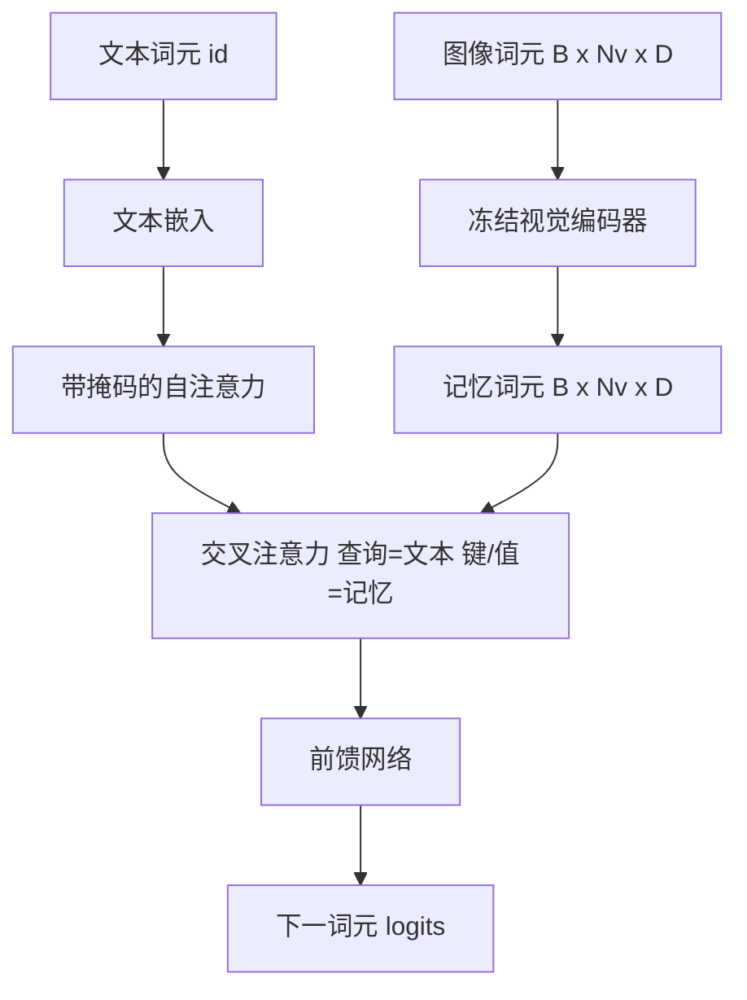
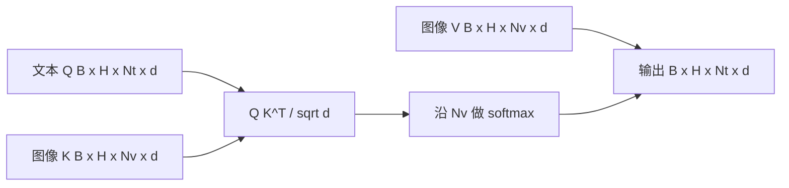

# 交叉注意力融合

> 投影层把一个图像向量和一个字幕向量对齐。真正的视觉语言解码器需要让每个文本词元关注每个图像 patch 词元，这样模型才能把每个词落到具体区域上。交叉注意力就是这种落地方式。文本发出查询，视觉键和值给出回答。本课会构建交叉注意力块、因果文本自注意力，以及让两者都合法的掩码形状。

**Type:** Build
**Languages:** Python
**Prerequisites:** Phase 19 lessons 30-37 (Track B foundations)
**Time:** ~90 minutes

## Learning Objectives

- 实现多头交叉注意力，其中查询流来自文本，键和值流来自视觉。
- 组合一个解码器块：因果自注意力 + 交叉注意力 + 前馈网络。
- 正确处理掩码形状：自注意力使用因果掩码，交叉注意力不使用掩码。
- 使用批量文本词元和固定图像词元池运行一次前向传播。

## 问题

把图像词元和文本词元拼成一个序列是一种融合方案，也就是早期融合，Chameleon 和 Emu3 走的是这条路。交叉注意力是另一种方案，也就是后期融合，由 Flamingo 引入，之后所有 Flamingo 形态的解码器都沿用了它。在后期融合中，文本解码器只在文本词元上运行，并在每一层通过交叉注意力伸手访问图像流。

后期融合有两个优点。第一，文本流保持干净，模型保留纯文本能力。第二，图像流对每张图像只计算一次，并在每个解码步骤复用，所以即使生成很长的字幕也很便宜。代价是每个块多一个注意力子层。

## 概念





### 掩码形状

解码器块里的两种注意力需要不同的掩码：

| Attention | Query length | Key length | Mask | Why |
|-----------|--------------|------------|------|-----|
| Self-attention | `Nt` (text) | `Nt` (text) | 因果：下三角 `(Nt, Nt)` | 自回归时文本词元不能向前看 |
| Cross-attention | `Nt` (text) | `Nv` (vision) | 无掩码 | 每个文本位置都可以看到整张图像 |

本课包含一个形状验证函数，这样把两者混用时会抛出清晰的 `ValueError`，而不是默默产出坏掉的损失曲线。

### 为什么交叉注意力不需要掩码

图像在生成任何文本之前已经完整可见。字幕的第 `t` 个词元可以关注图像的任意 patch。图像 patch 没有时间顺序。一些 Flamingo 变体在交织多张图像和多个文本片段时会添加逐样本掩码模式，但对于单张图像加一段字幕，交叉注意力会看到全部内容。

### 键值缓存

图像键和值在解码开始时计算一次，并保存在缓存中。每个新的文本词元都使用该缓存，不再重新计算。这就是字幕生成推理速度快的原因：重的 ViT 只运行一次，交叉注意力在每一步复用它的键和值。本课会暴露缓存并测试缓存命中路径。

### 块组合

一个解码器块按这个顺序运行：pre-LN -> self-attention -> residual -> pre-LN -> cross-attention -> residual -> pre-LN -> feed-forward -> residual。三个子层，各自带一个 LayerNorm。Flamingo 论文在交叉注意力上添加了可学习门控，让模型能选择退出图像路径，但会带来训练稳定性成本。这里使用的标准基线没有门控。

```python
class DecoderBlock:
  def forward(self, text_tokens, image_tokens, text_mask, cross_mask):
      text_tokens = text_tokens + self.self_attn(self.ln1(text_tokens),
                                                 mask=text_mask)
      text_tokens = text_tokens + self.cross_attn(self.ln2(text_tokens),
                                                  image_tokens,
                                                  mask=cross_mask)
      text_tokens = text_tokens + self.ffn(self.ln3(text_tokens))
      return text_tokens
```

## 构建

`code/main.py` 实现：

- `CrossAttention(hidden, heads)`，多头交叉注意力，带独立的 `q` 和 `kv` 投影。
- `CausalSelfAttention(hidden, heads)`，标准解码器中的带掩码自注意力。
- `DecoderBlock`，用 pre-LN 残差组合三个子层。
- `VisionLanguageDecoder`，四层解码器，输入来自模拟视觉编码器输出和小型文本嵌入表。
- `causal_mask(length)`，返回 `(length, length)` 下三角布尔张量。
- 一个演示：输入两条长度为 10 的文本序列，图像记忆长度为 197，并打印输出形状、自注意力掩码形状，以及每个位置的交叉注意力输出范数。

运行：

```bash
python3 code/main.py
```

输出：解码器会产生一个 `(2, 10, text_vocab)` 的 logits 张量。掩码形状为 `(10, 10)`。KV-cache 复用检查会确认缓存路径和非缓存路径得到相同 logits。

## 使用

交叉注意力出现在两个生产模型家族中：

- **Flamingo and IDEFICS.** 每 K 个语言模型块插入一个交叉注意力子层，并冻结 LM。视觉语言适配器就是交叉注意力块加上它的门控。
- **BLIP-2.** Q-Former 使用一组固定的 32 个查询词元对图像特征做交叉注意力，然后把这些查询投影到 LM 嵌入空间。

本课中的块形状可以直接映射到两者。掩码纪律，自注意力因果、交叉注意力无掩码，也相同。

## 测试

`code/test_main.py` 覆盖：

- 因果掩码是下三角，并匹配预期布尔形状
- 无论键长度如何，交叉注意力输出形状都是 `(B, Nt, hidden)`
- KV-cache 路径在浮点容差内匹配非缓存路径
- 文本流和图像流形状不匹配时抛出清晰的 `ValueError`
- 完整解码器前向传播产生正确的批量和序列形状

运行：

```bash
python3 -m unittest code/test_main.py
```

## 练习

1. 给交叉注意力残差添加一个可学习的 tanh 门控，也就是 Flamingo 技巧，并验证训练可以从接近零的初始门控收敛。门控从 0 开始，模型先恢复纯文本行为，再混入图像流。

2. 实现交织注意力，让同一个解码器消费多张图像和多个文本片段。构建逐样本交叉注意力掩码，防止文本片段 2 关注图像 1。

3. 在 `Nt=64, Nv=576`，也就是更高分辨率的 24x24 网格下，分析交叉注意力和自注意力层的性能。交叉注意力成本是 `Nt * Nv`，在高图像分辨率下占主导。

4. 在交叉注意力图上添加查询侧 dropout，并在演示中测量字幕多样性，交叉图中的 dropout 会提高字幕样本方差。

5. 把交叉注意力层替换成 Q-Former 风格的注意力块，其中固定的 32 词元查询池每层对图像特征关注一次。

## 关键术语

| Term | What it means |
|------|---------------|
| Late fusion | 文本和视觉保留在独立流中，交叉注意力在每个块中连接它们 |
| Cross-attention | Q 来自一个流，K 和 V 来自另一个流 |
| Causal mask | 下三角布尔掩码，用于防止自回归时向前看 |
| KV cache | 图像键和值只存一次，并在每个解码步骤复用 |
| Memory tokens | 解码器访问的冻结图像词元 |

## 延伸阅读

- Flamingo (2022)，了解带门控交叉注意力的标准后期融合设计。
- BLIP-2 (2023)，了解 Q-Former，它本质上是包装成可学习查询池的交叉注意力块。
- IDEFICS (2023)，了解 Flamingo 方案的开放权重复现。
