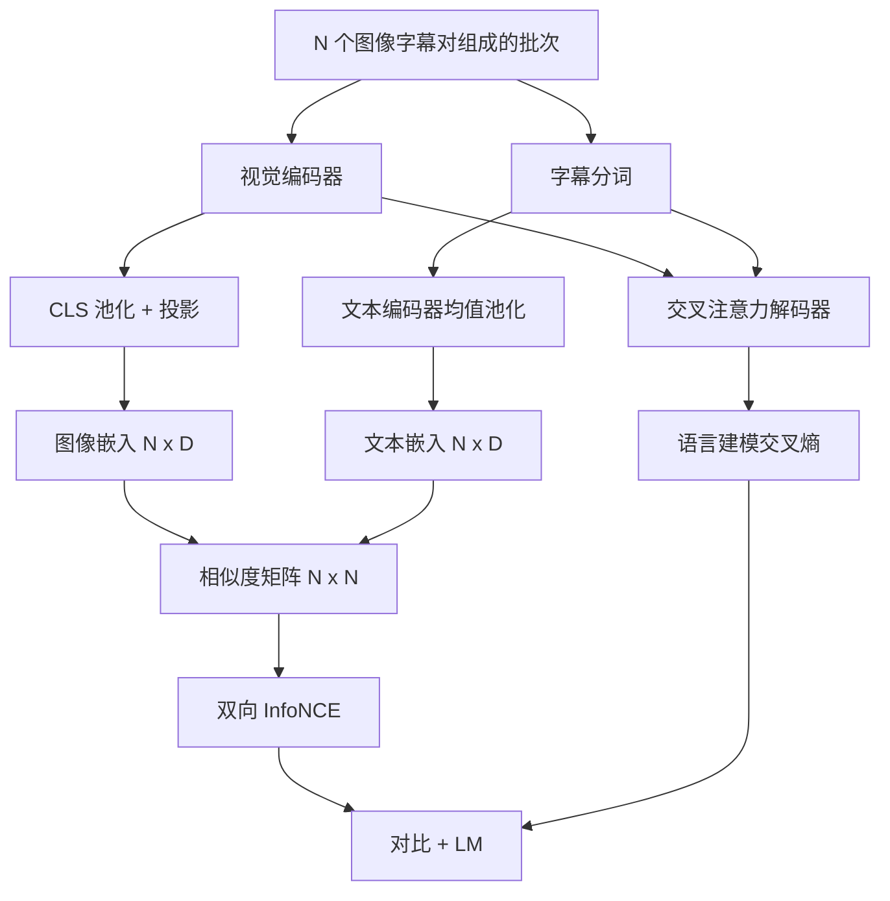

# 视觉语言预训练

> 编码器、投影层和解码器已经接好。现在把它们一起训练。学习由两个目标驱动：一个是对比式图像文本损失 InfoNCE，它把联合嵌入空间中的匹配对拉近；另一个是语言建模损失，它要求解码器为每张图像写字幕。组合起来，它们教会网络既能为字幕找到正确图像，也能为图像写出字幕。

**Type:** Build
**Languages:** Python
**Prerequisites:** Phase 19 lessons 30-37 (Track B foundations)
**Time:** ~90 minutes

## Learning Objectives

- 在一批图像字幕对上实现 InfoNCE 对比损失。
- 将对比损失和自回归语言建模损失组合起来。
- 合成一个 200 对的模拟图像字幕语料，不下载真实数据集。
- 运行 50 步演示训练循环，并观察两种损失都在下降。

## 问题

视觉语言模型需要两项能力。它必须能排序：给定一段字幕，从很多图像中找到正确图像。它也必须能生成：给定一张图像，写出字幕。只用其中一种能力预训练模型，只会得到半套系统。CLIP 很擅长排序，但不能写字幕。GPT-4V 能写字幕，但会用单独的检索头做排序。多目标预训练能一次得到两种能力。

InfoNCE 处理排序部分。对于一批 N 个配对样本，模型把 N 个匹配对视为正样本，把 `N^2 - N` 个不匹配对视为负样本，然后在得到的 `(N, N)` 相似度矩阵上运行交叉熵损失。LM 损失处理生成部分：以图像为条件做标准下一词元预测。两种损失都可微，并且可以共享编码器、投影器和解码器权重。

## 概念



### 用一段话解释 InfoNCE

把 N 个图像嵌入按行堆叠，把 N 个文本嵌入也按行堆叠。对两者做 L2 归一化。计算 `N x N` 矩阵 `S = I T^T / tau`，其中 `tau` 是可学习温度。对角线条目是匹配对，非对角线条目是负样本。使用沿对角线向下的目标 `argmax` 应用交叉熵：第 `i` 行的最高条目应该在第 `i` 列。再沿列方向对称地做同样计算。总损失是两者的平均值。这就是八行代码里的 CLIP 损失。

### 温度很重要

温度 `tau` 控制 softmax 有多尖锐。太小，例如 `tau = 0.01`，梯度几乎只来自最难负样本，训练会很嘈杂。太大则 softmax 变平，梯度消失。CLIP 把 `tau` 作为参数学习，本演示也一样。

### 语言建模损失

解码器通过交叉注意力消费图像记忆词元，并在每个位置预测下一个文本词元。损失是标准交叉熵，目标是下一位置词元。padding 位置会从损失中屏蔽。

### 组合损失

`total = contrastive + lm_weight * lm`，其中 `lm_weight` 是标量，通常为 1.0。两种损失共享进入编码器和投影的梯度，只有解码器接收 LM 损失梯度。这就是 CoCa、BLIP 和 SigLIP 风格模型都会使用的多任务方案，只是权重不同。

| Component | Loss surface | Affects |
|-----------|--------------|---------|
| InfoNCE | 联合空间中的配对排序 | 编码器 + 投影 + 文本头 |
| LM | 以图像为条件的词元预测 | 编码器 + 投影 + 解码器 |
| Combined | 多任务 | 整个栈 |

### 为什么 50 步足够演示

模拟语料是一个合成的 200 对集合，包含随机图像和随机字幕 id。使用 batch size 16 训练 50 步 SGD 后，即使绝对值仍高于真实数据模型，两种损失也会明显下降。演示的重点是确认梯度管线端到端工作，并且添加 LM 损失不会破坏对比目标。

## 构建

`code/main.py` 实现：

- `MultimodalModel`，组合小型 ViT 编码器、MLP 投影器、一个微型文本侧编码器，对嵌入 id 做均值池化，以及第 61 课的交叉注意力解码器。
- `info_nce_loss(image_emb, text_emb, temperature)`，CLIP 风格的双向对比损失。
- `lm_loss(logits, target_ids, padding_id)`，带掩码的下一词元交叉熵。
- `make_mock_corpus(seed, n_pairs)`，返回 200 个确定性的 `(image, caption_ids)` 配对。
- 一个训练循环，使用 batch size 16、Adam 优化器和可学习 log-temperature 参数运行 50 步。每 5 步打印两种损失。

运行：

```bash
python3 code/main.py
```

输出：对比损失从约 `ln(16) = 2.77` 降向 2.4；LM 损失从随机均匀基线 `ln(512) ≈ 6.24` 降向约 4.7。两者下降证明梯度连接正确。真实模型会训练数百万步，但动态相同。

## 使用

这是以下模型中使用的同类损失方案：

- **CLIP (2021).** 只做图像文本对比，并带一个独立的冻结编码器字幕探针。
- **CoCa (2022).** 在一个模型中同时使用图像文本对比和图像字幕 LM 损失。本课构建的正是这种模式。
- **BLIP (2022) and BLIP-2.** 对比 + LM + 图像文本匹配头。三种损失组合。
- **SigLIP (2023).** 把 InfoNCE 换成 sigmoid 配对损失。对比角色相同，函数形式不同。
- **LLaVA family.** 两阶段训练，第一阶段是对齐，在冻结 LM 上做余弦；第二阶段解冻 LM 并添加 LM 损失。第 60 课对应第一阶段，本课对应第二阶段。

## 测试

`code/test_main.py` 覆盖：

- InfoNCE 损失在图像和文本行之间对称
- 当相似度矩阵是大正数的完美对角矩阵时，InfoNCE 损失返回 0
- LM 损失正确屏蔽 padding 位置
- 模型前向传播能无错误地产生两种损失
- 5 步训练循环会降低组合损失

运行：

```bash
python3 -m unittest code/test_main.py
```

## 练习

1. 用 SigLIP 风格的 sigmoid 配对损失替换 InfoNCE，并比较它在模拟语料上的收敛情况。

2. 添加 hard-negative mining 步骤：每隔一个批次，从前一个批次里选择最难的非对角配对并追加进去。训练并观察对比损失是否下降更快。

3. 在联合嵌入上方添加一个图像文本匹配二分类头，判断真假：两者是否匹配，作为第三个损失，复现 BLIP 的三头设置。

4. 把模拟语料替换成从 Markov 链抽样的 caption-id 序列，其转移矩阵以图像哈希为条件。因为存在真实可学信号，字幕损失应该进一步下降。

5. 用 `lm_weight = 0` 训练同一个模型，再用 `lm_weight = 1` 训练。比较对比损失，LM 损失不应让排序目标退化。

## 关键术语

| Term | What it means |
|------|---------------|
| InfoNCE | 噪声对比估计：在相似度矩阵上做交叉熵 |
| Temperature | 控制对比 softmax 尖锐程度的标量 |
| Hard negative | 模型觉得困惑的非对角配对，对采样有用 |
| LM loss | 字幕侧标准下一词元交叉熵 |
| Joint embedding space | 图像和文本向量经投影后所在的共享空间 |

## 延伸阅读

- CLIP 论文，了解原始对比方案。
- CoCa 论文，了解一个模型中的对比加字幕生成。
- SigLIP 论文，了解 sigmoid 配对损失变体及其更好扩展的原因。
