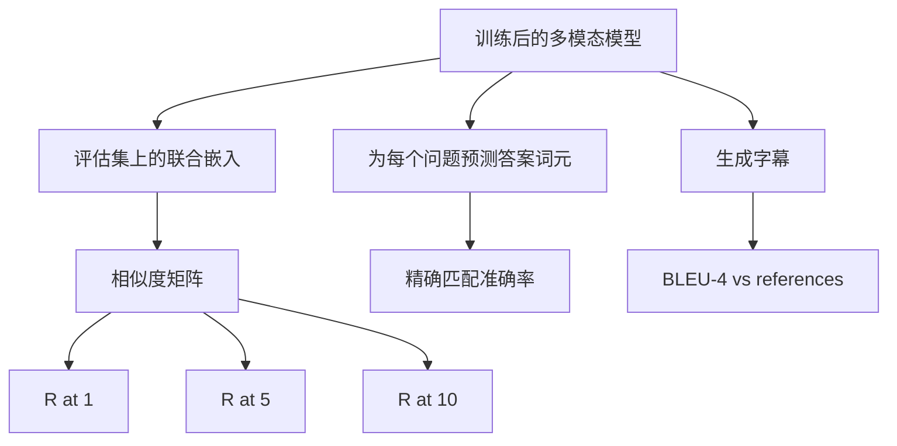

# 多模态评估

> 训练只是循环的一半。另一半是测量。本课从基础组件构建三种评估表面：图像字幕检索，用 R@1、R@5、R@10 报告；视觉问答，用精确匹配准确率报告；图像字幕生成，用 BLEU-4 报告。每个指标都是一个作用于模型输出的函数，并配有一个数秒内运行完成的合成评估套件。

**Type:** Build
**Languages:** Python
**Prerequisites:** Phase 19 lessons 58-62 (Track E foundations: encoder, transformer, projection, cross-attention fusion, pretraining)
**Time:** ~90 minutes

## Learning Objectives

- 从图像和字幕嵌入之间的相似度矩阵计算 Recall@K。
- 从把 `(image, question)` 配对映射到固定答案词表的模型计算精确匹配 VQA 准确率。
- 不使用任何外部库，从生成词元序列和参考词元序列计算 BLEU-4。
- 基于第 62 课训练好的模型运行全部三种评估。

## 问题

当训练损失进入平台期时，很容易想宣布多模态模型已经完成。训练损失衡量的是训练分布上的拟合，不衡量模型能否在留出批次中排序配对、回答问题，或写出人类能接受的字幕。三种评估表面很标准：

- **Retrieval (R@1, R@5, R@10).** 为查询字幕构建联合嵌入，按余弦相似度排序评估池里的每张图像，报告匹配图像是否落在前 1、前 5、前 10。对称的 image-to-text 形式用同样方式运行。
- **Visual question answering (exact match).** 给定 `(image, question)`，模型输出一个答案词元。精确匹配对每个样本是一位判断：预测答案是否等于参考答案？在评估集上取平均。
- **Captioning (BLEU-4).** 生成字幕。计算 1-gram 到 4-gram 精度相对参考字幕的几何平均，并带长度惩罚。多参考是标准形式，一张图像对应多条参考字幕。

每个指标都是薄函数。本课会用代码把它们全部构建出来，让数学具体，并让评估表面受你控制。真实基准套件，MS-COCO、VQA v2、GQA、OK-VQA，都可以接入相同函数形状。

## 概念



### 从相似度矩阵计算 Recall@K

构建图像嵌入和字幕嵌入之间的 `(N, N)` 余弦相似度矩阵。对每一行，按相似度降序排列列。Recall@K 是对角线列索引位于前 K 个位置内的行比例。对称 Recall@K，caption-to-image，在转置矩阵上计算。两种数值都会报告。对于 N=100 的评估，R@1 = 0.6 表示 100 条字幕中有 60 条把正确图像检索为第一名。

### VQA 精确匹配

对于每个 `(image, question, answer)`，编码图像，嵌入问题，通过解码器融合，然后读出下一个词元。预测词元 id 与参考 id 比较，相等则正确。在评估集上取平均。真实 VQA 数据集每个问题带有多个人类标注答案，并使用软准确率公式，如果 10 个标注者中至少 3 个同意则为 1.0，低于时按比例缩放。本课为清晰起见使用单答案精确匹配。

### BLEU-4

```text
BLEU-4 = BP * exp(mean(log p1, log p2, log p3, log p4))
```

其中 `p_n` 是修正 n-gram 精度，也就是生成 n-gram 中出现在任意参考中的裁剪计数，除以生成 n-gram 总数。`BP` 是长度惩罚：

```text
BP = 1                if generated length > reference length
   = exp(1 - r/g)     otherwise, where r is reference length and g is generated
```

对于小样本，某些 `p_n` 可能为零，因此需要平滑。实现使用 Chen and Cherry 的 “method 1”，对任何零计数的分子和分母都加 1。这是低计数场景下最安全的默认值。

### 合成评估套件

一个 50 样本评估套件会用第 62 课的模拟语料模式在内存中构建，并使用留出 seed。套件由三个列表组成：

- `pairs`：50 个用于检索的 `(image, caption_ids)` 配对。
- `vqa`：50 个 `(image, question_ids, answer_id)` 三元组。
- `caps`：50 个 `(image, [reference_caption_ids, ...])` 条目，每张图像最多 3 条参考。

套件由 seed 确定，并且从训练语料中留出，所以指标会在模型从未见过的数据上计算。把套件持久化为 JSON 留作练习，见下方。

| Metric | Range | Random baseline (N=50) |
|--------|-------|------------------------|
| R@1 | 0 到 1 | 0.02 (1 / N) |
| R@5 | 0 到 1 | 0.10 |
| R@10 | 0 到 1 | 0.20 |
| VQA EM | 0 到 1 | 1 / vocab |
| BLEU-4 | 0 到 1 | 小但非零 |

对于合成数据上的 50 步训练运行，不期望指标很高，只期望它们高于随机基线，这正是演示会检查的内容。

## 构建

`code/main.py` 实现：

- `recall_at_k(sim_matrix, k)`，为两个方向返回 `[0, 1]` 内的浮点数。
- `vqa_exact_match(predictions, references)`，返回 `int` 相等结果的均值。
- `bleu4(generated, references, smoothing=True)`，支持多参考。
- `build_eval_suite(seed, n_samples, vocab_size, max_len)`，返回三个确定性评估列表。
- `evaluate(model, suite)`，运行全部三种指标并返回数值 `dict`。
- 一个演示：加载第 62 课中新初始化的多模态模型，先评估，再训练 50 步后再次评估，并打印前后指标。

运行：

```bash
python3 code/main.py
```

输出：前后指标表显示检索从接近随机提升到模型学到的信号，VQA 高于随机，BLEU-4 也提升，合成结构足以带来 4-gram 精度提升。

## 使用

每个指标都直接映射到生产基准：

- **Retrieval.** MS-COCO 5K val、Flickr30K、ImageNet zero-shot 都是在同一相似度矩阵上的 R@K 问题。把合成评估替换为真实文件，函数签名不变。
- **VQA.** VQA v2、GQA、OK-VQA 使用同样的精确匹配形状，VQA v2 用 soft-acc 而不是单答案 EM。
- **BLEU-4.** MS-COCO captioning、NoCaps、Flickr30K captioning 都使用 BLEU-4 加 CIDEr 和 METEOR。添加 CIDEr 只是再写一个函数。

对于真实基准，把 `build_eval_suite` 换成真实加载器，并保留函数体。数学不依赖具体基准。

## 测试

`code/test_main.py` 覆盖：

- recall@k 在完美单位相似度矩阵上返回 1.0，在翻转矩阵上对 k < N 返回 0.0
- recall@k 遵守 `k <= N` 上界
- 当生成序列和其中一个参考完全相同时，bleu4 返回 1.0
- 当词表完全不相交时，bleu4 返回 0.0
- vqa 精确匹配等于相等配对的比例
- build_eval_suite 返回预期数量的配对、vqa 项和字幕条目

运行：

```bash
python3 -m unittest code/test_main.py
```

## 练习

1. 给字幕指标添加 CIDEr。CIDEr 对 n-gram 使用 TF-IDF 权重，会奖励信息量更高的词元。

2. 实现 VQA soft-accuracy：每个问题有多个人类答案，如果任意匹配，则准确率为 `min(human_count / 3, 1)`。复现 VQA v2。

3. 添加一个 NaN 安全版本的 `bleu4`，能处理空生成序列而不崩溃。

4. 在 R@K 旁边计算 mean reciprocal rank (MRR)。MRR 对正确项落在 top K 之外的具体位置敏感，R@K 只关心它是否进入 top K。

5. 在训练期间五个检查点，step 0、10、20、30、40、50，运行评估并绘制学习曲线。确认指标轨迹跟随损失轨迹。

## 关键术语

| Term | What it means |
|------|---------------|
| R@K | 正确匹配落在前 K 个结果中的查询比例 |
| Exact match | 最简单的 VQA 评分：预测答案等于参考答案 |
| BLEU-4 | 1 到 4-gram 精度的几何平均，带长度惩罚 |
| Multi-reference | 字幕指标接受每张图像的多条参考字幕 |
| Held-out | 评估集从与训练语料不同的 seed 中采样 |

## 延伸阅读

- VQA v2 论文，了解 soft-accuracy 公式和数据集统计。
- CIDEr 论文，了解使用 TF-IDF 加权 n-gram 的字幕评分。
- BLEU 原始论文，Papineni et al., 2002，了解平滑变体。
- MS-COCO captioning eval scripts，了解标准参考实现。
