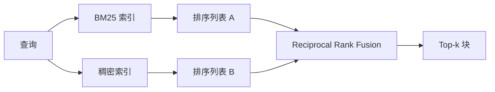

# 使用 BM25 和稠密嵌入的混合检索

> 词法检索和语义检索会在相反的查询分布上失败。带 reciprocal rank fusion 的混合检索不是插值，而是投票，并且这种投票在每类查询上都能赢。

**Type:** Build
**Languages:** Python
**Prerequisites:** Phase 11 lessons 04 (embeddings), 06 (RAG); Phase 19 Track B foundations (lessons 20-29); Phase 19 lesson 64 (chunking strategies)
**Time:** ~90 minutes

## Learning Objectives
- 按 Robertson and Sparck Jones 公式从零实现 BM25，包含字段权重、文档长度归一化，以及可调 k1 和 b。
- 基于确定性模拟嵌入构建稠密检索器，让循环离线运行。
- 精确实现 Cormack、Clarke 和 Buettcher 在 2009 年发表的 reciprocal rank fusion，并解释为什么它优于分数加权插值。
- 调整 RRF k 常数和每个模态的权重，并在小型 fixture 语料上读出取舍。

## 问题

当查询包含语料中逐字出现的字面标识符时，词法搜索会胜出。查询 `AbortMultipartOnFail` 可以让 BM25 在微秒内返回正确的 Go 函数。同一个查询如果被嵌入，会落在三个相似度聚类的边界上，稠密检索器会把错误文件排在第一。

当查询已经从语料的字面词中改写出去时，稠密搜索会胜出。用户问 “how do we handle cancelled uploads” 时，从未输入 abort 或 multipart。BM25 返回关于 “uploading large files” 的文档块，因为那页包含 uploads。稠密检索会找到摘要中提到 cancellation 的 abort 函数。

二者之间的选择不是静态的。查询分布才是变量。生产 RAG 系统从同一个端点处理两类查询，所以检索必须同时处理两者。这就是混合检索。合并步骤必须正确。

## 概念



### 用一段话解释 BM25

BM25 通过对查询词求和来给 query-document 配对打分。每个查询词贡献一个逆文档频率因子，乘以带长度归一化修正的饱和词频因子。两个旋钮。`k1` 控制词频饱和，默认 1.5 是论文推荐值，没有基准不要改。`b` 控制文档长度有多重要，默认 0.75 表示长文档会被惩罚，但不是线性惩罚。

IDF 公式使用平滑后的 Robertson and Sparck Jones 定义，即 `log((N - df + 0.5) / (df + 0.5) + 1)`。log 内部的加一让某个词出现在超过一半语料中时 IDF 仍为正。在小语料中，停用词技术上也可能很稀有，这一点很重要。

字段权重让你告诉 BM25，符号名中的匹配比正文中的匹配更重要。实现方式是在索引期间对词频乘以权重，而不是在评分时处理。这样数学保持一致，也避免为每个字段单独计算分数。

### 用一段话解释稠密检索

用嵌入模型把每个块嵌入为固定维向量。查询时，嵌入查询，按余弦相似度对每个块排序，并返回 top-k。模型是决定质量的变量。检索算法本身只有两行：点积和排序。

本课使用确定性的哈希嵌入，这样你无需网络调用就能阅读融合数学。哈希会把按词元键控的偏移加到一个 96 维向量中，然后归一化。余弦排序跨运行确定，这是测试套件所需的。

### Reciprocal rank fusion，已发表公式

两个排序列表。对于出现在任一列表中的每个候选项，求和它的 reciprocal-rank 贡献。2009 年论文使用 `1 / (k + rank)`，默认 k 等于 60。按总分排序。算法就是这些。

论文中的常数 k = 60 不是随意的。k = 60 时，rank-1 的贡献是 1 / 61，rank-10 的贡献是 1 / 70。贡献衰减很慢，所以较深的候选项仍然能投票。更小的 k 会让顶部结果占主导。更大的 k 会拉平贡献曲线。

我们的实现里有两个可调旋钮。`k` 常数。一对每模态权重，让你在已有先验表明某个模态对语料更好时提升 BM25 或 dense。把 rank 贡献乘以权重是最简单且有原则的实现。它保留 rank 衰减形状，并保持无尺度。

### 为什么融合优于分数加权插值

BM25 分数无界且依赖语料。余弦相似度有界在 -1 到 1。线性组合 `alpha * bm25 + (1 - alpha) * cosine` 需要逐语料调 alpha，并且每次重建索引都会失效。基于排名的融合不会这样。两个排名可以跨模态比较。公开 TREC track 中，自 2010 年以来，RRF 基线都优于分数插值。

这和 Vespa、Weaviate 文档里关于 RankFusion vs RRF 的论点相同。它们得出同样结论：除非你有非常强的证据要插值分数，否则保持基于排名。

## 构建

`code/main.py` 实现：

- `tokenize(text)`，快速正则分词器。
- `BM25Index`，带字段权重，支持 `add` 和 `search`，并可调 k1、b。
- `mock_embed`, `DenseIndex`，与第 64 课相同的确定性嵌入，让块可以比较。
- `rrf(rankings, k, weights)`，带多模态权重的论文版融合。
- `HybridRetriever`，组合 BM25 和 dense。
- 一个演示 `main()`，加载小型 fixture 语料，运行三个分别瞄准各检索器强弱点的查询，并打印每个模态产生的排名以及融合列表。

运行：

```bash
python3 code/main.py
```

并排阅读演示输出。字面标识符查询在 BM25 中 rank 1，在 dense 中 rank 4，在 RRF 中 rank 1。改写查询在 BM25 中 rank 6，在 dense 中 rank 1，在 RRF 中 rank 1。歧义查询在 BM25 中 rank 3，在 dense 中 rank 3，在 RRF 中 rank 1。融合不是破同分器，而是在每类查询上获胜的系统。

## 调整旋钮

| Knob | Default | Move it up when | Move it down when |
|------|---------|----------------|------------------|
| BM25 k1 | 1.5 | 词在文档中重复，并且你希望频率更重要 | 文档很短，词重复是噪声 |
| BM25 b | 0.75 | 长文档确实每个词信息量更低 | 文档长度与主题无关 |
| RRF k | 60 | 较深候选项也应该继续投票 | top-1 应该占主导 |
| BM25 weight | 1.0 | 语料包含字面标识符，查询会匹配它们 | 查询是用户改写后的 |
| Dense weight | 1.0 | 查询是改写后的 | 查询是字面的 |

通过在你的留出查询集上重新运行第 68 课的评估测试框架来调参，不要凭直觉。

## 演示会隐藏的失败模式

**词表外词元。** BM25 的 IDF 从语料中计算，所以只出现在查询中的词贡献为零。稠密嵌入会为同一个词幻觉出一个向量。对于语料外标识符，稠密模态会返回看似合理但错误的邻居。融合能吸收这一点，因为 BM25 不返回结果，rank 贡献会消失，但前提是按文档去重，而不是按块去重。

**停用词支配。** BM25 查询 “the” 会在语料上产生均匀排名。在索引器中过滤停用词，或者接受高 IDF 词自然占主导。

**跨模态内容相同。** 如果语料小到 BM25 的 top-1 也是 dense 的 top-1，RRF 会给出同样的 top-1 和同样邻居。这是正确行为，不是失败，但会让融合看起来不可见。向评估中添加一组对抗查询来验证融合确实工作。

## 使用

生产模式：

- 在进程内索引 BM25，瓶颈是词频字典，不是向量。
- 在独立存储中索引稠密向量，本课使用平面列表，生产中会使用 HNSW。
- 并行运行两种查询，融合只是对并集做常数时间合并。
- 持久化每个检索命中的模态，这样下游重排器能看到哪个模态投了票。

## 交付

第 66 课会接收本课融合后的 top-k，并用 cross-encoder 重排。第 68 课会用 precision、recall、MRR 和 nDCG 评估整个流水线。本课的混合检索器是第 69 课端到端系统的第一阶段。

## 练习

1. 用 provider 的真实模型替换 `mock_embed`。重新运行演示，并报告 dense-only 排名在改写查询上的变化。
2. 添加第三种模态：单独索引块摘要，并作为第三个排序列表融合。测量收益。
3. 扫描 RRF k，取 10、30、60、100、200。绘制第 68 课中的 recall@k 曲线。报告你的语料上曲线峰值对应的 k。
4. 正确实现 BM25F，也就是逐字段长度归一化，而不是乘数技巧，并在符号匹配最重要的语料上比较。

## 关键术语

| Term | What people say | What it actually means |
|------|-----------------|------------------------|
| BM25 | “Lexical search” | 带 idf x 饱和 tf x 长度归一化的概率排序 |
| RRF | “Rank fusion” | 跨排序列表求和 1 / (k + rank)，k = 60 为默认值 |
| k1 | “TF saturation” | 控制重复词停止增加分数的速度 |
| b | “Length penalty” | 0 表示忽略文档长度，1 表示完整归一化 |
| Field weighting | “Symbol boost” | 在索引期间重复词元，以提升该字段中的匹配 |
| Rank-based vs score-based fusion | “Why RRF beats linear” | 排名可跨模态比较，分数不能 |

## 延伸阅读

- Cormack, Clarke, Buettcher, “Reciprocal Rank Fusion outperforms Condorcet and individual rank learning methods”, SIGIR 2009
- Robertson, Walker, Beaulieu, Gatford, Payne, “Okapi at TREC-3”，原始 BM25 论文
- [Vespa: Hybrid Retrieval with BM25 and Embeddings](https://docs.vespa.ai/en/tutorials/hybrid-search.html)
- [Weaviate: Hybrid Search](https://weaviate.io/developers/weaviate/search/hybrid)
- Phase 11 lesson 06，RAG fundamentals
- Phase 19 lesson 64，产生这里被索引的块的分块器
- Phase 19 lesson 66，消费融合 top-k 的 cross-encoder reranker
