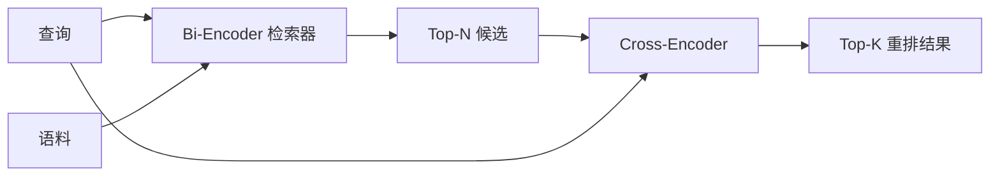

# Cross-Encoder 重排器

> Bi-encoder 会分别嵌入查询和文档。Cross-encoder 会把它们拼接起来，一次读取两者。Cross-encoder 是最聪明的读者，也是最慢的读者。把它作为 bi-encoder top-k 之后的第二阶段使用，收益足以抵消成本。

**Type:** Build
**Languages:** Python
**Prerequisites:** Phase 11 lesson 06 (RAG), Phase 11 lesson 07 (advanced RAG); Phase 19 Track B foundations (lessons 20-29); Phase 19 lesson 65 (hybrid retrieval feeding this stage)
**Time:** ~90 minutes

## Learning Objectives
- 通过输入形状、参数量和每查询成本区分 bi-encoder 检索器与 cross-encoder 重排器。
- 从零实现一个小型 cross-encoder，它是消费打包后 `(query, document)` 序列并输出单个相关性标量的 transformer 块。
- 串起两阶段 retrieve-then-rerank 流水线：用便宜检索器取 top-N，用 cross-encoder 从 N 重排到 top-K，并返回 K。
- 在小型 fixture 语料上测量延迟与质量的取舍，并为给定延迟预算选择合适的 N。

## 问题

Bi-encoder 会把查询和文档映射到同一个向量空间，并按余弦相似度排序。两次编码彼此看不见。模型必须在不知道查询的情况下，把文档里所有有用信息压进单个向量。这很快，索引时每个文档嵌入一次，查询时每个查询嵌入一次，而且这是在语料规模上排序的唯一办法。

代价是精度。两个文档如果整体主题相同，即使其中一个回答查询而另一个没有，它们的嵌入也可能几乎一样。Bi-encoder 无法区分它们。

Cross-encoder 通过一起读取查询和文档来解决这个问题。模型接收 `[query] [SEP] [document]` 作为单个序列，在拼接处运行完整注意力，并产生一个相关性标量。文档中的每个词元都可以关注查询中的每个词元。模型用完整上下文决定分数。

代价是吞吐。Bi-encoder 嵌入一次后可以长期查询，cross-encoder 则要对每个 `(query, document)` 配对运行一次。对于 1000 万文档语料，这意味着每个查询要做 1000 万次前向传播。在请求预算内无法运行。

解决方案是分阶段。先用 bi-encoder 检索 top-N。再用 cross-encoder 把 N 重排到 top-K。N 很小，通常 50 到 200，而 cross-encoder 的质量提升集中在最重要的位置。总延迟留在请求预算内。总质量接近 cross-encoder 的质量，但受 bi-encoder 在 N 上召回率的上限限制。

## 概念



### Cross-encoder 的输入形状

标准打包方式是 `[CLS] query_tokens [SEP] document_tokens [SEP]`。CLS 位置输出会送入一个单线性头，输出相关性标量。有些实现使用 mean-pooling 而不是 CLS，差别不大。重点是模型为每个配对产生一个数字。

2200 万参数的 cross-encoder，也就是已发布的 `ms-marco-MiniLM-L-6-v2` 权重量级，是典型生产点。更小模型损失质量的速度快于节省延迟的速度。更大模型，例如 5.68 亿参数的 `bge-reranker-v2-m3`，通常保留给离线重排，或 K 很小的首页重排。

### 为什么本课训练一个微型模型

真实 cross-encoder 是微调后的编码器 transformer。生产中你会加载 checkpoint 并运行它。本课的目标是展示模型形状和延迟质量曲线形状，而不是训练最先进的排序器。因此我们构建一个小型 `nn.Module`，包含一个 transformer 块、多头注意力，默认 4 个头，以及一个回归头。它从 seed 确定性初始化，所以演示不需要磁盘权重也可复现。

玩具模型从 fixture 语料中学到正确形状：相关的 query-document 配对比分相关配对预测分数更高。端到端流水线会重排 bi-encoder 输出，重排后的 top-k 与 gold labels 相关。

### 延迟与质量

两阶段流水线有一个可调项：N。在留出查询集上从 5 到 100 扫描 N，就会得到曲线。

| N | Recall@1 of stage 2 | Cross-encoder forward passes per query | Latency |
|---|--------------------|---------------------------------------|---------|
| 5 | 0.62 | 5 | 低 |
| 20 | 0.81 | 20 | 中 |
| 50 | 0.86 | 50 | 高 |
| 100 | 0.86 | 100 | 很高 |

上面的数字只是说明形状，不是这个 fixture 的测量值。但曲线形状是真实的。通常在 20 到 50 个候选附近会出现拐点，重排收益开始饱和。过了拐点，你就在为空成本付费。

根据评估曲线和延迟预算选择 N。Cross-encoder 无法把召回率提升到 bi-encoder 在 N 上的召回率之上，所以过低的 N 限制的不只是延迟，还有质量。

## 构建

`code/main.py` 实现：

- `CrossEncoder`，一个小型 `torch.nn.Module`：词元嵌入、一个带多头注意力和前馈网络的 transformer 块，以及产生单个标量的 mean-pooled head。
- `tokenize_pair(query, document)`，把两个字符串打包成带 type ids 的单个 id 序列，用 type ids 标记边界，确定且只用 stdlib。
- `train_tiny(pairs)`，在手工标注的 `(query, document, relevance)` 三元组列表上做一轮监督训练，让模型在 fixture 上产生合理分数。
- `rerank(query, candidates, top_k)`，生产接口。
- `pipeline(query, retriever, top_n, top_k)`，两阶段流程。
- 一个演示 `main()`，从第 65 课模式加载语料，检索 top-N，重排到 top-K，并排打印两个列表，并报告每个阶段的延迟。

运行：

```bash
python3 code/main.py
```

输出会显示 bi-encoder 的 top-N、cross-encoder 的 top-K，以及计时摘要。Cross-encoder 每次调用更慢，但不会在整个语料上运行。两阶段总延迟仍在请求预算内，同时能选出 bi-encoder 排在第二或第三的答案。

## 演示会隐藏的失败模式

**Cross-encoder 不对称。** `rerank(q, d)` 和 `rerank(d, q)` 是不同分数。始终把查询放在前面。如果意外交换，召回会崩掉。

**N 太低，暴露不出问题。** 如果设置 N = K，cross-encoder 不能重新排序，只能重新加权。提升看起来为零。让 N 至少是 K 的三倍。

**训练数据泄漏到评估。** 如果手工标注训练配对包含评估查询，重排看起来会像魔法。即使在 fixture 上，也要严格分离训练和评估。

**生产权重很密集。** 2200 万参数 cross-encoder 在 float32 下是 88MB。承诺 sub-100ms p95 前，先规划模型服务器内存。

**批处理很重要。** 真实 cross-encoder 会把 N 个候选放进一个批次运行。本课在 `_batch_encode` 中这样做，它用 `torch.tensor(...)` 构建批量 id 和 type-id 张量，并运行一次前向传播。跳过批处理，延迟会乘以 N。

## 使用

生产模式：

- 把 bi-encoder、cross-encoder 和 N 绑定在一起。更改任何一个都会让评估失效。
- 按 `(query, document_id)` 哈希缓存重排器输出。同一个查询面对稳定语料会重排成相同顺序，缓存命中可以免费降低延迟。
- 记录 rank-1 cross-encoder 分数。top-1 分数低于语料特定阈值的查询是域外命中，应向 LLM 暴露为 “I am not confident”。

## 交付

第 68 课会端到端评估这个两阶段流水线。第 69 课会把这个重排器接在第 65 课混合检索器之后、答案生成器之前。重排器是端到端系统的第二阶段。

## 练习

1. 从 5 到 50 扫描 N，并绘制重排输出的 recall@1。在这个 fixture 上找到拐点。
2. 把 cross-encoder 训练十个 epoch，而不是一个。测量每个 epoch 上正负配对之间的分数间隔。
3. 用 CLS-token head 替换 mean-pooling。比较这个 fixture 上的收敛情况。
4. 添加第二个 cross-encoder 头，预测二分类标签 “is this answer in the document”。推理时使用两个头，一个排序，一个做阈值判断。
5. 用第 65 课里的确定性模拟 bi-encoder 替换当前组件，并串起两个阶段。测量相对只用 bi-encoder 的 top-K 变化。

## 关键术语

| Term | What people say | What it actually means |
|------|-----------------|------------------------|
| Bi-encoder | “Vector retriever” | 独立编码查询和文档，并用余弦排序 |
| Cross-encoder | “Reranker” | 联合编码 `(query, doc)`，输出一个相关性标量 |
| Two-stage pipeline | “Retrieve and rerank” | 便宜检索器返回 N，昂贵重排器保留 K |
| N (candidate budget) | “Rerank pool” | cross-encoder 每个查询要评分的候选数量 |
| Mean-pooling head | “Mean of last hidden” | 把编码器最后一层输出平均成一个向量 |

## 延伸阅读

- Nogueira, Cho, “Passage Re-ranking with BERT”, 2019，标准 cross-encoder ranker 论文
- Reimers, Gurevych, “Sentence-BERT: Sentence Embeddings using Siamese BERT-Networks”, 2019，关于 bi-encoders vs cross-encoders
- [SentenceTransformers Cross-Encoders documentation](https://www.sbert.net/examples/applications/cross-encoder/README.html)
- [BGE Reranker v2 model card](https://huggingface.co/BAAI/bge-reranker-v2-m3)
- Phase 19 lesson 65，为这个重排阶段供给候选的混合检索器
- Phase 19 lesson 68，测量该重排带来提升的评估
