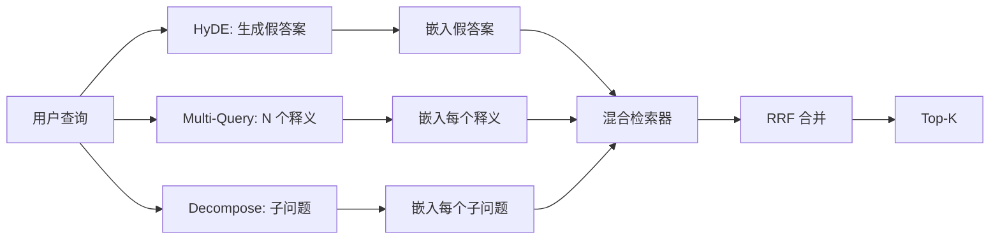

# 查询重写：HyDE、Multi-Query 和 Decomposition

> 用户输入的查询不是检索器想要的查询。重写会在检索前弥合这道差距，让索引看到更接近答案样子的东西。

**Type:** Build
**Languages:** Python
**Prerequisites:** Phase 11 lessons 04 (embeddings), 06 (RAG); Phase 19 Track B foundations (lessons 20-29); Phase 19 lessons 64 and 65
**Time:** ~90 minutes

## Learning Objectives
- 实现 Hypothetical Document Embeddings (HyDE)：生成一个假答案，嵌入它，并用这个向量而不是查询向量检索。
- 实现 multi-query expansion：把一个查询重写成 N 个释义，用每个释义检索，并用 reciprocal rank fusion 合并并集。
- 实现 query decomposition：把复杂问题拆成子问题，逐子问题检索，再合并。
- 在 fixture 上正面对比三种重写器，并解释每种策略何时胜出。
- 接入一个生成确定性 fixture 输出的模拟 LLM，让重写循环离线运行。

## 问题

用户输入 “what does our team do when uploads fail and the budget is gone?”。语料里有一篇文档写着 “AbortMultipartOnFail aborts an in-flight S3 multipart upload and decrements the per-bucket retry budget when the upload fails”。查询和文档没有共享名词短语。BM25 会错过。Bi-encoder 会把文档排在第三或第四，因为查询向量落在嵌入空间中偏向 cancelled jobs 文档的区域，而不是 aborted uploads 文档的区域。第 66 课的两阶段重排能在答案位于 top-N 时救回来，但如果它根本没进 top-N，重排器永远看不到它。

修复方法是在查询接触检索器之前重写查询。2023 年论文 “Precise Zero-Shot Dense Retrieval without Relevance Labels”，Gao et al.，引入了 HyDE：让 LLM 写出会回答该查询的文档，嵌入这篇假想文档，并用它的嵌入作为检索向量。假想文档用语料的声音写成，因此位于嵌入空间的正确区域。查询向量则没有。

HyDE 还有两个近亲技术。Multi-query expansion，微软 GraphRAG 使用过这个术语，会生成查询的 N 个释义，并分别检索再合并。Decomposition，在 2024 年 Stanford DSPy 工作中被称为 “subquery decomposition”，会把 “what does our team do when uploads fail and the budget is gone” 拆成两个问题：“what happens when an upload fails” 和 “what happens when the retry budget is gone”。两次检索，一个合并结果，答案的两部分都可达。

本课会实现全部三种，并在同一个 fixture 语料上运行它们。

## 概念



### HyDE 细节

HyDE 用 LLM 写出的假想文档向量替换用户查询向量。提示词很短：

```
You are a domain expert. Write a one-paragraph passage that answers the question
below. Use the same vocabulary and phrasing the documentation in this domain would
use. Do not refuse. Do not say you do not know.

Question: {user_query}

Passage:
```

LLM 的答案作为事实答案是错的，因为 LLM 不知道你的语料。这没关系。检索器关心的不是事实正确性，而是词元分布。假想段落包含 “abort”、“multipart”、“bucket”、“budget”，因为这个主题的文档段落会这么写。嵌入这个段落。向量会落在真实段落附近。

生产中你会把假想文档限制在两三句。更长的假想文档会收集更多噪声。更短的文档会丢掉 HyDE 需要的词法信号。

### Multi-query expansion 细节

生成用户查询的 N 个释义。最简单的提示词：

```
Rewrite the following question in {N} different ways. Each rewrite must preserve
the original intent. Number them 1 to {N}. Do not add explanations.
```

对每个释义检索 top-k。用 RRF，也就是第 65 课的同一个算法，合并 N 个排序列表。便宜、并行、确定。

当用户措辞只是众多有效问法中的一种，并且某个重写版本能问得更好时，multi-query 会胜出。当所有重写都同样糟，因为原始查询以同一种方式糟糕时，它会失败。

### Decomposition 细节

单次检索无法满足多面向问题。Decomposition 要求 LLM 把问题拆成子问题，系统逐子问题检索。提示词：

```
The following question may require information from multiple distinct topics.
Decompose it into a list of sub-questions. Each sub-question must be answerable
independently. If the question is already atomic, return it unchanged.

Question: {user_query}
```

逐子问题检索，然后合并。Decomposition 适合包含连词、多从句比较或两个无关主题的问题。不适合原子问题。对于原子问题，分解器的职责是返回单个问题，而不是编造假子问题。

### 为什么三者都存在

三者互补。HyDE 弥合查询和语料之间的词元差距。Multi-query 覆盖释义方差。Decomposition 覆盖多主题查询。生产系统会运行三者，并按查询选择策略，第 69 课的端到端系统展示了选择器。

## 模拟 LLM

本课离线运行。模拟 LLM 是一个按用户查询索引的小型查找表，加上一个处理未知查询的 fallback。查找表包含：

- 对每个 fixture 查询：一段写好的假想段落、三个释义和一个分解。
- 对未知查询：一个确定性转换：取查询中的内容词，通过同义词映射扩展，并返回结果。

重要的是模拟的形状，不是数据。生产中你会把模拟替换成真实模型调用。检索器不变。

## 构建

`code/main.py` 实现：

- `MockLLM`，上面描述的确定性替身。
- `HyDERewriter`，调用 LLM 写假想文档，并以 `RewriteResult` 返回重写器输出，包含假想文本和检索器应使用的查询。
- `MultiQueryRewriter`，调用 LLM 生成 N 个释义，并返回查询列表。
- `DecomposeRewriter`，调用 LLM 做分解，并返回子问题。
- `retrieve_with_rewriter`，接收一个重写器和一个检索器，运行重写并融合结果。
- 一个演示，在 fixture 上运行三种重写器，并打印哪种策略最先返回 gold answer document。

检索器形状复用第 65 课，混合 BM25 + dense。融合也是同一个 RRF。唯一新形状是重写器接口，它很小。

运行：

```bash
python3 code/main.py
```

输出是逐策略排名和最终摘要。HyDE 在措辞不匹配查询上胜出。Multi-query 在释义方差查询上胜出。Decomposition 在多主题查询上胜出。Fallback，也就是无重写器，在三者至少一个上失败。

## 演示会隐藏的失败模式

**HyDE 幻觉出错误的语料专属标识符。** 模型编造函数名。假想文档在正确文档上的 BM25 分数会崩掉，因为编造出的名字成了索引中不存在的高权重词元。限制假想文档长度，并在融合中降低 BM25 权重。

**Multi-query 重写全部收敛。** 弱模型产生三个几乎相同的释义。N 次检索返回相同 top-k。RRF 合并不比单次检索更好。在重写提示词中添加明确的多样性指令，并用 Jaccard 检测重复。

**Decomposition 过度拆分。** 分解器把原子问题变成列表。检索全部返回同一文档，但排名降低。合并比原始查询更差。在 fan-out 前添加一次 “are these sub-questions distinct enough” 检查来发现它。

**延迟成倍增加。** HyDE 消耗一次 LLM 调用。Multi-query 消耗一次 LLM 调用生成 N 个重写，然后 N 次检索。Decomposition 消耗一次 LLM 调用分解，然后 M 次检索。检索可以并行，LLM 调用是下限。

## 使用

生产模式：

- 按查询长度做逐查询策略选择：短原子查询用 multi-query，复杂多从句查询用 decomposition，术语密集查询用 HyDE。
- 按查询哈希缓存重写器输出。很多查询会重复。
- 并行运行三者，并用 RRF 把三组结果融合为一个结果集。成本是三次 LLM 调用和一次融合，质量是三种策略覆盖范围的并集。

## 交付

第 69 课会把这个重写器阶段接在第 65 课检索器和第 66 课重排器之前。第 68 课会评估重写器为检索召回带来的提升。

## 练习

1. 实现 RAG-Fusion，这是 2024 年 multi-query 变体，其中重写器释义故意多样，然后由重排步骤，第 66 课，选择最终列表。
2. 添加第四种策略：step-back prompting，让 LLM 生成更一般的问题，在其上检索，再收窄。与 fixture 上的表现比较。
3. 通过添加一个 “is the question atomic” 头来训练分解器识别原子查询。测量前后的过度拆分率。
4. 用真实模型调用替换模拟 LLM。测量你的栈上每种策略的延迟。
5. 给每个重写添加置信分。丢弃低于阈值的重写。测量对召回的影响。

## 关键术语

| Term | What people say | What it actually means |
|------|-----------------|------------------------|
| HyDE | “Fake-document retrieval” | LLM 写答案，嵌入它并基于它检索，而不是基于查询 |
| Multi-query | “Paraphrase expansion” | 查询的 N 个重写，检索 N 次，用 RRF 合并 |
| Decomposition | “Subquery split” | 多主题查询拆成子问题，并分别检索 |
| Atomic query | “Single-topic” | 不编造假子问题就无法再分解 |
| Step-back | “Abstract the query” | 提出更一般的问题，检索，再收窄 |

## 延伸阅读

- Gao, Ma, Lin, Callan, “Precise Zero-Shot Dense Retrieval without Relevance Labels” (HyDE), 2023
- Microsoft Research, “Multi-Query Expansion for Retrieval”
- Stanford DSPy, “Subquery Decomposition for Multi-Hop QA”
- [LlamaIndex query transformations documentation](https://docs.llamaindex.ai/en/stable/optimizing/advanced_retrieval/query_transformations/)
- Phase 11 lesson 07，advanced RAG patterns
- Phase 19 lesson 65，这个重写器供给的检索器
- Phase 19 lesson 68，测量重写器提升的评估
