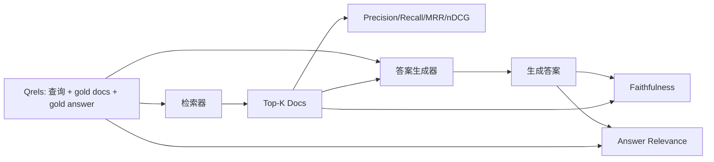

# RAG 评估：Precision、Recall、MRR、nDCG、Faithfulness、Answer Relevance

> 如果你不能同时给检索和答案打分，就不能发布系统。二者不是同一个指标，同一个提示词会在不同轴线上失败。

**Type:** Build
**Languages:** Python
**Prerequisites:** Phase 11 lessons 06 (RAG), 10 (evaluation); Phase 19 Track B foundations (lessons 20-29); Phase 19 lessons 64, 65, 66, 67
**Time:** ~90 minutes

## Learning Objectives
- 从 gold qrels 计算四个检索指标：precision@k、recall@k、MRR (mean reciprocal rank) 和 nDCG@k。
- 计算两个答案评分指标：faithfulness，每个 claim 都扎根于检索上下文，以及 answer relevance，答案回应了问题。
- 构建一个 fixture qrels 文件，包含 queries、gold doc ids 和 gold answer text，供评估端到端读取。
- 读取指标值，诊断流水线失败位置：检索、排序、生成或 grounding。

## 问题

RAG 系统至少有四个移动部件：chunker、retriever、reranker、generator。任何一个都可能导致错误答案。没有逐阶段指标，你就是闭着眼飞。

用户报告错误答案。原因是 chunker 切断了答案片段吗？是 retriever 没有把块放进 top-k 吗？是 reranker 把正确块推到第一名之后了吗？是 generator 忽略块并编造了吗？只看答案无法判断。你需要：

- 检索指标，给 retriever 输出打分。
- 排序指标，给正确块在排序中的位置打分。
- Faithfulness，给 generator 是否留在检索上下文内打分。
- Answer relevance，给答案是否回应问题本身打分。

本课在一个 fixture qrels 文件上构建全部六个指标。评估离线且确定；生产中你会把模拟 LLM-as-judge 换成真实 judge。

## 概念



### Precision@k

检索器返回的 top-k 文档中，有多大比例在 gold set 里？如果 gold 有三篇文档，top-3 返回其中两篇和一篇错误文档，precision@3 就是 2 / 3。当无关检索块成本很高时使用 precision，比如生成器会在它上面浪费词元，或该块会污染答案。

### Recall@k

gold 文档中，有多大比例在 top-k 里？如果 gold 有三篇文档，top-5 包含全部三篇，recall@5 就是 1.0。当漏掉答案成本很高时使用 recall，你宁可多看到一个错误块，也不愿完全错过答案块。

在生产 RAG 中，人们通常引用的指标是 recall@k。生成可以轻易丢掉无关块，但无法从从未看到的块中编出正确答案。

### MRR (Mean Reciprocal Rank)

对每个查询，找到 ranked list 中第一篇相关文档的位置。倒数排名是 1 / position。对查询集取平均。MRR 是一个单数值摘要，衡量检索器能否把最佳答案放在顶部。

MRR 很重视位置 1。gold doc 在 rank 1 的查询贡献 1.0。rank 2 贡献 0.5。rank 10 贡献 0.1。该指标由列表顶部主导。

### nDCG@k

Normalized Discounted Cumulative Gain。完整公式会给每个检索文档分配 gain，通常相关为 1，不相关为 0，再按位置对数折扣，求和后除以 ideal DCG，也就是完美排序时的 DCG。范围 0 到 1。

nDCG 支持分级相关性：gold 可以说 “doc A is 3, doc B is 2, doc C is 1”。MRR 和 recall@k 会把一切压平成二值。当语料对每个查询有多个部分相关文档时，使用 nDCG。

### Faithfulness

对于生成答案中的每个 claim，检查该 claim 是否被检索上下文支持。标准实现使用 LLM-as-judge 提示词，接收 `(claim, context)` 并返回 yes 或 no。指标是通过的 claim 比例。

Faithfulness 捕捉模型编造内容的生成器失败模式。即使检索器返回正确块，会幻觉的生成器也是坏的。Faithfulness 也叫 groundedness、support、attribution。

本课用确定性模拟 judge 实现 faithfulness，它检查每个 claim 的词元是否按阈值重叠于检索上下文。生产中你会换成真实模型调用。指标形状相同。

### Answer relevance

答案是否真正回应问题？Faithfulness 问的是 “答案是否扎根于上下文？”。Answer relevance 问的是 “答案是否扎根于问题？”。忠实但离题的答案会在 faithfulness 上高分，在 relevance 上低分。简短、切题但忽略上下文的答案会在 relevance 上高分，在 faithfulness 上低分。

标准实现同样使用 LLM-as-judge：接收 `(question, answer)` 并询问答案是否回应问题。本课实现一个 token-overlap-plus-judge 替身。

## fixture qrels

```python
{
  "qid": "q1",
  "query": "what is the abort threshold for multipart uploads",
  "gold_doc_ids": ["d1", "d3"],
  "gold_answer_substring": "three failed parts",
  "graded_relevance": {"d1": 3, "d3": 2},
}
```

每个查询包含：
- 查询字符串，
- 一组 gold doc ids，用于 precision / recall / MRR，
- 一个 graded relevance dict，用于 nDCG，
- gold answer substring，作为每条 qrel 上的参考 metadata 保留。本课中的 faithfulness 是通过判断抽取出的 claims 是否被检索上下文支持来计算的，不是用这个 substring。

生产中你会标注这些。本课提供手工构建的 fixture，让评估开箱即跑。

## 构建

`code/main.py` 实现：

- `precision_at_k(retrieved, gold, k)`，字面定义。
- `recall_at_k(retrieved, gold, k)`，字面定义。
- `mean_reciprocal_rank(retrieved_list_of_lists, gold_list)`，对查询取均值。
- `ndcg_at_k(retrieved, graded_relevance, k)`，使用二值或分级 gain 的 DCG / IDCG。
- `extract_claims(answer)`，把答案拆成句子形状的 claims。
- `faithfulness(claims, context_texts, judge)`，被判断为受支持的 claim 比例。
- `answer_relevance(question, answer, judge)`，判断答案是否回应问题。
- `MockJudge`，确定性的 token-overlap judge，让评估离线运行。
- `evaluate_pipeline(pipeline_fn, qrels, ks)`，运行每个指标的编排器。
- 一个演示，对 qrels 运行三种流水线变体，chunker baseline、hybrid retrieval、hybrid + rerank，并打印指标表。

运行：

```bash
python3 code/main.py
```

输出会在一个指标表中显示每个变体的 precision@k、recall@k、MRR、nDCG@k、faithfulness 和 answer relevance。Hybrid retrieval 行在 recall 上优于 chunker baseline；rerank 行在 MRR 上优于 hybrid。

## 读取指标来诊断失败

| Symptom | Likely cause | What to fix |
|---------|-------------|-------------|
| 低 recall@k，低 precision@k | Chunker 切断答案，或 retriever 找不到它 | Chunker 边界，第 64 课，或 retriever 模态，第 65 课 |
| recall@k 还行，MRR 低 | 正确块在 top-k 中，但不在位置 1 | Reranker，第 66 课 |
| MRR 高，faithfulness 低 | Generator 尽管有正确上下文仍编造内容 | 生成提示词，强制 cite-or-refuse |
| faithfulness 高，relevance 低 | 答案有依据但离题 | Query rewriter，第 67 课，或生成提示词 |
| 四者都高，用户仍抱怨 | 评估集不具代表性 | 用真实用户查询扩展 qrels |

## 演示会隐藏的失败模式

**LLM-as-judge 偏差。** 模型会把自己的输出判断得比实际更忠实。使用不同于生成器的模型家族做 judge，或手工评分一个样本。

**Qrels 腐化。** 随着语料变化，gold answers 会漂移。2024 年 1 月对 q1 是 gold 的文档，到 2024 年 10 月可能不再是正确答案，因为团队重命名了函数。安排季度 qrels 评审。

**Faithfulness 微检查漏掉宏观 claims。** 逐句 faithfulness 可能通过，但整体答案结构仍误导。给自动指标加上样本级定性评审。

**Recall@k 掩盖逐查询失败。** 90% 平均召回可能隐藏某一类查询总是失败。按查询类别切片 qrels，literal、paraphrased、multi-topic，并报告逐切片指标。

## 使用

生产模式：

- 每次检索器或生成器变更都运行评估。把 recall@k 回归当作测试失败。
- 持久化逐查询指标 trace。用户抱怨时，查找匹配的 qrels 条目，看它是否本该被捕获。
- 分层 qrels：20 个查询的 smoke set 在 CI 中运行；200 个查询的 regression set 每晚运行；2000 个查询的 deep set 每周运行。

## 交付

第 69 课会连接整个流水线，chunker、retriever、reranker、generator，并用这个评估给端到端系统打分。

## 练习

1. 添加第五个检索指标：hit-rate@k。与 recall@k 比较。解释它们何时不同。
2. 实现分级 faithfulness：0 不支持，1 部分支持，2 完全支持。相应更新指标。
3. 用真实模型调用替换模拟 judge。测量 fixture 上 mock 和 real judge 的分歧。
4. 添加查询类别切片，“literal”、“paraphrased”、“multi-topic”。报告逐切片指标。
5. 添加 “answer length” 指标，并把它与 faithfulness 相关联。绘制曲线。

## 关键术语

| Term | What people say | What it actually means |
|------|-----------------|------------------------|
| Precision@k | “Hit rate over retrieved” | top-k 中属于 gold 的比例 |
| Recall@k | “Hit rate over gold” | gold 中出现在 top-k 的比例 |
| MRR | “First-hit position” | 第一篇相关文档的 1 / rank 的均值 |
| nDCG@k | “Graded ranking quality” | top-k 上的 DCG 除以 ideal DCG |
| Faithfulness | “Groundedness” | 答案 claims 被检索上下文支持的比例 |
| Answer relevance | “Did it address the question?” | 答案是否匹配问题意图 |
| Qrels | “Gold labels” | 带 gold documents 和 answers 的标注查询集 |

## 延伸阅读

- Buckley, Voorhees, “Evaluating Evaluation Measure Stability”, SIGIR 2000，排序指标稳定性的标准论文
- Jarvelin, Kekalainen, “Cumulated Gain-based Evaluation of IR Techniques”，nDCG 论文
- [Ragas: Automated Evaluation of RAG Pipelines](https://docs.ragas.io)
- [Anthropic, Evaluating RAG](https://www.anthropic.com/news/evaluating-rag)
- Phase 11 lesson 10，evaluation framework foundations
- Phase 19 lessons 64-67，本课评估的组件
- Phase 19 lesson 69，本评估打分的端到端流水线
