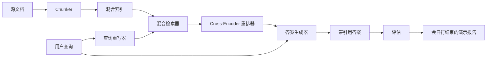

# 端到端 RAG 系统

> 六课组件。一个流水线。一个评估循环。一个会自行结束的演示。这就是你要发布的系统。

**Type:** Build
**Languages:** Python
**Prerequisites:** Phase 11 lessons 06 (RAG), 10 (evaluation); Phase 19 Track B foundations (lessons 20-29); Phase 19 lessons 64, 65, 66, 67, 68
**Time:** ~90 minutes

## Learning Objectives
- 把 chunker、hybrid retriever、query rewriter、cross-encoder reranker 和 answer generator 组合成一个端到端流水线。
- 实现一个答案生成器，按块 anchor 引用它的 claims，并带低置信度拒答 fallback。
- 对组装后的流水线运行第 68 课评估，证明分阶段构建在每个指标上都优于孤立组件。
- 构建一个会自行结束的 CLI 演示：摄取 fixture 语料，运行固定查询集，并以摘要报告和退出码 0 结束。

## 问题

六个孤立组件证明不了什么。Chunker 可能在语料上的 recall@5 胜出，却在系统 recall@5 上失败，因为 retriever 无法对 chunker 输出排序。Reranker 可能在合成候选池上提升 MRR，却在真实 bi-encoder 候选上失败，因为 bi-encoder 在重排预算下的召回太低。Query rewriter 可能在单个查询上提升 gold doc，却在下一个查询上破坏结果，因为模拟 LLM 返回退化的假想文档。

集成测试必须是整条流水线针对同一个 fixture qrels 端到端运行，使用同一个指标，并由一个编排文件把所有东西接起来。这就是本课要构建的内容。如果集成流水线上的指标优于每个阶段的孤立演示，你才证明了系统。

## 概念



### 接线选择

流水线是一个小图。每个阶段都是签名清晰的函数。

| Stage | Input | Output |
|-------|-------|--------|
| Chunker | Document text | List of Chunk records |
| Retriever | Query string | Top-N Chunk records |
| Rewriter (optional) | Query string | List of rewrites + hypothetical |
| Reranker | Query, candidates | Top-K Chunk records with cross scores |
| Generator | Query, top-K Chunk records | Answer string with citations |

当每个签名稳定时，组合就很直接。本课的 `Pipeline` 类持有五个阶段，并有一个按顺序运行它们的 `query` 方法。每个阶段都可替换：传入不同的 chunker、retriever、rewriter、reranker 或 generator，流水线仍会运行。

### 带引用的答案生成器

生成器是最后一个阶段，也是最容易坏的阶段。本课提供一个确定性模拟生成器，它会：

1. 接收重排后的 top-K 块。
2. 选择最多两个块，这些块文本与查询的内容词重叠最高。
3. 输出答案，由每个选中块中的一句话拼接而成，每句话后附 `[doc_id:chunk_index]` anchor。
4. 如果没有块的重叠超过拒答阈值，则输出 “I do not know”，且不带引用。

生产中你会把模拟器替换成真实 LLM 调用，使用这个提示词模板：

```
You are answering a question using only the snippets below.
Cite every claim with the anchor in parentheses.
If the snippets do not answer the question, say "I do not know".

Question: {query}

Snippets:
{enumerated chunks with anchors}

Answer:
```

低置信度拒答路径正是记录 cross-encoder rank-1 分数的原因。如果它低于语料阈值，生成器就拒答。这是防止幻觉答案的安全阀。

### 会自行结束的演示

演示会端到端运行所有东西。它打印一个查询的逐阶段拆解，在四个 fixture qrels 上运行评估，打印指标表，并在所有第 68 课指标都达到演示设定阈值时以状态 0 退出。如果任何指标低于阈值，演示会以非零状态退出，并用消息指出失败指标。

这就是 CI smoke test 的形状。流水线离线、快速、确定。fixture 上的阈值故意收紧，所以六课中任何一处回归都会让演示失败。

## 构建

`code/main.py` 实现：

- `Chunk`，贯穿所有阶段的记录，扩展了第 64 课的形状，增加 chunk_index 和 source doc_id。
- `Chunker`，从第 64 课选择一种策略，默认 recursive split。
- `HybridIndex`，打包第 65 课的 BM25 + dense + RRF。
- `Rewriter`，可选，按查询长度和连词存在性从第 67 课的 HyDE、multi-query、decomposition 中选择一种。
- `Reranker`，第 66 课训练好的 cross-encoder，使用更小的 fixture 训练集，数秒内收敛。
- `Generator`，带引用和低置信度拒答的确定性模拟生成器。
- `Pipeline`，用 `query(question)` 方法组合五个阶段，并返回 `Result(answer, top_k, latency_ms_per_stage)`。
- `run_demo()`，摄取语料，运行三个 fixture 查询，运行评估，打印结果，并根据阈值设置退出码。

运行：

```bash
python3 code/main.py
```

输出包含一个打印出来的查询 trace、完整评估表，以及最终 pass/fail 状态。在 fixture 上返回退出码 0。

## 演示会隐藏的失败模式

**Chunker 边界漂移。** 如果在评估 qrels 标注过程和演示之间更换 chunker 策略，gold doc ids 不再对齐。把 chunker 策略锁在 qrels 文件中。演示包含一个命名 chunker 的 header。

**Reranker 训练集泄漏到评估。** 第 66 课的 14 个训练三元组包含类似评估查询的查询。生产中要严格留出评估查询。演示中的评估查询刻意与重排训练集不相交。

**模拟生成器隐藏幻觉风险。** 模拟器不会幻觉，因为它只输出检索块中的文本。本课说明了这一点，并把生产替换路径指向真实模型。

**无流式输出。** 流水线在每个阶段结束后返回完整答案。生产系统会流式输出生成器结果。流式超出范围，答案评分指标无论如何都作用于最终字符串。

**离线延迟。** 模拟 LLM 调用是常数时间。真实 LLM 调用占主导。要在请求范围内规划延迟预算，本课逐阶段计时只测量 CPU 工作。

## 使用

生产模式：

- 把流水线放在一个编排器文件下，并提供显式阶段接口。避免把接线分散到整个仓库。
- 每次合并触及某个阶段前都运行评估。如果评估下降，合并不能落地。
- 持久化每次 CI 运行的指标 trace，这样你可以把回归归因到阶段替换。
- 添加一个 20 个查询的 smoke set，作为 regression set 的子集，能在 30 秒内运行；完整 regression set 每晚运行。

## 交付

本课的流水线文件就是 Phase 19 Track F 其余课程假设的形状。后续课程可以在其上添加摄取自动化、增量重建索引、遥测和服务层。检索、重排、重写和评估部分在这里已经完整。

## 练习

1. 在重写器内部添加逐查询策略选择器：使用第 67 课的启发式，长度、连词、术语比例，选择 HyDE、multi-query 或 decomposition。
2. 在 env flag 后面为生成器添加真实 LLM 调用。默认使用 mock。测量延迟差异。
3. 扩展演示，让它接收 `--corpus path` 参数加载真实语料。重新运行评估和阈值检查。
4. 给 chunker 添加 `--strategy` 参数。测量每种策略对端到端召回的贡献。
5. 添加流式生成器接口，并把它接入评估。确认 faithfulness 是在最终字符串上计算，而不是在流式前缀上计算。

## 关键术语

| Term | What people say | What it actually means |
|------|-----------------|------------------------|
| Pipeline | “RAG pipeline” | 从摄取到带引用答案的组合阶段 |
| Citation anchor | “Source link” | 附在每个 claim 上的 `(doc_id, chunk_index)` 引用 |
| Refuse-on-low-confidence | “I do not know” | 当 reranker top-1 分数低于阈值时，生成器不返回答案 |
| Smoke set | “CI eval” | 每个 PR 检查中运行的最小 qrels 子集 |
| Stage interface | “Function signature” | 每个流水线阶段的稳定输入和输出类型 |

## 延伸阅读

- [Anthropic, Building search and retrieval](https://www.anthropic.com/news/contextual-retrieval)
- [Pinterest, MCP internal search](https://medium.com/pinterest-engineering)，参考生产架构
- [Ragas: Automated Evaluation of RAG Pipelines](https://docs.ragas.io)
- Phase 11 lesson 06，RAG fundamentals
- Phase 19 lessons 64-68，本课组合的组件
