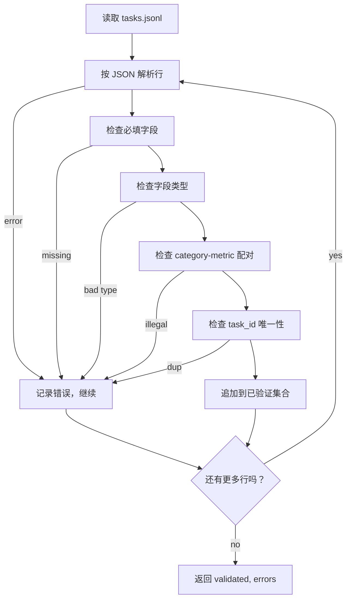

# 任务规范格式

> 评估测试框架的质量取决于它的任务契约。先冻结 JSONL 形状和指标词表，再写任何评分函数。

**Type:** Build
**Languages:** Python
**Prerequisites:** Phase 19 Track B foundations
**Time:** ~90 min

## Learning objectives

- 定义一种 JSONL 任务记录 schema，用同一个形状覆盖算术、多选、代码执行、分类和自由文本摘要。
- 固定一组封闭的指标名称词表，让下游课程 71 到 73 可以基于单个字段分发。
- 把 few-shot 示例和后处理规则作为任务的一部分，而不是 runner 的一部分，这样同一个 prompt 在不同模型上产生相同目标。
- 实现严格验证器，在畸形记录进入 runner 之前拒绝它们。
- 交付一个 10 任务 fixture 集，覆盖规范的每个分支，让验证器有真实材料可检查。

## 为什么需要冻结规范

研究代码库积累 eval scripts 的速度会快于积累测试。六个月后，每个 notebook 都有自己的 JSON 形状，每个指标被重复实现两次，没有任何运行可以互相比较。修复方式很无聊。选择一个 schema。写一个验证器。拒绝其他所有东西。本课就是这么做。

这个形状借鉴了 BIG-bench、HELM 和 lm-eval 风格测试框架的思路，但字段名是我们自己的。每个字段都有单一所有者。Runner 读取任务。Metric 读取 targets。Post-process 步骤归一化生成结果。没有字段可以在流水线中途变化。

## 记录形状

一个任务是单行 JSON 对象。测试框架读取 `tasks.jsonl` 并独立验证每一行。坏行会中止该记录，而不是中止整次运行。

```json
{
  "task_id": "arith_001",
  "category": "arithmetic",
  "prompt": "Compute the result. Question: 17 + 24\nAnswer:",
  "targets": ["41"],
  "metric_name": "exact_match",
  "few_shot_examples": [
    {"prompt": "Question: 2 + 2\nAnswer:", "completion": "4"}
  ],
  "post_process": "strip_whitespace",
  "metadata": {"difficulty": "easy"}
}
```

必填字段是 `task_id`、`category`、`prompt`、`targets`、`metric_name`、`post_process`。`few_shot_examples` 和 `metadata` 可选。未知顶层字段会验证失败。

## 字段规则

`task_id` 是不含空白的字符串。验证器会强制文件内唯一。

`category` 是 `arithmetic`、`mcq`、`code_exec`、`classification`、`summary` 之一。类别约束合法的 metric 和 post-process 配对。`code_exec` 任务必须使用 `metric_name = code_exec`，`mcq` 任务必须对单字母目标使用 `metric_name = exact_match`。

`prompt` 是非空字符串。验证器禁止尾随空白，并拒绝 prompt 正文中已经包含 few-shot 块的记录。Few-shot 渲染发生在 runner 中，而不是作者手写在任务里。

`targets` 是非空字符串列表。对于 `exact_match`，任意元素匹配都算通过。对于 `f1` 和 `rouge_l`，得分最高的目标获胜。对于 `mcq`，列表恰好包含一个元素。

`metric_name` 是 `exact_match`、`f1`、`bleu_4`、`rouge_l`、`accuracy`、`code_exec` 之一。词表是封闭的。新增指标需要新课程，并在这里新增条目。

`few_shot_examples` 是 `{prompt, completion}` 配对列表。验证器把列表限制在八个条目内，以保持 prompt 有界。

`post_process` 是 `none`、`strip_whitespace`、`lower`、`extract_letter`、`extract_code_block`、`extract_first_line` 之一。每条规则只有一种确定性行为。验证器禁止组合规则。

## 验证器行为



验证器返回两个列表：已验证记录，以及错误记录，错误记录包含出错行、违反的规则和出错字段。除非设置显式 `--allow-bad-tasks` 标志，否则 runner 在错误列表非空时拒绝启动。

## Few-shot 渲染

Runner 会把 few-shot 示例用空行分隔拼到 prompt 前面。每个模型走同一条代码路径，所以唯一方差来源是模型本身。作者只写一次示例，而不是给每个 provider 写一次。

```python
def render(task):
    parts = []
    for ex in task.get("few_shot_examples", []):
        parts.append(ex["prompt"] + " " + ex["completion"])
    parts.append(task["prompt"])
    return "\n\n".join(parts)
```

## 后处理规则

后处理步骤在生成之后、指标之前运行。它是确定且无状态的。

- `none` 返回原字符串。
- `strip_whitespace` 去掉开头和结尾空白。
- `lower` 把字符串转为小写。
- `extract_letter` 返回第一个匹配 `[A-E]` 的字符，用于 MCQ。
- `extract_code_block` 返回第一个三反引号围栏块的正文，用于 code-exec。
- `extract_first_line` 返回第一个非空行，用于 summary classification。

需要此列表之外规则的任务，应该放进新课程。

## 本课不做什么

它不评分。不调用模型。不运行代码。这些会出现在第 71、72 和 75 课。本课冻结它们都要遵守的契约。

10 任务 fixture 覆盖两个算术项、两个 MCQ 项、两个 code-exec 项、两个分类项和两个摘要项。验证器会通过全部 10 个。另一个 fixture，`tasks_bad.jsonl`，触发每条规则，验证器会返回刚好对应数量的错误。

## 如何阅读代码

`main.py` 定义 `TaskSpec`、`validate_task`、`validate_file` 和 CLI 入口。Fixture loader 是 `load_fixtures`。Render 和 post-process helpers 与验证逻辑放在一起，这样第 75 课的 runner 可以导入单个模块。

从头到尾阅读 `main.py`。然后读 `code/tests/test_spec.py`。测试会固定每条验证规则和每种 post-process 行为。`main.py` 底部的演示会验证捆绑 fixture 并打印摘要。

## 继续深入

真实评估套件增长类别，就像 schema 增长列。稳妥做法是拒绝添加任何没有同时附带指标、后处理规则和至少一个 fixture 任务的类别。把规范当作数据库迁移。每个变更都要审查、版本化，并配有测试。本课的验证器就是关卡。
