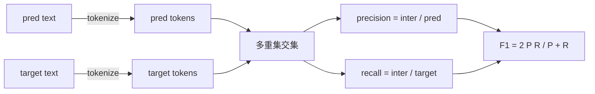
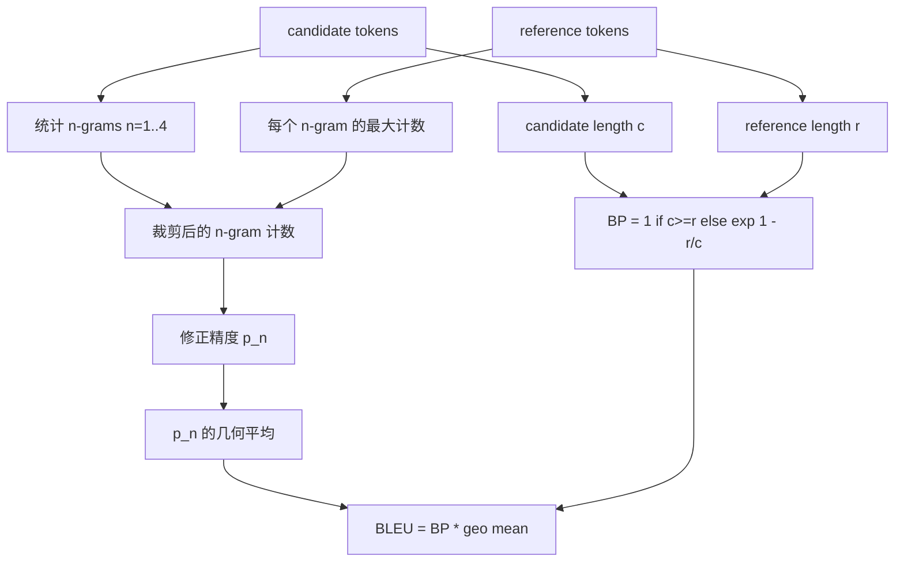

# 经典指标

> BLEU、ROUGE-L、F1、exact-match、accuracy。五个指标仍然覆盖了大多数已发表的 LLM 评估数字。从第一性原理实现每一个，这样你才知道数字到底是什么意思。

**Type:** Build
**Languages:** Python
**Prerequisites:** Phase 19 Track B foundations, lesson 70
**Time:** ~90 min

## Learning objectives

- 用显式分词规则实现词元级 exact-match、F1 和 accuracy。
- 从零实现 BLEU-4：修正 n-gram 精度、n 等于 1 到 4 的几何平均、长度惩罚。
- 使用最长公共子序列实现 ROUGE-L，并用 F-beta 组合 precision 和 recall。
- 按第 70 课的 metric_name 字段分发，让 runner 与指标无关。
- 用来自手算示例的参考向量固定行为，而不是依赖第三方库。

## 为什么重新实现

你会读到一篇论文报告 BLEU 28.3，另一篇报告 BLEU 0.283。你会发现两个库的 ROUGE-L 分数相差十个点，因为一个先转小写而另一个不转。停止困惑的最快办法是自己写指标，然后指出决定 tokenizer 的那一行和应用 smoothing 的那一行。之后，跨论文比较数字就变成阅读指标设置，而不是争论库。

Stdlib 加 numpy 就够了。BLEU 是计数和裁剪。ROUGE-L 是动态规划。F1 是词元上的集合交集。最难的部分是选择 tokenizer 并承诺使用它。

## 分词

Tokenizer 是 `re.findall(r"\w+", text.lower())`。转小写、字母数字连续段、丢弃标点。本课的每个指标都使用这个精确 tokenizer。Runner 不能自行选择。如果更换 tokenizer，你运行的就是另一个基准。

```python
TOKEN_RE = re.compile(r"\w+", re.UNICODE)
def tokenize(text):
    return TOKEN_RE.findall(text.lower())
```

这是有意简化。生产设置会关心 CJK、缩写和代码标识符。本课重点是 tokenizer 是契约，不是旋钮。

## Exact match

```python
def exact_match(pred, targets):
    return float(any(pred.strip() == t.strip() for t in targets))
```

它对每个任务返回 1.0 或 0.0。数据集聚合是均值。这是算术、MCQ 和短分类任务的主力指标。

## 词元级 F1

为预测和目标建立词元多重集。Precision 是多重集交集除以预测多重集大小。Recall 是同一交集除以目标多重集大小。F1 是调和平均。实现会处理空预测和空目标边界情况。



对于多目标任务，我们取目标列表中的最佳 F1。这匹配文献中广泛报告的 SQuAD 风格行为。

## BLEU-4

BLEU 是标准机器翻译指标，并且仍然出现在摘要工作中。我们使用的形式是 corpus-level BLEU-4，带标准长度惩罚，并对修正 n-gram 计数使用加一平滑，这样单个缺失的 4-gram 不会把分数推到零。

对每个 candidate-reference 配对，我们统计 n 等于 1、2、3、4 的修正 n-gram 精度。修正精度会把候选 n-gram 计数裁剪到该 n-gram 在任意参考中的最大计数，因此候选不能通过重复一个短语来虚增。四个精度的几何平均再由长度惩罚包裹。



平滑规则是 Lin and Och 称为 method 1 的规则：在取 log 前，把每个 n-gram 精度的分子和分母都加一。这避免参考没有匹配 4-gram 时出现 `log 0`，并且在长候选上接近未平滑值。

## ROUGE-L

ROUGE-L 比较候选和参考词元序列的最长公共子序列。LCS 能捕获词序而不要求连续，这就是它成为默认摘要指标的原因。我们用标准动态规划表计算 LCS 长度，然后将 recall 派生为 `lcs / reference length`，precision 派生为 `lcs / candidate length`，并用 F-beta 组合，其中 beta 等于 1，得到对称 F1 形式。

```python
def lcs_length(a, b):
    n, m = len(a), len(b)
    dp = numpy.zeros((n + 1, m + 1), dtype=int)
    for i in range(n):
        for j in range(m):
            if a[i] == b[j]:
                dp[i+1, j+1] = dp[i, j] + 1
            else:
                dp[i+1, j+1] = max(dp[i+1, j], dp[i, j+1])
    return int(dp[n, m])
```

numpy 表让实现更易读，纯 Python list 也可以。选择 ROUGE-L 的任务会为每个任务支付 O(n m) 成本。对于常见摘要长度，这仍然低于一毫秒。

## Accuracy

对于多目标分类任务，accuracy 简化为对单个归一化目标做 exact-match。我们把它暴露为单独函数，这样 dispatcher 可以基于 `metric_name` 分发，而不需要在 runner 内部做字符串比较。

## 分发契约

单一入口是 `score(metric_name, prediction, targets)`。它返回 `[0, 1]` 内的浮点数。Runner 不按指标名分支。它把调用交给指标层并写入结果。这就是第 75 课会粘到第 70 课任务规范上的表面。

```python
def score(metric_name, pred, targets):
    if metric_name == "exact_match":
        return exact_match(pred, targets)
    if metric_name == "f1":
        return max(f1_score(pred, t) for t in targets)
    if metric_name == "bleu_4":
        return max(bleu4(pred, t) for t in targets)
    if metric_name == "rouge_l":
        return max(rouge_l(pred, t) for t in targets)
    if metric_name == "accuracy":
        return accuracy(pred, targets)
    raise ValueError(f"unknown metric_name: {metric_name}")
```

`code_exec` 在第 72 课处理，并在那里接入 dispatcher。

## 本课不做什么

它不调用模型。不做第 70 课 post-process 规则之外的生成归一化。不计算置信区间。不做 BLEURT 或 BERTScore，它们需要模型，属于另一课。本课目标是地板：五个指标、一个 tokenizer、一个分发表。

## 如何阅读代码

`main.py` 把每个指标定义为自由函数，并包含 dispatcher。参考向量位于文件底部的 `_reference_examples` 块。演示会在八个示例上运行 dispatcher，并打印逐指标分数。`code/tests/test_metrics.py` 中的测试固定参考向量，并压测每个边界情况：空预测、空参考、无共享词元、完全匹配、重复短语裁剪。

从头到尾阅读 `main.py`。函数按复杂度排序。exact_match 和 accuracy 各一行。F1 六行。BLEU 和 ROUGE-L 是重部分，其中包含关于 smoothing 规则和 LCS 递推的详细注释。

## 继续深入

经典指标必要但不充分。它们奖励表层重叠，却会错过含义。修复方式是在你信任经典地板后，在上面叠加基于模型的指标，BLEURT、BERTScore、GEval。那是后续课程。现在：让这五个指标工作，用测试固定它们，你就有了可审计、快速、可复现的指标栈。
