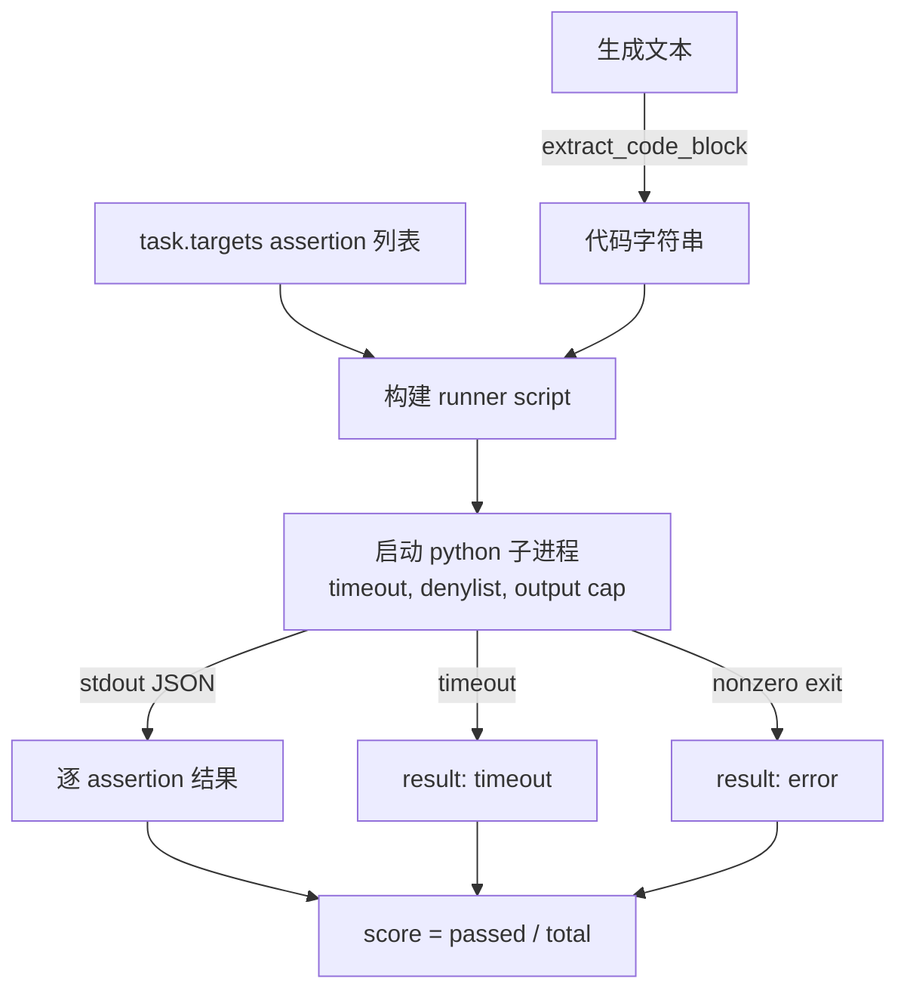
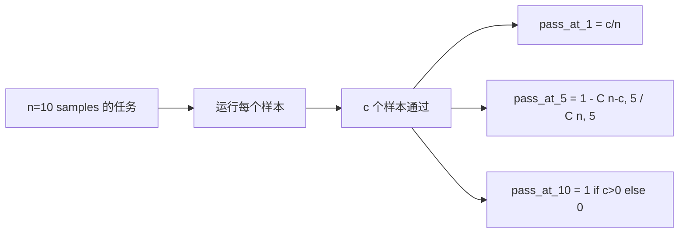

# 代码执行指标

> 生成代码通过测试时才算正确。评估测试框架必须提取代码，在不弄崩主机的情况下运行它，并诚实统计通过率。本课构建这个表面。

**Type:** Build
**Languages:** Python
**Prerequisites:** Phase 19 Track B foundations, lessons 70 and 71
**Time:** ~90 min

## Learning objectives

- 从自由形式生成中提取代码块，方式要匹配第 70 课的 post-process 规则。
- 在隔离子进程中执行候选代码，并带 wall-clock timeout、输出上限和 import denylist。
- 把任务评分为提供的 assertion 字符串中通过的比例。
- 为从同一模型采样多个生成的任务计算 pass-at-k。
- 把 sandbox 崩溃、语法错误和超时当作一等失败模式，并给出 runner 可记录的不同退出码。

## 为什么使用隔离子进程

内联 `exec` 是安全和稳定性隐患。生成的 `while True: pass` 会永远阻塞评估。生成的 `import shutil; shutil.rmtree('/')` 和听起来一样灾难。修复方式是为每个候选启动一个新的 Python 解释器，通过 stdin 传入代码，把 assertion 结果写到 stdout，并在进程超时时杀掉它。宿主评估进程继续运行。

HumanEval、MBPP、BigCodeBench 和 LiveCodeBench 等真实评估都使用子进程 sandbox。有些还叠加 Docker。我们停在子进程是有原因的：它可移植、只用 stdlib，并能捕获教育评估中重要的失败模式。生产部署会添加 seccomp、网络隔离和只读文件系统。下一课的加固主题不在这个 track 里。

## code-exec 任务的形状

`code_exec` 任务在 `targets` 中携带 assertion 字符串。Runner 从生成中提取 fenced code block，围绕它构建测试 harness，并运行结果。



分数是 `[0, 1]` 内的比例。一个包含三个 assertions 的任务，如果两个通过，得分 0.667。不管发生什么失败，runner 都返回同一形状：子进程崩溃会映射成归一化错误码，而不是让 Python traceback 冒泡到 harness。

## Denylist

Denylist 基于 import。运行候选代码前，runner script 会把危险模块的 imports 重写为抛出 `ImportError("denied")` 的 stub。列表故意保守：`os.system`、`subprocess`、`socket`、`requests`、`urllib`、`urllib.request`、`urllib.error`、`urllib.parse`、`ctypes`、`shutil`、`http.client`、`asyncio.subprocess`。

我们不会假装这牢不可破。有决心的对抗代码可以逃出 Python 的任何进程内 sandbox。Denylist 是兜底。Wall-clock timeout 和输出上限才是承重控制。

```python
DENIED = {
    "os.system": True,
    "subprocess": True,
    "socket": True,
    "shutil": True,
    "requests": True,
    "urllib": True,
    "ctypes": True,
}
```

我们通过前置 `import sys` 和一个把 `os.system` monkey-patch 成 raise 的 guard 来包装候选代码。完整模板在 `main.py` 中。

## Wall-clock timeout

每个子进程默认有三秒 wall-clock 预算。Runner 使用 `subprocess.run(..., timeout=t)`。如果触发超时，runner 捕获 `TimeoutExpired`，杀掉进程，并为任务记录 `timeout` exit reason。该任务分数为零。Runner 继续往下走。

超时可以通过 `task.metadata.timeout_s` 按任务配置。长时间运行的单元测试可以要求更多时间；第 70 课验证器把值限制在三十秒，以保持套件有界。

## 输出上限

子进程可能刷爆 stdout，耗尽主机内存。Runner 会把 stdout 流入缓冲区，一旦运行总量超过 256 KB 就杀掉子进程。结果记录为 `exit_code = error`，detail 字符串为 `"output overflow"`。实践中，当生成意外写出带打印的无限循环时会出现这个情况。

## Pass-at-k

Pass-at-k 是 HumanEval 等使用的无偏估计器。给定每个任务 `n` 个独立样本，其中 `c` 个通过，从 `n` 中采样大小为 `k` 的样本包含至少一个通过解的概率是：

```
pass_at_k(n, c, k) = 1 - C(n - c, k) / C(n, k)
```

当 `n - c < k` 时，分子未定义，值为 `1`。实现会直接处理这个边界情况。我们暴露 `pass_at_k(n, c, k)`，供第 74 课排行榜层使用。



## 退出码

Runner 为每个任务返回五种结果之一：

- `pass`，每个 assertion 都通过。
- `assertion_fail`，代码运行了，但至少一个 assertion 失败。
- `syntax_error`，代码无法导入或有 SyntaxError。
- `timeout`，wall clock 耗尽。
- `error`，其他任何崩溃，包括 denylist 命中和输出溢出，溢出会以 detail `"output overflow"` 出现。

分数仍然是比例。退出码是 metadata。下游课程可以决定把 timeout 算零，还是算缺失数据。

## 本课不做什么

它不给你真实 sandbox。不运行来自开放网络的不可信代码。不处理文件 I/O 或网络调用这类有状态任务。那些需要容器或 microVM。本课重点是契约：隔离子进程、denylist、timeout、输出上限、干净退出码词表，以及 pass-at-k 数学。

## 如何阅读代码

`main.py` 定义 `extract_code`、`run_candidate`、`score_code_exec` 和 `pass_at_k`。子进程 runner script 作为字符串构建，并通过 `-c` 传给新的 Python 解释器。`code/tests/test_exec.py` 中的测试会针对 HumanEval 风格手算示例，覆盖四种退出码以及 pass-at-k。

从头到尾阅读 `main.py`。Runner 模板是承重部分。盯住 assertion 循环，直到你能预测它写回父进程的 JSON envelope。

## 继续深入

一旦子进程形状工作，下一件事就是可移植性。不同 Python 版本在 Windows 上处理 SIGKILL 的方式不同。最干净的修复方式是把 runner 放进 Docker 镜像。再下一步是用真实单元测试文件替代 assertion 字符串，这样评估才匹配生产 CI。到那时就别再把 assertion 字符串称为测试了，它们是玩具测试，也有玩具失败模式。
