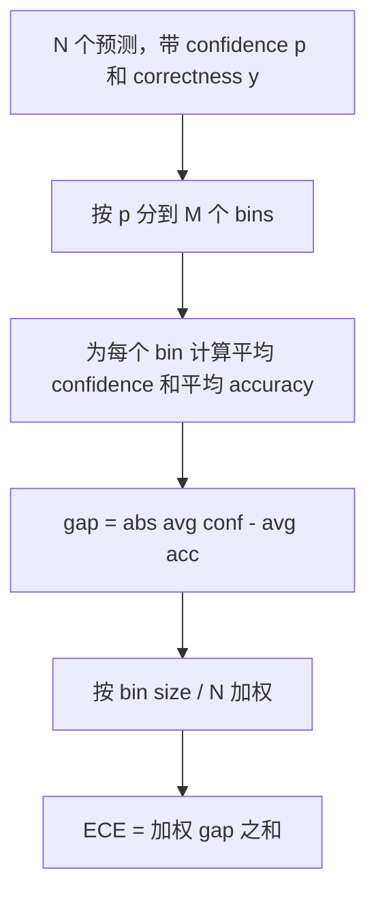
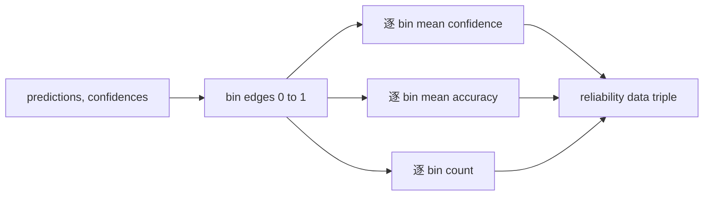

# 困惑度与校准

> 如果你的模型对一千个答案说自己有 90% 把握，却只答对六百个，它就没有良好校准。校准是可信评估的一半。另一半是困惑度，它告诉你模型是否认为留出文本本身合理。

**Type:** Build
**Languages:** Python
**Prerequisites:** Phase 19 Track B foundations, lessons 70 and 71
**Time:** ~90 min

## Learning objectives

- 根据模型 adapter 提供的词元负对数概率，在留出语料上计算词元级困惑度。
- 根据分箱预测概率，计算分类器或多选评估的 expected calibration error (ECE)。
- 计算 Brier score，也就是针对正确性指示变量的均方误差，并解释它什么时候补足 ECE 做不到的事。
- 构建绘制 confidence-versus-accuracy 曲线所需的 reliability diagram 数据。
- 把三者接入评估测试框架，让 runner 可以把 `perplexity`、`ece` 和 `brier` 数字附到模型报告中。

## 困惑度告诉你什么

困惑度是每词元平均负对数似然的指数。越低越好。困惑度为一表示模型给每个真实词元都分配概率一。困惑度等于词表大小表示模型是均匀的，什么也没学到。真实数字落在中间：强的 2026 base model 在 WikiText-103 上大约是八到十二。差的模型在同一文本上会超过五十。

测试框架本身不计算 log-probabilities。它们来自模型 adapter。测试框架做聚合：接收每词元 log-probabilities 列表、每个序列的 token counts 列表，并返回 corpus perplexity。

```python
def perplexity(neg_log_probs, token_counts):
    total_nll = sum(neg_log_probs)
    total_tokens = sum(token_counts)
    return math.exp(total_nll / total_tokens)
```

实现会处理零词元边界情况，并断言 negative log-probabilities 非负。常见错误是忘记取负：adapter 返回 `log p` 而不是 `-log p`，会产生低于一的困惑度，这是不可能的。函数会把它作为契约违规捕获。

## ECE 衡量什么

Expected calibration error 会按置信度把预测分到固定数量的 bin 中，然后测量每个 bin 内平均置信度和准确率之间的差距，并按 bin 大小加权。



标准形式在 `[0, 1]` 上使用十个等宽 bin。实现支持任意正整数数量。我们暴露 `bins` 参数，让 runner 可以在发布惯例 10 和比较惯例 15 之间选择。

ECE 受 bin 数和样本量偏置影响。十个 bin 和一百个预测时，你无法区分 0.02 ECE 与随机噪声。实现会和 ECE 一起返回 populated bins 的数量，让 runner 在样本太少时拒绝报告单一数字。

## Brier score 做了 ECE 没做的什么

ECE 只关心平均差距。一个模型如果在一半 bins 上过度自信，在另一半 bins 上信心不足，可能有低 ECE，但局部校准很差。Brier score 衡量每个预测相对真实结果的平方误差，因此直接惩罚分散程度。

对于二值结果，Brier 是 `mean((p_i - y_i)^2)`。它可分解为 reliability、resolution 和 uncertainty。我们计算分数和分解。Runner 报告标量，但把分解记录给 dashboard。

```python
def brier(p, y):
    return float(np.mean((p - y) ** 2))
```

## Reliability diagram 数据

Reliability diagram 绘制每个 bin 中的预测置信度和经验准确率。对角线表示完美校准。函数返回三个数组：逐 bin 平均置信度、逐 bin 平均准确率和逐 bin 计数。绘图代码在下游；本课停在数据形状。



返回的 tuple 是调用层绘图或计算自定义 ECE 变体所需的内容，例如 adaptive ECE、sweep ECE 等。我们返回 numpy arrays，这样下游代码不需要转换。

## 置信度来源

测试框架不假设置信度来自 softmax。它接受每个预测一个 `[0, 1]` 内的数字。对于多选任务，自然置信度是 `softmax over option log-likelihoods`。对于自由文本，自然置信度是模型自报概率，或平均 log-likelihood 的指数。评估只消费数字。它来自哪里是 adapter 的工作。

## 边界情况

- 全部预测错误：ECE 是平均置信度，Brier 很高，perplexity 则取决于模型如何看待文本。
- 全部预测正确且高置信度：ECE 接近零，Brier 接近零。
- p=0.5 的完全不确定预测器：ECE 是 0.5 减 accuracy，Brier 是 0.25 减一个修正项。
- 空输入：ECE、Brier 和 reliability 返回 `0.0`，或填零数组。Perplexity 在零词元情况下返回 `NaN`。这些路径都不发 warning；runner 检查值并决定报告还是跳过。

这些情况都写进了测试。真实模型在真实基准上不会命中它们，但有 bug 的 adapter 或很小的样本会命中，runner 不应崩溃。

## 分发

校准不像 F1 那样是逐任务指标。它是逐模型报告。Runner 会在整个评估过程中积累 `(confidence, correct)` 配对，并一次性计算 ECE、Brier 和 reliability 数据。Perplexity 在留出文本语料上计算，独立于逐任务评分。

接口是：

```python
report = CalibrationReport.from_predictions(confidences, correct)
report.ece          # float
report.brier        # float
report.reliability  # tuple of three numpy arrays
report.populated_bins  # int
```

`PerplexityResult.from_token_nll(neg_log_probs, token_counts)` 返回 perplexity 和每词元平均负对数似然。

## 本课不做什么

它不调用模型。不实现 softmax。不从输出词元估计置信度，那是 adapter 的工作。不做 temperature scaling 或 Platt scaling，那些是事后修正，属于另一课。本课重点是让三个数字，perplexity、ECE、Brier，可信且可复现。

## 如何阅读代码

`main.py` 定义 `perplexity`、`expected_calibration_error`、`brier_score`、`reliability_diagram`，以及 `CalibrationReport` / `PerplexityResult` dataclasses。演示在 ground truth 已知的合成预测上运行：一个校准良好的模型、一个过度自信的模型、一个信心不足的模型。`code/tests/test_calibration.py` 中的测试固定每个边界情况，以及合成预测器的参考值。

从头到尾阅读 `main.py`。函数顺序从标量到向量再到报告。每个函数都有短 docstring，说明数学和契约。

## 继续深入

校准是已发表评估中最容易被忽略的轴。大多数排行榜报告一个 accuracy 数字就结束。一个 accuracy 获胜但 Brier 失败的模型，在生产部署上不如一个 accuracy 低几分但能可靠报告不确定性的模型。校准管线到位后，在留出验证切片上添加 temperature scaling，重新计算 ECE，然后观察差距缩小。那是另一课，但地板在这里。
