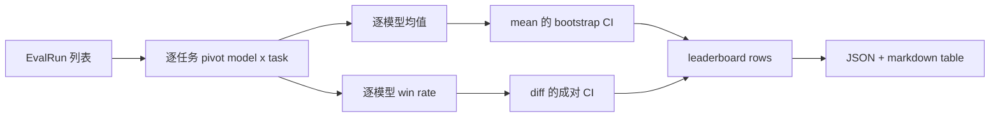
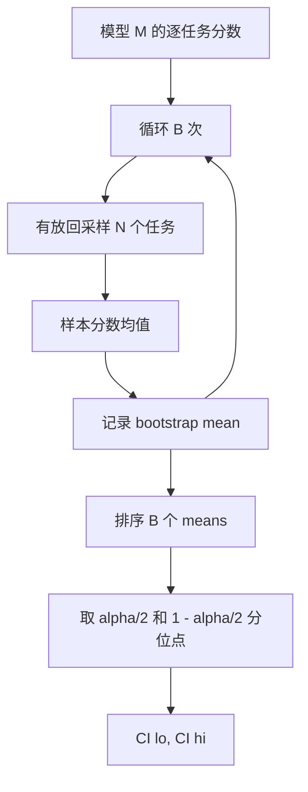

# 排行榜聚合

> 逐任务分数很容易。跨异构任务的逐模型排名更难。千级预测排行榜上的统计显著性是所有人都会跳过的部分。本课不跳过它。

**Type:** Build
**Languages:** Python
**Prerequisites:** Phase 19 Track B foundations, lessons 70, 71, 73
**Time:** ~90 min

## Learning objectives

- 把多个模型、多个任务上的逐任务分数聚合成整洁的逐模型行。
- 归一化异构分数，避免 pass rates 和 BLEU 值过度影响总分。
- 按均值和按 win-rate 给模型排名，并解释何时该用哪种摘要。
- 计算每个模型 mean score 和成对差异的 bootstrap confidence intervals。
- 以 JSON report 和 markdown table 输出排行榜，供第 75 课 runner 粘贴到 CI comment。

## 输入形状

聚合器消费 `EvalRun` 记录列表：

```python
@dataclass
class EvalRun:
    model_id: str
    task_id: str
    metric_name: str
    score: float          # in [0, 1]
    category: str
```

第 75 课的 runner 会为每个 `(model, task)` 配对发出一条记录。聚合器不关心分数如何产生。它期望归一化已经发生：每个分数都在 `[0, 1]`。

## 输出

会输出三张表：



排行榜行包含：`model_id`、`mean_score`、`mean_ci_lo`、`mean_ci_hi`、`win_rate`、`tasks_completed`，以及可选 `categories` map，用于逐类别均值。

## 归一化

如果一个任务分数在 `[0, 1]`，另一个在 `[0, 100]`，第二个会悄悄主导均值。聚合器验证每个输入分数都位于 `[0, 1]`，否则拒绝运行。修复在上游：指标应已经返回比例。第 71 到 73 课会强制这个契约。

## Mean 和 win-rate

两种排名方案服务不同目标。

Mean score 是一个模型的逐任务分数平均值。这是排行榜报告的头条数字。它对离群值和任务不平衡敏感。

Win-rate 统计模型在同一任务上击败所有其他模型的频率。对每个任务，得分最高的模型获胜，平局拆分。Win rate 等于 wins 除以该模型有分数的任务数。它对离群值和尺度差异不那么敏感，但会丢失信息。

```python
def win_rate(model_id, runs_by_task, all_models):
    wins, total = 0, 0
    for task_id, runs in runs_by_task.items():
        scores = {r.model_id: r.score for r in runs if r.model_id in all_models}
        if model_id not in scores:
            continue
        total += 1
        best = max(scores.values())
        if scores[model_id] >= best:
            wins += 1
    return wins / total if total else 0.0
```

测试框架两者都报告。第 75 课 runner 默认按 mean 排名；markdown 中的 win-rate 列就在旁边，如果用户偏好它即可查看。

## Bootstrap confidence intervals

逐模型均值带有通过任务 bootstrap 重采样估计的 confidence interval。我们有放回地重采样 task ids，计算重采样集合上的均值，重复 `B` 次，并取 level `alpha` 下的 percentile interval。



对于成对比较，我们 bootstrap 逐任务差异 `score_A - score_B`，取 percentile interval 并报告。用户查看区间是否排除零。如果排除，差异在 alpha 水平显著。如果没有，排行榜把模型视为并列。

低层 helper，`bootstrap_mean_ci`、`bootstrap_pairwise_diff`，默认 `B=1000`；公开聚合器，`aggregate`、`pairwise_diffs`，默认 `b=500`，让演示和测试保持快速。默认 alpha 是 0.05。本课保持 bootstrap 只用 numpy，不用 scipy。

## Categories

如果设置了 `EvalRun.category`，聚合器也会报告逐类别均值。这就是每个排行榜上写着 `math`、`reasoning`、`code`、`safety` 的列。它让 runner 发现某个模型整体不错但代码能力弱，而头条 mean 会隐藏这件事。

## Markdown 渲染

排行榜渲染为 markdown 表格：

```text
| Rank | Model | Mean | 95% CI | Win rate | Tasks |
|------|-------|------|--------|----------|-------|
| 1    | gpt   | 0.78 | 0.74-0.82 | 0.62 | 50 |
| 2    | claude| 0.75 | 0.71-0.79 | 0.34 | 50 |
| 3    | random| 0.10 | 0.07-0.13 | 0.04 | 50 |
```

表按 mean score 排序。CI 渲染为两位小数。长 model ids 会截断到二十个字符。

## 本课不做什么

它不运行模型。不调用指标层。不实现 adaptive ECE 或其他校准变体，那些是第 73 课。它不实现任务加权。这里每个任务权重相同。生产排行榜会给任务加权；我们通过 `weight` 字段保留 hook，但聚合器忽略它。如果需要，请在后续课程添加加权。

## 如何阅读代码

`main.py` 定义 `EvalRun`、`LeaderboardRow`、`aggregate`、`bootstrap_mean_ci`、`bootstrap_pairwise_diff` 和 `render_markdown`。演示构建三个模型和十二个任务的合成套件，聚合并打印排行榜以及成对 diff 表。`code/tests/test_leaderboard.py` 中的测试固定 bootstrap、markdown 渲染、win-rate 边界情况和空输入行为。

从头到尾阅读 `main.py`。数据形状，EvalRun、LeaderboardRow，先出现；然后是聚合器；第三是 bootstrap；最后是渲染。每个函数都有聚焦契约。

## 继续深入

自然的下一步是 paired-task significance，而不是 unpaired bootstrap。如果模型 A 和 B 都运行了同一百个任务，适当测试是逐任务差异上的 paired bootstrap，本课已经实现。再往后，你会想要层次 bootstrap，它尊重任务家族，数学题之间并不独立，一个算术错误模式会影响其中十道题。那是后续工作。本课重点是把地板做对，让评估报告出你能辩护的数字。
