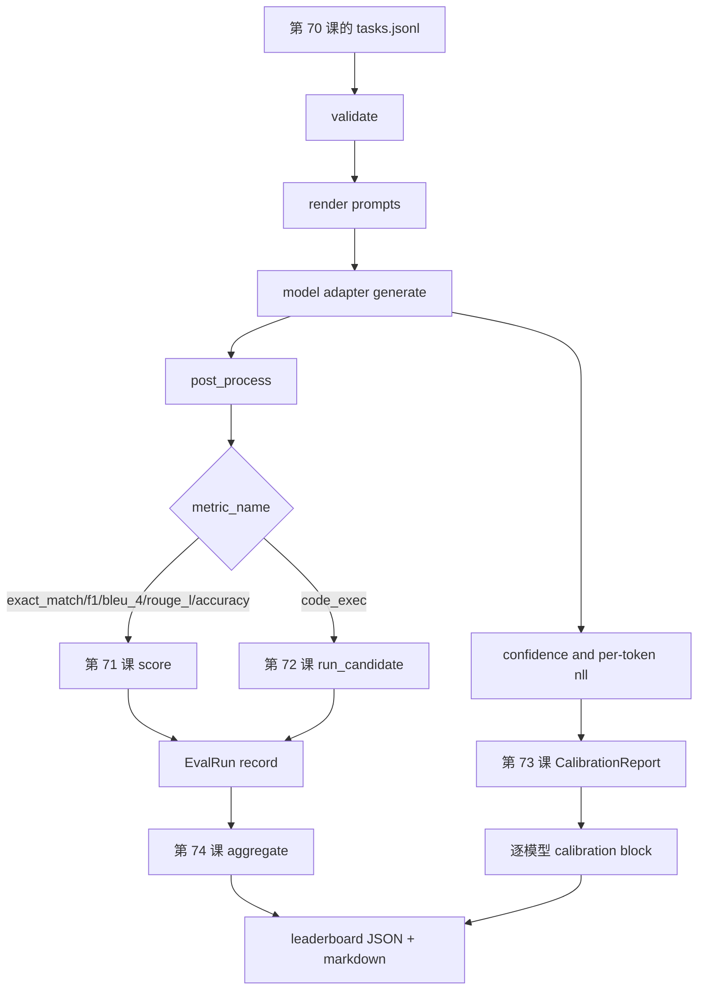

# 端到端评估运行器

> 五课管线，一课粘合。Runner 读取第 70 课的任务规范，通过 adapter 调用模型，用第 71 和 72 课评分，附上第 73 课的校准报告，并发出第 74 课的排行榜。演示会自行结束。

**Type:** Build
**Languages:** Python
**Prerequisites:** Phase 19 Track B foundations, lessons 70 through 74
**Time:** ~90 min

## Learning objectives

- 定义一个 `ModelAdapter` 接口，任何模型，mock、本地、API，都可以用很小的方法表面满足它。
- 在一个 worker pool 中并行执行任务，对 fixture JSONL 文件运行评估。
- 在一次 pass 中组合指标层，exact_match、F1、BLEU-4、ROUGE-L、code_exec，以及校准层。
- 发出逐模型 `EvalRun` 记录，并直接送入排行榜聚合器。
- 同时输出 JSON report 和 markdown table；干净运行时以退出码零自行结束，验证或运行时失败时非零退出。

## 流水线



Runner 是集成点。第 70 到 74 课各自拥有一个模块，runner 会组合它们。Runner 不复制这些模块中的任何逻辑，只导入它们。

## Adapter 接口

Adapter 是 runner 和任意模型之间的连接面。接口故意很小。

```python
class ModelAdapter:
    model_id: str

    def generate(self, prompt: str, task: TaskSpec) -> Generation: ...
```

`Generation` 是一个 dataclass，包含：

- `text`：模型的自由形式输出
- `confidence`：`[0, 1]` 内浮点数，表示模型对答案的自报概率
- `token_nll`：可选，生成词元上的负对数似然之和
- `token_count`：可选，生成词元数量

Runner 中的 mock adapters 提供三种风味：`RuleBasedAdapter`，确定、接近完美；`NoisyAdapter`，过度自信且经常错误；`BiasedAdapter`，擅长某一类别但在另一类别上很差。演示会让三者都跑过第 70 课 fixture。

## 并行执行

Runner 使用 `concurrent.futures.ThreadPoolExecutor` 按模型并行运行任务。Worker 数默认是八和任务数中的较小值。线程足够了，因为真实模型调用的瓶颈是网络 I/O。Code-exec 路径会在任务内部启动自己的子进程，executor 只调度等待。

为了确定性测试，runner 暴露 `run_eval(adapters, tasks, parallel=False)`，这样测试可以固定执行顺序。

## 单 pass 评分循环

对每个任务：

1. 渲染 prompt，few-shot 前缀加 prompt 正文。
2. 调用 adapter 并计时。
3. 按任务规则对生成结果做 post-process。
4. 分发到指标层。
5. 构建带分数和指标 metadata 的 `EvalRun` 记录。
6. 把 `(confidence, correct)` 配对追加到校准缓冲区。

对于 exact_match 风格指标，`exact_match`、`accuracy`、`code_exec`，`correct` 信号是 `score >= 1.0`；对于分级指标是 `score >= 0.5`。阈值位于 `_correct_from_score`，runner 不暴露公开 override。

## 聚合

每个任务都有结果后，runner 调用第 74 课的 `aggregate` 和 `pairwise_diffs`，以及第 73 课的 `CalibrationReport.from_predictions`。输出是一个 JSON envelope：

```json
{
  "leaderboard": [...],
  "pairwise": [...],
  "calibration": {
    "model_id_a": {"ece": 0.04, "brier": 0.10, "populated_bins": 8, ...},
    ...
  },
  "summary": {
    "tasks": 10,
    "models": 3,
    "wall_seconds": 1.2
  }
}
```

Runner 也会把 markdown table 写到 stdout，方便用户把结果粘到 PR review。

## 会自行结束的演示

演示会让三个 mock adapters 跑过第 70 课的十个 fixture 任务。Wall time 应该低于十秒。干净运行时退出码为零。

干净运行标准是：

- 每个任务都通过第 70 课验证。
- 每个任务都通过第 71 和 72 课评分。
- 校准报告通过第 73 课无错误聚合。
- 排行榜把 rule-based adapter 严格排在 random adapter 之上。

如果任一条件破坏，runner 会非零退出，并在 JSON envelope 中写入结构化错误。

## 本课不做什么

它不调用真实模型。不实现 API key flow 或 rate-limit 处理。不实现 streaming 或 partial generation；adapter 每次调用返回一个 generation。不做重试或缓存。这些关注点位于 adapter 层；runner 与指标和 provider 无关。

## 如何阅读代码

`main.py` 是集成点。它通过小型 `_load_sibling` helper 从其他五课模块按相对路径导入。Dataclasses `Generation`、`EvalReport` 和 `ModelAdapter` 在本地定义。Mock adapters 位于文件底部。

从头到尾阅读 `main.py`。略读 imports，然后看 `run_eval`，再看 `_score_one`，最后看 adapters。末尾演示是入口点。

`code/tests/test_runner.py` 中的测试固定 adapter 接口、单 pass 循环、并行与顺序等价、校准缓冲区，以及 JSON envelope 形状。

## 继续深入

这个 runner 是地板。生产评估系统会添加：按 `(task_id, model_id, model_version)` 键控的结果缓存；追踪每次运行美元和词元的成本账本；在 rate limit 上退避的重试层；用于 pass-at-k 任务的采样策略；长套件的流式输出格式。每一项都是包裹 runner 的单一关注点，不需要改变指标或聚合层。这种分离就是契约的意义。

Mock 跑通后，再给真实 provider 添加 adapter。选一个有免费层的，写三十行胶水，看排行榜亮起来。然后添加第二个 provider，让测试框架完成工作。
