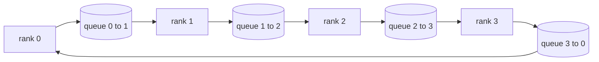

# 从零实现集合操作

> 支撑分布式训练的四个集合操作是 allreduce、broadcast、allgather 和 reduce_scatter。训练框架提供的其他原语都只是围绕它们的包装。先基于 `multiprocessing.Queue` 网格实现一次，再用参考实现验证，track 后面的内容就都成了接线。

**Type:** Build
**Languages:** Python
**Prerequisites:** Phase 19 Track C lessons 42-49
**Time:** ~90 min

## Learning Objectives

- 用两遍实现 ring allreduce，先 reduce-scatter 再 allgather，并证明每 rank 通信量是每元素 2(N-1)/N 字节。
- 基于 `multiprocessing.Queue` 上的点对点发送构建 broadcast、allgather 和 reduce_scatter。
- 针对同一输入，把每个原语与 `torch.distributed` gloo 参考实现验证。
- 从集群形状、延迟下限和带宽上限解释 ring 与 tree 的选择。

## 问题

朴素 allreduce 会把 N 份张量发送到 root，再广播 N 份回来。每 rank 带宽按 O(N) 扩展，root 成为瓶颈，wall-clock 下限是最慢链路乘以 N。Ring allreduce 把它压平成 2(N-1) 个大小为 T/N 的块，所以每 rank 字节数降到 2T(N-1)/N，且不随集群大小线性增长。Tree allreduce 在小 N 和高延迟链路上胜出，因为深度是 log2(N) 跳，而不是 2(N-1)。为集群形状选错拓扑，最慢 GPU 就会决定 step time。

本 track 中你会读到的每个分布式训练框架都依赖这四个原语。PyTorch DDP 对每个参数 bucket 做一次 allreduce 来同步梯度。ZeRO 用 reduce_scatter 分片优化器状态，并用 allgather 广播更新后的参数。FSDP 把完整 forward 变成 allgather 加 reduce_scatter。Pipeline parallel 需要 broadcast 在 stage group 间传递 activations。如果你不能实现这四个 collectives，就无法解释训练为何停顿、梯度不匹配为何出现在 rank 3，或为什么切换拓扑后 pipeline bubble 翻倍。

## 概念



### 两遍 ring allreduce

把张量切成 N 个等大块，编号 0..N-1。每个 rank 拥有与自身 rank 相同编号的块。第一遍 reduce-scatter 运行 N-1 步。第 s 步，rank r 把块 `(r - s) mod N` 发送给 rank `(r + 1) mod N`，并从 rank `(r - 1) mod N` 接收块 `(r - s - 1) mod N`，把收到的块累加到本地副本。N-1 步后，rank r 拥有块 r 的完整求和。第二遍 allgather 再运行 N-1 步，把已完成块沿环旋转，直到每个 rank 都持有每个块的完整求和。

| Primitive | Per-rank bytes | Steps | When to use |
|-----------|---------------|-------|-------------|
| Ring allreduce | 2T(N-1)/N | 2(N-1) | 大 T、胖管道同构集群 |
| Tree allreduce | T log2(N) | 2 log2(N) | 小 T 或高延迟链路 |
| Broadcast | T | log2(N) tree | 参数初始化、标量配置 |
| Allgather | T(N-1)/N | N-1 | 分片 forward、ZeRO unshard |
| Reduce_scatter | T(N-1)/N | N-1 | ZeRO 梯度分片 |

### Queue mesh 作为 NCCL 替身

NCCL 运行在 PCIe 和 NVLink 上，并用硬件卸载 reductions。CPU 上没有这些能力。每条 ring edge 一个 `multiprocessing.Queue` 可以提供有序点对点传递，且单生产者单消费者。归约发生在用户空间，所以你会支付 Python 开销，但线路模式和 NCCL ring allreduce 一样。先在 queue 版本上推理正确性，集群行为就能跟上。

### 与 gloo 验证

每个原语都有单元测试，把它的输出与在同一 world size、同一张量上初始化 gloo backend 的 `torch.distributed` 输出比较。如果你的 ring allreduce 与 gloo 的差异超过 float32 epsilon，测试失败。用参考实现验证不可协商；没有它，原语会一直看起来正确，直到真实训练运行第 10000 步。

## 构建

`code/main.py` 实现：

- `Mesh` 类，把 N 个 `multiprocessing.Queue` 接成一个环，并为每个 rank 暴露 `send(dst, tensor)` 和 `recv(src)`。
- `ring_allreduce(mesh, rank, world_size, tensor)`，运行两遍算法。
- `broadcast(mesh, rank, world_size, tensor, src)`，基于对数树。
- `allgather(mesh, rank, world_size, tensor)`，使用 N-1 次旋转。
- `reduce_scatter(mesh, rank, world_size, tensor)`，也就是 allreduce 的前半部分。
- `_gloo_reference(op, world_size, tensor)`，用 gloo 让同一输入跑过 `torch.distributed`，做字节相等比较。

运行：

```bash
python3 code/main.py
```

输出：每个原语的验证表，对比 queue-mesh 和 gloo 输出，随后是每 rank 字节计数，证明 2T(N-1)/N 缩放。

## 野外生产模式

三种模式让这些原语足够可靠，可以发布。

**Allreduce 前先 bucket gradients。** 10 亿参数模型有数万梯度张量。每个张量一次 allreduce 会支付 N 次延迟下限。DDP 把梯度打包成约 25 MB 的块，并对每个 bucket 只发一次 allreduce；小张量搭大张量的顺风车。没有 bucketing，延迟开销会主导 step。

**通信与计算重叠。** Backward 按反向层序计算梯度。最后一层梯度一准备好，就启动它的 allreduce，同时下一层继续计算。PyTorch DDP 用 bucket-ready hooks 接线。网络有余量时，重叠能把可见通信时间减半。

**按消息大小选 ring 或 tree，不按信仰选。** NCCL 带拓扑检测器，对大于约 1 MB 的消息选 ring，对更小消息选 tree。交叉点是带宽与延迟：高于 1 MB 时，带宽项 2T(N-1)/N 占主导，ring 胜；低于 1 MB 时，log2(N) 跳数胜。硬编码一种拓扑会在错误消息大小上损失吞吐。

## 使用

生产模式：

- **PyTorch DDP.** Backward 后对 bucketed gradients 调用 `dist.all_reduce`。Bucket size 可调，默认 25 MB 对 100Gbit Ethernet 合理。
- **DeepSpeed ZeRO.** 发出 reduce_scatter 来分片梯度，并在 forward 前 allgather 重建完整参数。本课原语正是 ZeRO 调用的那些。
- **FSDP.** Forward 以 allgather 开始，unshard 该层，计算，然后用 reduce_scatter 归约并丢弃 unshard。同一组原语，不同调度。

## 交付

在第 77 到 81 课中使用 queue-mesh 原语。第 77 课把 allreduce 接入 DDP。第 78 课把 reduce_scatter 接入 ZeRO。第 79 课把 broadcast 接入 pipeline activations。第 81 课把四者组合进端到端演示。

## 练习

1. 添加 tree allreduce 变体，并按消息大小在 ring 和 tree 间切换。测量交叉点。
2. 添加 `recv_timeout_ms`，让停滞 rank 暴露 deadline error，而不是永久挂起。
3. 用 TCP sockets 替换 `multiprocessing.Queue` 实现四个原语。同样测试，真实网络。
4. 添加带宽 instrumentation hook，让每 rank 字节计数写入 JSONL。
5. 在 4 ranks 上比较 ring 与 tree 对 1KB、1MB、16MB 张量的 wall-clock 时间。用实证结果解释交叉点。

## 关键术语

| Term | What people say | What it actually means |
|------|----------------|------------------------|
| Allreduce | “Sum across ranks” | 调用后每个 rank 都持有相同的归约张量 |
| Ring | “The fast topology” | 大小为 T/N 的 N-1 个块沿环流动两遍 |
| Tree | “The log topology” | 归约沿二叉树进行，深度为 log2(N) 跳 |
| Allgather | “Concatenate shards” | 每个 rank 最终持有其他每个 rank 的 shard |
| Reduce_scatter | “Split the sum” | 每个 rank 最终只持有一个块的求和 |
| Bucket | “Fuse small tensors” | 把 N 个小 allreduce 合并成一个大 allreduce |

## 延伸阅读

- [PyTorch Distributed: NCCL collectives](https://pytorch.org/docs/stable/distributed.html#collective-functions)
- [Horovod ring allreduce paper](https://arxiv.org/abs/1802.05799)
- [NCCL topology and algorithm selection](https://docs.nvidia.com/deeplearning/nccl/user-guide/docs/index.html)
- [Patarasuk and Yuan, Bandwidth optimal allreduce algorithms](https://www.cs.fsu.edu/~xyuan/paper/09jpdc.pdf)
- Phase 10 Lesson 05，distributed training overview
- Phase 19 Lesson 77，基于这些原语构建 DDP
