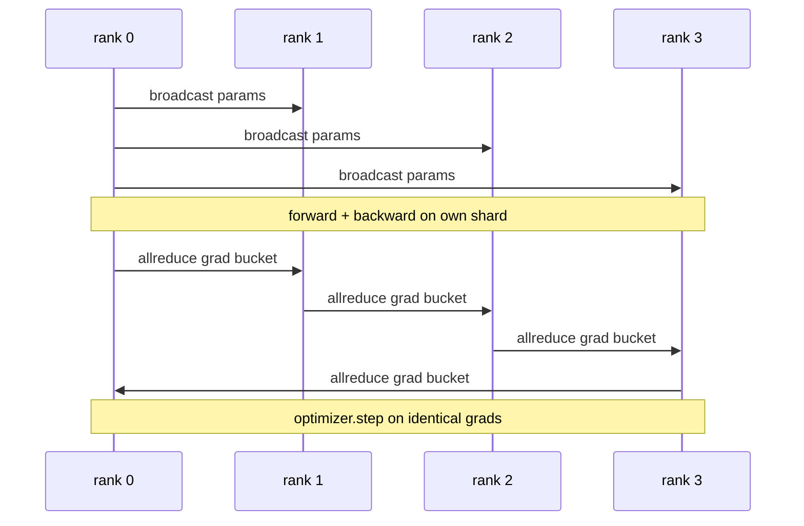

# 从零实现数据并行 DDP

> DistributedDataParallel 是 allreduce 之上的 hook。包装一个模型，从 rank 0 广播初始参数，让每个 rank 从相同状态开始，在每个参数上安装 backward hook，对梯度发出 allreduce，剩下就是梯度下降。整个模式 200 行。

**Type:** Build
**Languages:** Python
**Prerequisites:** Phase 19 Track C lessons 42-49
**Time:** ~90 min

## Learning Objectives

- 接一个 `DistributedDataParallel` 形状的 wrapper，广播初始参数，并在 backward 后 allreduce 梯度。
- 使用 `torch.multiprocessing.spawn` 在 gloo backend 上通过 file-based rendezvous 启动 N 个 CPU ranks。
- 通过在相同数据上顺序训练同一个模型，并展示逐 step 参数等价，证明梯度同步正确性。
- 解释 buckets，梯度融合，和 overlap，backward 中通信，是把可工作的 DDP 变成生产 DDP 的两个改变。

## 问题

一个带 12 GB activations 的 10 亿参数模型放不进单张消费级 GPU。即使能放下，训练也要数周。Data parallel 把 batch 拆到 N 个 ranks 上，每个 rank 在自己的 shard 上计算 forward 和 backward，并在每一步把所有 rank 的梯度求和，让 N 个副本保持一致。优化器 step 使用的是求和后的梯度。

没有梯度同步，N 个副本到第 2 步就会分叉。模型不再是 “一个在更多数据上训练的模型”，而是 N 个共享初始权重的独立模型。梯度同步做得不好，一参数一次 allreduce、无重叠、无 bucketing，网络会成为瓶颈，GPU 空等线路。DDP 的手艺就是让梯度同步相对计算几乎免费。标准 PyTorch DDP 通过 bucket gradients、把 allreduce 与下一层 backward 重叠、在 NVLink 上使用 NCCL 来做到这一点。我们可以在 CPU 上用 gloo 做全部三件事，并学到同样经验。

## 概念



### DDP 需要的三个操作

| Stage | Collective | Why |
|-------|-----------|-----|
| Init | 从 rank 0 broadcast | 每个 rank 从相同参数开始 |
| After backward | 每个 grad allreduce | 优化器 step 使用均值梯度 |
| Sometimes | broadcast buffers | Batchnorm running stats 保持同步 |

### 为什么用 mean 而不是 sum

Allreduce-SUM 除以 world_size 得到均值梯度。均值对 world_size 不变：在一个 rank 上调好的 learning rate 到四个 ranks 也可用，因为每步梯度幅度不变。不除的 Allreduce-SUM 会迫使你每次改变集群大小都重新调 learning rate。DDP 包装 SUM 并除以 world_size；本课也这样做。

### 为什么 bucket gradients

Transformer 有数千个参数张量。每个张量一次 allreduce 会支付数千次 gloo 延迟下限。DDP 把梯度分组成约 25 MB 的 buckets，每个 bucket 发一次 allreduce。线路上传输的总字节相同，但延迟被 bucket 摊销。本课的小模型把所有东西放进一个 bucket；结构才是可迁移的部分。

### 为什么固定 seed

每个 rank 必须对 shuffle 调用 `torch.manual_seed(seed + rank)`，但对参数初始化调用 `torch.manual_seed(seed)`。单一共享 seed 意味着每个 rank 看到相同 batch 顺序，破坏 data parallel；参数使用 rank-specific seed 意味着初始参数相差 float epsilon，梯度同步不再让副本一致。seed 模式错误，参数等价测试会在第 1 步失败。

## 构建

`code/main.py` 实现：

- `MiniMLP`：一个 3 层 MLP，小到数秒内收敛，大到足以暴露接线。
- `DistributedDataParallel(model, world_size)`：构造时广播 params，返回 wrapper，其 `sync_grads` 会把 allreduce-summed grads 除以 world_size。
- `worker(rank, world_size, ...)`：完整训练循环，使用 gloo 初始化 `torch.distributed`，forward、backward、sync、step。
- `_reference_single_process_loop(...)`：在一个 rank 上对同一模型和同一数据顺序训练，用于测试每步后参数字节相等。

运行：

```bash
python3 code/main.py
```

输出：逐 step 训练表，对比单进程 loss 和参数 checksum 与 4 ranks DDP 运行。两条路径在 float epsilon 内产生相同 loss curves，证明梯度同步正确。

## 野外生产模式

三种模式让 DDP 足够可靠，可以发布。

**Find unused parameters.** 有些 forward 路径会按条件跳过参数，early exit、mixture-of-experts router。被跳过的参数没有梯度，但 DDP 的 bucket-ready hook 仍会等它们，导致 allreduce 死锁。`find_unused_parameters=True` 告诉 DDP 在归约前查看哪些 params 得到梯度。代价是每步做一次图遍历，所以除非 forward 有分支，否则保持关闭。

**Static graph optimisation.** 当 forward 跨 step 稳定时，`static_graph=True` 让 DDP 预计算 bucket schedule。这个优化在规模上重要：预计算每步省下几 ms，乘以 10000 步就很可观。

**Gradient accumulation needs care.** 在 K 个 microbatches 上累积梯度，而不是每个 microbatch 都同步，是 10x 吞吐收益。DDP 暴露 `no_sync()` 作为暂停 post-backward allreduce 的上下文管理器。忘记使用它，就会白白 allreduce K 次；吞吐跌到地板。

## 使用

生产模式：

- **PyTorch DDP.** 标准实现。`torch.nn.parallel.DistributedDataParallel(model)` 接好 bucketing、overlap 和 no_sync context。
- **HuggingFace Accelerate.** 添加处理 `torchrun` env vars 和模型包装的 launcher。底层仍是 DDP。
- **Megatron-LM data parallel.** 把 DDP 与 tensor parallel 组合给大模型使用；data-parallel 部分仍是 backward 后 allreduce 模式。

## 交付

第 78 课，ZeRO sharding，用 reduce_scatter 替换逐参数 allreduce，让每个 rank 只存自己的优化器状态 shard。第 81 课把 DDP 与 ZeRO 组合进端到端演示。

## 练习

1. 添加可配置大小的 gradient buckets，并在更深模型上测量相对每参数一次 allreduce 的加速。
2. 把 `no_sync()` 实现为上下文管理器，并验证 K 个 microbatches 上的梯度累积匹配单进程基线。
3. 添加 `find_unused_parameters` 模式，让 forward 有时跳过某个 MLP 层；不加该标志时运行应死锁。
4. 用只含 `torch.distributed.barrier()` 的同步替换 gloo，感受 allreduce-based 和 barrier-based sync 的差异。
5. 对 batch sizes 1、16、256，测量梯度同步开销占 step time 的比例，并解释缩放。

## 关键术语

| Term | What people say | What it actually means |
|------|----------------|------------------------|
| DDP | “Data parallel” | 每步广播 params 并 allreduce grads 的 wrapper |
| Bucket | “Fuse grads” | 把 N 个小 allreduce 分组成一个大 allreduce |
| Overlap | “Hide comm” | 在后续层还在计算 backward 时发出 allreduce |
| no_sync | “Accumulate” | 梯度累积时跳过 post-backward allreduce |
| find_unused | “Branchy forward” | 归约前检测没有 grad 的参数 |

## 延伸阅读

- [PyTorch DistributedDataParallel docs](https://pytorch.org/docs/stable/generated/torch.nn.parallel.DistributedDataParallel.html)
- [PyTorch DDP internals tutorial](https://pytorch.org/tutorials/intermediate/ddp_tutorial.html)
- [Li et al, PyTorch Distributed: Experiences on Accelerating Data Parallel Training](https://arxiv.org/abs/2006.15704)
- Phase 19 Lesson 76，DDP 构建在其上的 collectives
- Phase 19 Lesson 78，ZeRO sharding 用 reduce_scatter 替换 per-param allreduce
