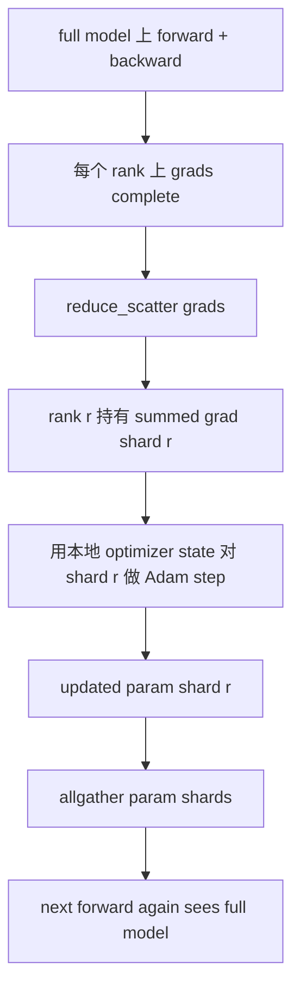

# ZeRO 优化器状态分片

> Adam 为每个参数存两份动量估计，而且都是 float32。一个 7B 参数模型携带 56 GB 的优化器状态。ZeRO stage 1 把这些状态分片到 N 个 ranks 上，每个 rank 只拥有 1/N 的优化器。局部 step 后，更新后的参数 shard 广播回来，每个 rank 重建完整模型，下一步开始。收益是训练栈中最大单次分配的线性内存下降。

**Type:** Build
**Languages:** Python
**Prerequisites:** Phase 19 Track C lessons 42-49
**Time:** ~90 min

## Learning Objectives

- 把优化器状态，first moment、second moment、fp32 master copy，在 N 个 ranks 间分片，让每个 rank 拥有 1/N。
- 使用 reduce_scatter 让每个 rank 只拿到自己 shard 的梯度和，再用 allgather 把更新后的参数 shard 广播回来。
- 计算 stage 1、stage 2、stage 3 相对于 vanilla DDP 的内存节省表。
- 根据模型大小和带宽预算，解释 stage 1、stage 2、stage 3 的选择。

## 问题

Vanilla DDP 会复制一切：参数、梯度和优化器状态都会完整存在于每个 rank 上。对于一个 fp16 的 7B 参数模型，这意味着每 rank 14 GB 参数、14 GB 梯度和 28 GB 优化器状态。优化器状态是最大的项，也最容易分片，因为它只在 step 期间被触碰，不在 forward 或 backward 期间。

ZeRO stage 1 分片优化器状态。每个 rank 持有 1/N 的 Adam moments。Backward 后，ZeRO 不会 allreduce 完整梯度再本地 step，而是 reduce_scatter，这样每个 rank 只收到自己 shard 的梯度和。rank 对 master parameters 的 shard 做优化器 step。更新后的参数 shard 再 allgather 回来，这样每个 rank 在下一次 forward 前都拥有完整模型。优化器内存下降 N 倍。每步线路流量和 DDP 相同：一次 reduce_scatter 加一次 allgather，在带宽上等于一次 allreduce。内存获胜，吞吐保持。

## 概念



### ZeRO 的阶段

| Stage | What is sharded | Memory per rank | Comm per step |
|-------|----------------|------------------|---------------|
| DDP | nothing | params + grads + optim | 1x allreduce |
| ZeRO-1 | optimiser state | params + grads + optim/N | 1x reduce_scatter + 1x allgather |
| ZeRO-2 | optim + grads | params + grads/N + optim/N | 1x reduce_scatter + 1x allgather |
| ZeRO-3 | optim + grads + params | params/N + grads/N + optim/N | 每层 1x allgather + 每层 1x reduce_scatter |

Stage 1 是最便宜的收益，因为优化器状态占预算最大。Stage 2 需要梯度分片累积逻辑，但带宽相同。Stage 3，FSDP，为每层通信付费，以换取参数分片的内存下降。本课完整实现 stage 1。

### 真实数字下的内存数学

对于一个使用 Adam、混合精度训练的参数量为 P 的模型：

| Term | Vanilla | ZeRO-1 | Why |
|------|---------|--------|-----|
| fp16 params | 2P bytes | 2P bytes | forward 需要 |
| fp16 grads | 2P bytes | 2P bytes | backward 需要 |
| fp32 master copy | 4P bytes | 4P/N bytes | 只有优化器用它 |
| fp32 first moment | 4P bytes | 4P/N bytes | 只有优化器用它 |
| fp32 second moment | 4P bytes | 4P/N bytes | 只有优化器用它 |
| Total | 16P bytes | 4P + 12P/N bytes |   |

在 N=8 时：vanilla 16P，ZeRO-1 5.5P，下降 65%。在 N=64 时：vanilla 16P，ZeRO-1 4.19P，下降 74%。

### 为什么 reduce_scatter 胜过先 allreduce 再切分

Allreduce 会让每个 rank 都拿到完整求和梯度。如果你只需要 shard r，那么被 reduce 的梯度中 `(N-1)/N` 的部分对 rank r 来说是浪费。Reduce_scatter 恰好给每个 rank 分配它拥有的 shard；每 rank 字节数和 allreduce 相同，因为 allreduce 本身就是 reduce_scatter 加 allgather，但后半部分会在之后由参数 shard 的 allgather 替代。总线路流量与 DDP 相同，内存被切分。

## 构建

`code/main.py` 实现：

- `flatten_params(module)` 和 `unflatten_into(module, flat)`，把模型参数打包成一个连续张量，再解包回去。平坦布局让按 rank 分片变成简单 slice。
- `ZeroOptimizer(model, world_size, rank, lr)`，持有该 rank 的 master copy 和 Adam moments shard。
- `step()`，对平坦梯度运行 reduce_scatter，对该 rank 的 shard 做 Adam，再把更新后的参数 allgather 回来。
- 一个演示，训练 3 层 MLP 20 步，并打印每步内存预算以及 vanilla DDP baseline。

运行：

```bash
python3 code/main.py
```

输出：每步 loss 和内存表，显示 ZeRO-1 在每个 rank 上只持有 1/N 的优化器状态，而 DDP 持有完整副本。

## 野外生产模式

三种模式让 ZeRO 足够可靠，可以发布。

**Sharded checkpointing matters.** ZeRO-1 的优化器状态分布在各个 ranks 上；checkpoint 必须记录哪个 rank 拥有什么。第 80 课会构建 sharded checkpoint manifest，让 ZeRO 在相同 world size 上恢复。没有它，保存的状态在重启时不可读。

**Mixed precision is the point.** ZeRO 是混合精度技术；被分片的是 fp32 master copy。不配合 mixed precision 使用 ZeRO，会在 fp32 master 上付出内存税，却没有对应的 fp16 forward 收益。生产运行总是把 ZeRO 与 autocast 或 bf16 权重配套。

**Stage 1 is a near-free win.** 带宽上的通信与 DDP 相同。内存节省按 N 线性增长。唯一代价是优化器 shard 的 bookkeeping。生产栈默认 stage 1，除非参数 shard 内存也成问题；那时 stage 2 或 3 用通信换内存。

## 使用

生产模式：

- **DeepSpeed ZeRO.** 参考实现。`deepspeed_config.json` 选择 stage 1/2/3 和 partition sizes。
- **PyTorch FSDP.** PyTorch 原生等价实现。`ShardingStrategy.SHARD_GRAD_OP` 是 ZeRO-2；`FULL_SHARD` 是 ZeRO-3。
- **HuggingFace Accelerate.** 通过统一配置包装 DeepSpeed 和 FSDP。

## 交付

第 79 课，pipeline parallel，是正交的分片轴：它不是在同一个模型内分片优化器状态，而是把层分片到各个 ranks 上。第 81 课把 DDP + ZeRO 组合进端到端演示。

## 练习

1. 扩展到 ZeRO-2，分片梯度：每个 rank 只存自己 shard 的梯度，通过 backward 后清零非 shard 部分实现。
2. 添加内存 profiler，打印 rank 0 上实际 fp32 字节使用量与公式预测的对比。
3. 测量 vanilla DDP 与 ZeRO-1 的每步 wall-clock time，并分解为 forward、backward、comm。
4. 在 ZeRO-1 下实现 gradient clipping：L2 norm 必须通过 local norm squared 的 allreduce 在所有 shards 上计算。
5. 实现一个 “naive ZeRO”，用 allreduce 代替 reduce_scatter，测量线路时间差异。用数字为 reduce_scatter 选择辩护。

## 关键术语

| Term | What people say | What it actually means |
|------|----------------|------------------------|
| ZeRO-1 | “Shard the optimiser” | 每个 rank 持有 1/N 的 fp32 master 和 Adam moments |
| ZeRO-2 | “Shard grads too” | 每个 rank 在 reduce_scatter 后还丢弃非 shard 梯度 |
| ZeRO-3 | “Shard params” | 每个 rank 持有 1/N 的 fp16 params；forward 中每层 allgather |
| Master copy | “fp32 weights” | 优化器更新的高精度参数副本 |
| Reduce_scatter | “Split the sum” | 只把该 rank 自己的梯度 shard 交给它 |

## 延伸阅读

- [Rajbhandari et al, ZeRO: Memory Optimizations Toward Training Trillion Parameter Models](https://arxiv.org/abs/1910.02054)
- [DeepSpeed ZeRO documentation](https://www.deepspeed.ai/tutorials/zero/)
- [PyTorch FSDP documentation](https://pytorch.org/docs/stable/fsdp.html)
- Phase 19 Lesson 76，本课所依赖的 reduce_scatter 和 allgather
- Phase 19 Lesson 80，本课需要保存的 ZeRO state 的分片 checkpoint
