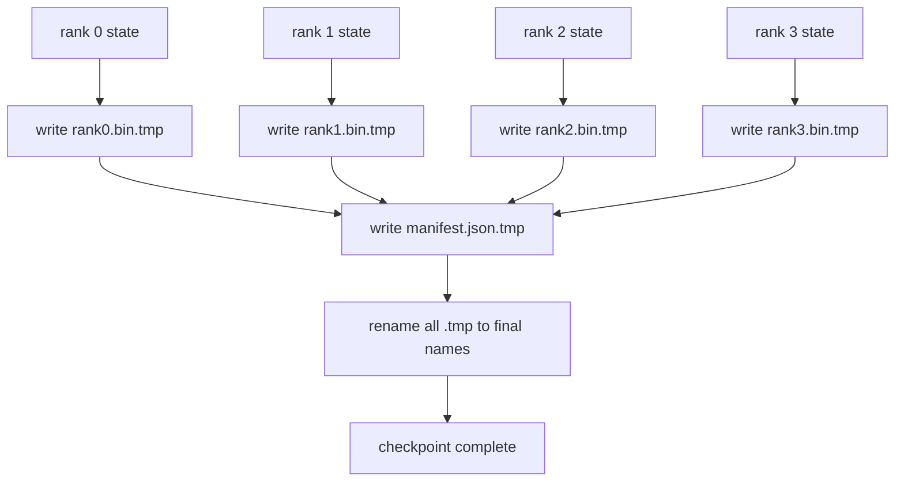

# 分片检查点与原子恢复

> 一个 70B 参数训练任务会每隔几小时因节点故障暂停一次。checkpoint 格式决定你丢掉 30 分钟还是 30 小时。分片 checkpoint 会并行写出每个 rank 的 shard，并在 manifest 中记录所有权。恢复时，每个 rank 从自己的文件加载 shard，在相同 world size 上重建状态，优化器像什么都没发生一样继续 step。原子写能防止半成品 checkpoint 污染下一次恢复。

**Type:** Build
**Languages:** Python
**Prerequisites:** Phase 19 Track C lessons 42-49
**Time:** ~90 min

## Learning Objectives

- 把多 rank checkpoint 保存为每 rank 一个 shard 文件，再加一个记录每个 shard 归属的 manifest。
- 使用原子写模式，先写临时路径再 rename，确保写到一半崩溃时不会产出半成品 checkpoint。
- 从 manifest 恢复，验证 fp16 parameters 和 ZeRO optimizer state 在每个 rank 上都 byte-equal。
- 用 manifest schema 对抗三种失败模式：world-size 变化、shard 数不匹配、部分写入。

## 问题

普通 checkpoint 会把所有参数和优化器状态读入 rank 0，聚合，再写成单个文件。对于一个 70B 模型，这意味着 1.1 TB 状态要经过一个 rank 的网络端口。写入会阻塞其他所有 ranks，因为它们都在等聚合完成。IO 带宽由最慢的单张 GPU 网络链路决定，而不是总带宽。在真实集群上，先 gather 再 write 这一步可能比前一个训练小时还长，也就意味着一天只能产出不到一个 checkpoint。

分片 checkpoint 改变了模式：每个 rank 并行把自己的 shard 写到自己的文件里。Manifest 记录哪个 rank 拥有哪个 shard，这样恢复时就能把每个 shard 放回原处。聚合写带宽随集群扩展。一个 1 TB checkpoint，原本通过一个 rank 需要 4 小时，通过 64 个 ranks 只要 4 分钟。并且 manifest 给你一个关于不兼容恢复的契约：world-size 变化可检测，部分写入可检测，加载路径可以明确失败，而不是静默使用旧数据。

## 概念



### Manifest schema

```json
{
  "world_size": 4,
  "step": 1234,
  "wall_clock_seconds": 4521,
  "shards": [
    {"rank": 0, "path": "rank0.bin", "sha256": "...", "param_shard_offset": 0, "param_shard_numel": 65536},
    {"rank": 1, "path": "rank1.bin", "sha256": "...", "param_shard_offset": 65536, "param_shard_numel": 65536}
  ],
  "schema_version": 1
}
```

三个字段是承重的。`world_size` 让在不同规模上恢复时明确失败，而不是静默损坏。每个 shard 的 `sha256` 可以捕获部分或损坏写入。每个 shard 的 `param_shard_offset` 和 `param_shard_numel` 让 loader 在正确位置重建 flat parameter tensor。

### 原子写

标准模式：把每个 shard 写到 `<name>.tmp`，把 manifest 写到 `manifest.json.tmp`，分别 fsync，然后 rename。同一文件系统上的 POSIX rename 是原子的；新文件要么完整存在，要么旧文件保留。最终 rename 前发生崩溃，会让旧 checkpoint 继续作为 live one。没有原子写，崩溃可能留下一个部分 shard 和一个指向它的 manifest，加载后会在恢复时损坏优化器状态。

### schema 必须防住的三种失败模式

| Failure | Symptom | Defence |
|---------|---------|---------|
| World-size change | 用 N=8 在 N=4 的 manifest 上恢复 | manifest 中 world_size 不匹配，明确失败 |
| Shard count mismatch | 恢复时看到的 rank*.bin 少于 manifest 中的 shards | 枚举 shards，验证每个都存在 |
| Partial write | shard 文件在 flush 中被截断 | 加载时做 sha256 验证 |

每种防御都会尽早拒绝坏加载；否则会发生静默损坏，100 步后 loss 变成 NaN 才暴露。

### 为什么用每 rank 文件，而不是一个大文件

通过 `O_APPEND` 同时写一个文件在 POSIX 上对字节对齐写入是可行的，但实际中一个 shard 内的偏移跨越 MB 级区域，锁开销会压倒一切。每 rank 文件没有竞争，而且在底层文件系统是并行型的情况下（Lustre、GPFS）还能享受 striping。生产栈，DeepSpeed、FSDP、NeMo，都是因为这个原因使用每 rank 文件。

## 构建

`code/main.py` 实现：

- `ShardManifest` dataclass，带上面的 schema，以及 `to_json` / `from_json`。
- `save_sharded(state_dict_per_rank, dir, step)`，用原子 temp-then-rename 模式把每个 rank 的二进制状态写到自己的文件，然后写 manifest。
- `load_sharded(dir, expected_world_size)`，读取 manifest，验证每个 shard 的 sha256，并返回每 rank 的 state dict。
- 一个 round-trip 测试：构建 per-rank state，保存，加载，断言 byte-equal。

运行：

```bash
python3 code/main.py
```

输出：写出 4 个 shard 文件和 manifest，然后重新加载，并通过 byte-equal 验证。

## 野外生产模式

三种模式让 checkpoint 足够可靠，可以发布。

**Async write.** 生产栈会把 checkpoint write 放到单独线程或进程里，这样训练可以继续。barrier 在下一个 checkpoint：前一个 save 没完成之前，不要开始下一次。DeepSpeed 的 `async_io` 标志就是这么做的。本课保持写入同步，这样步骤可见。

**Local fast disk first, then async upload.** 先写本地 NVMe，再异步上传到 S3 或 GCS。双层模式让集群内 checkpoint 在恢复时足够快，同时把耐久副本传到集群外存档。manifest 携带本地路径；upload manifest 携带远程路径。

**Rotation matters.** 生产运行会保留最近 K 个 checkpoint，通常 3 到 5 个，并轮换最旧的。不做 rotation，磁盘会在中途写满，下一次 checkpoint 失败。有 rotation 时，下一次保存会先删除最旧的，腾出预算。

## 使用

生产模式：

- **DeepSpeed checkpointing.** `deepspeed.save_checkpoint(tag=step)` 写 per-rank 文件和一个指向当前 active tag 的 `latest` 文件。
- **PyTorch FSDP checkpointing.** `torch.distributed.checkpoint` 用 `Planner` 保存分片状态，决定每个 rank 的布局。
- **NeMo.** 通过统一的 `save_to_checkpoint` API 包裹 DeepSpeed 和 FSDP，并添加 metadata。

## 交付

第 81 课会保存端到端 DDP+ZeRO 运行的分片 checkpoint，并在相同 world size 上重新加载，以证明恢复契约成立。

## 练习

1. 添加 async write：在线程里启动 save，让训练继续。直到前一个完成前，不允许下一次 save。
2. 添加 `last_5_steps` rotation：保留最近 5 个 checkpoint，在保存新 checkpoint 前删除最旧的。
3. 添加一个仅 CRC 的快速验证路径，用于 inner-loop reload，rotation 把一个 checkpoint 升格为新的 active one 而不做完整 sha256。
4. 添加跨 world-size load：从 N=4 重新分片到 N=8，通过读取 manifest、拼接并重新分片实现。
5. 添加到假的 S3，第二个目录，的上传，并写 upload manifest。为双层存储策略辩护。

## 关键术语

| Term | What people say | What it actually means |
|------|----------------|------------------------|
| Sharded checkpoint | “Per-rank save” | 每个 rank 并行写自己的 shard 文件 |
| Manifest | “Index” | 记录 shard 路径、offset 和 sha256 的 JSON 文件 |
| Atomic write | “tmp then rename” | 先写 .tmp，再 POSIX rename，崩溃时保留旧文件 |
| Partial write | “Truncated shard” | 写入中崩溃会产出损坏 shard；sha256 能捕获 |
| Rotation | “Keep last K” | 写新 checkpoint 前删除最旧的，限制磁盘使用 |

## 延伸阅读

- [DeepSpeed checkpointing](https://www.deepspeed.ai/tutorials/checkpointing/)
- [PyTorch torch.distributed.checkpoint](https://pytorch.org/docs/stable/distributed.checkpoint.html)
- [POSIX rename atomicity](https://pubs.opengroup.org/onlinepubs/9699919799/functions/rename.html)
- Phase 19 Lesson 78，本 checkpoint 设计来保存的 ZeRO state
- Phase 19 Lesson 81，端到端演示会 round-trip 保存状态
