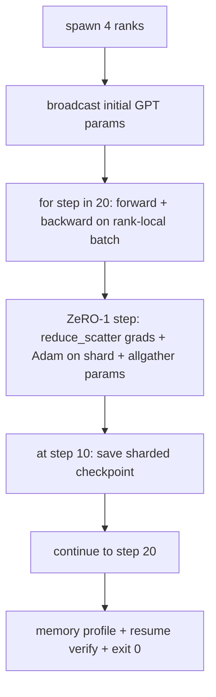

# 端到端分布式训练

> 第 76 到 80 课各自做了一块。这是组装：一个 tiny GPT，跨 4 个模拟 ranks 训练，使用 DDP 做梯度同步，使用 ZeRO-1 做优化器状态分片，并在中途保存分片 checkpoint。演示运行 20 步，会自行结束，打印 loss 曲线和内存分析，并写出可恢复 checkpoint。

**Type:** Build
**Languages:** Python
**Prerequisites:** Phase 19 Track C lessons 42-49
**Time:** ~90 min

## Learning Objectives

- 把 DDP，第 77 课，ZeRO-1，第 78 课，和分片 checkpoint，第 80 课，组合进一个训练循环。
- 在 4 个模拟 ranks 上，把一个 2 层 transformer language model 在小型合成语料上训练 20 步。
- 打印逐步 loss 表、逐 rank 内存分析，以及一个在相同 world size 上 byte-equal 恢复的 checkpoint manifest。
- 为这种组合辩护：每个部分在前面的课程里都能独立测试，而本课证明它们能组合起来。

## 问题

capstone 证明这些组件可以协同工作。第 76 课实现了 collectives。第 77 课把它们包进 DDP。第 78 课用 reduce_scatter 分片优化器状态。第 79 课分析了 pipeline。第 80 课保存了分片 checkpoint。每一课都带自己的测试独立成立。真实训练运行会同时用到每个原语；如果组合错误，loss 会发散，checkpoint 无法恢复，或本该缩小的每 rank 内存反而增长。

本课运行端到端演示，并验证四个不变量：(a) 20 步内 loss 在浮点噪声范围内单调下降，(b) 每个 rank 在每一步都持有相同的参数 norm，(c) 每 rank 的优化器内存等于 ZeRO-1 公式 12P/N 字节，(d) 第 10 步的 checkpoint 在重启时 byte-equal 重新加载。演示会自行结束：20 步，一个命令，退出码 0。

## 概念



### Mini GPT

模型故意很小：2 个 transformer blocks，embed dim 32，4 个 attention heads，vocab 64，sequence length 16，batch 4。参数只有几千个。足够大，能测试每个接线决策，多头注意力走标准 masked 路径，LayerNorm 有权重需要同步，LM head 是回到 vocab 的单独线性投影。又足够小，在 4 个 CPU ranks 上跑 20 步只需几秒。

### 组合规则

| Lesson piece | What it owns | What it leaves to the loop |
|--------------|--------------|----------------------------|
| DDP broadcast | 初始参数同步 | 构造时一次调用 |
| ZeRO-1 step | 梯度同步、master copy 更新、参数广播 | 每步一次调用，替代 optimiser.step |
| Sharded checkpoint | 持久化 per-rank 状态，带 sha256 的 manifest | 在 rank 0 上，通过 allgather 收集 state 后调用 |
| Training loop | Forward、backward、loss logging | 按顺序调用上面三个 |

循环不需要知道 reduce_scatter 或 rendezvous files。ZeRO 和 checkpoint 模块暴露很窄的接口，由 loop 组合。

### 为什么是 tiny GPT，而不是 MLP

第 77 课的 MLP 足以验证梯度同步。tiny GPT 增加三件事：独立的 vocab LM head，本课中为了清晰没有 tying，完整 GPT 通常会把 head 和 token embedding tie 起来；softmax + cross-entropy 作为 loss，数值边界情况比 MSE 多；以及不对称的 forward，每层是 embeddings 然后 attention 然后 MLP。如果 capstone 还用 MLP，就会看不出组合是否正确处理了 LayerNorm 或 embedding 层的 grad shape。

### 自行结束意味着退出码 0

循环跑固定 20 步然后退出。没有 `while True`，没有人工介入，也没有外部状态恢复。一个能无人值守运行并在结束时留下完整日志的 capstone，才证明系统接线正确。如果任何部分死锁，演示就永远不返回，测试框架会捕获它。

## 构建

`code/main.py` 实现：

- `MiniGPT`：2 层 transformer，带 masked self-attention 和独立 LM head。
- `make_corpus(seed, total_tokens)`：确定性的 next-token-prediction 数据。
- `_train_worker`：每个 rank 启动一次；广播初始参数，运行循环，调用 ZeRO step，在 step 10 写 sharded checkpoint。
- `verify_resume`：主运行结束后，在进程内重新加载 step-10 checkpoint，并断言保存的 master shards 与内存快照逐字节相同。
- `main`：编排完整演示，打印 loss 表、memory profile 和验证结果。

运行：

```bash
python3 code/main.py
```

输出：20 行 loss 表、4 行 per-rank memory profile、checkpoint manifest，以及成功时的一行 `RESUME VERIFIED`。

## 野外生产模式

三种模式让组合在真实运行中成立。

**Checkpoint every K minutes, not every K steps.** Step time 会随 seq length 和 microbatch count 变化。10 分钟一次的 checkpoint 频率能在模型大小变化时捕获相同的计算进展。本课为了简单按步数计；生产中按 wall-clock 计。

**Detect divergence early.** 生产运行会在 backward 后加 NaN guard 和 loss-spike detector；如果 loss 在一步内跳过 2 倍，就回滚到前一个 checkpoint，而不是让优化器走进退化状态。本课 loss 曲线平滑，所以 guard 未使用，但 hook 保留。

**Aggregate the memory profile across ranks.** 真实运行中每个 rank 的内存不同，pipeline stage 最大的那个 rank 持有更多 activations。生产日志会记录 ranks 中的最大值和均值；本课打印逐 rank 值，以展示公式匹配。

## 使用

生产模式：

- **DeepSpeed.** 在一个 config 下组合 DDP + ZeRO + pipeline + activation checkpointing。本课的组合就是 DeepSpeed 形状的缩影。
- **PyTorch FSDP.** 原生等价物。`FullyShardedDataParallel` 配 `ShardingStrategy.SHARD_GRAD_OP` 就是 ZeRO-2。
- **NeMo and Megatron-LM.** 为极大模型再加 tensor parallel；否则组合形状相同。

## 交付

完整 track 到这里结束。这 6 课合起来，就是真实团队在采用 DeepSpeed 之前会构建的分布式训练子系统；它已经通过 gloo 证明了抽象，并且已经演练过失败模式。Phase 17，基础设施与生产，是把它带到真实集群的地方。

## 练习

1. 添加 attention head 的 tensor-parallel 切分，并验证 loss 与单 rank 基线一致。两个 ranks：每个 rank 一半 heads，对 attention output 做 allreduce。
2. 添加跨 4 个 microbatches 的 gradient accumulation，并证明梯度等于一个大 batch 的梯度。
3. 添加一个从 step 10 恢复并继续训练到 step 20 的路径，并让最终 loss 与原始运行一致。
4. 添加 metrics export，loss、grad norm、step time，写入 JSONL，方便事后可视化。
5. 添加 NaN guard，在 loss spike 时回滚到前一个 checkpoint，并用一步 LR multiplier 强制制造 spike 来测试回滚。

## 关键术语

| Term | What people say | What it actually means |
|------|----------------|------------------------|
| End-to-end | “Wire it all up” | 一次运行组合每个部分，而不是每个部分各自一个单元测试 |
| Memory profile | “GB per rank” | 每个 rank 上参数、梯度、优化器状态占用的字节数 |
| Resume contract | “Save and load” | checkpoint round-trip 后每个 rank 的状态 byte-equal |
| Self-terminating | “Bounded run” | 固定步数，完成后退出码 0，没有人工在环 |

## 延伸阅读

- [DeepSpeed end-to-end training tutorial](https://www.deepspeed.ai/getting-started/)
- [PyTorch FSDP advanced tutorial](https://pytorch.org/tutorials/intermediate/FSDP_advanced_tutorial.html)
- [Megatron-LM training script reference](https://github.com/NVIDIA/Megatron-LM)
- Phase 19 Lessons 76-80，本课组合的每个部分
- Phase 17，把组合带到真实集群
