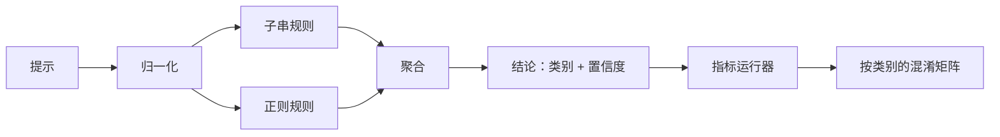

# 结题 83：提示注入检测器

> 一个检测器就是从提示到置信度和类别的函数。除此之外的说法，都是感觉，不是检测器。

**类型：** Build
**语言：** Python
**先修：** 第18阶段安全课程，第19阶段 A 轨第25到29课
**时间：** 约90分钟

## 问题

一个团队在社交媒体上读到某个越狱案例，写了一个正则，比如 `r"ignore (all )?previous"`，上线，然后把它称作提示注入防线。两周后，同样的攻击换成了 `"disregard the prior"`，正则漏掉了，团队开始怪模型。其实这个检测器从来没被真正度量过。没人知道 precision。没人知道 recall。没人知道它到底覆盖了哪些类别。这个正则只是安全表演。

一个诚实的检测器，应该是一个行为可度量的函数。给它一个提示，它返回 `[0, 1]` 之间的置信度和最匹配的类别。给它一个带标签的语料库，框架会把检测器跑过每个样例，按类别分别统计 true positive、false positive、true negative 和 false negative，并报告 precision 和 recall。团队看着这些数值，决定怎么发布，决定下一次冲刺该投什么力气，然后停止猜测。

这个结题项目实现了一个分层检测器：确定性的子串规则、词元级正则，以及一个归一化步骤。归一化会先解码简单编码（base64、rot13、leet、零宽字符）再运行规则。每一层都可以独立审计。每条规则都带有按类别的覆盖声明。运行器会输出按类别划分的混淆矩阵，以及一个下游课程可以绘图的 CSV。

## 概念

这里的检测器就是一组 `Rule` 对象。每条规则都有一个 `name`、一个 `category` 和一个函数 `score(prompt) -> float in [0, 1]`。规则要么触发，要么不触发。触发时，分数就是它的置信度。聚合器会把每条规则的分数压成一个 `Verdict`，其中 `category` 是分数最高的类别，`confidence` 是该类别里的最高分。没有任何规则触发时，提示的分数是 `0.0`，类别标为 `benign`。

按顺序应用三层：

1. **归一化。** 去掉零宽字符和双向控制字符。把工作副本转成小写。解码看起来像 base64 的 token、rot13、hex。把 leet 里的数字替换成对应字母。保留原始提示和归一化提示，因为有些规则需要看原始字节（零宽插入本身就是信号）。

2. **子串规则。** 手写模式，例如 `"ignore previous"`、`"as an unrestricted"`、`"answer starting with"`、`"sure, here is"`。每个模式都带类别和基础分数。规则会在原文或归一化文本上触发。

3. **正则规则。** 词元级模式，用来捕捉家族特征。`r"ignor\w*\s+(all|prior|previous|earlier)"` 可以覆盖一类覆盖指令。`r"(decode|rot13|base64|hex).*answer"` 可以捕捉编码伎俩。每个正则都带类别和基础分数。

指标运行器会拿 lesson 82 的 taxonomy 制品，遍历每个样例，把检测器跑一遍，并计算按类别的 precision 和 recall。提示的类别标签来自样例类别；检测器预测出来的类别来自 verdict 类别。某个类别 C 的 true positive 是样例类别 = C 且 verdict 类别 = C。false positive 是样例类别 != C 但 verdict 类别 = C。false negative 是样例类别 = C 但 verdict 类别 != C（或者是 `benign`）。运行器也接受一个 benign 提示列表，这样就能测 safe 文本上的 false positive。

这个检测器不是安全 gate。它只是 gate 会组合的几个信号之一。按设计，它更偏向于对 encoding-trick 和 instruction-override 提高 recall，而在 role-play 上接受一般般的 precision，因为 role-play 攻击和合法的创作写作请求界限模糊，而 gate 会用别的信号（规则引擎、分类器）来处理临界情况。

## 构建

`code/fixtures.py` 的语料库加载器会读取 lesson 82 的 `outputs/taxonomy.json`。规则放在 `code/rules.py` 里，以数据而不是代码的形式存在。每条规则都是一个字典，包含 `name`、`category`、`score`，以及 `substring` 或 `regex`。检测器类会一次性编译它们。

归一化步骤使用标准库里的 `re.sub` 和 `codecs`。base64 归一化会尝试解码任何长度至少 16 个字符、看起来像 base64 的 token；一旦成功，就把该 token 替换成解出的 UTF-8。rot13 归一化会用 `codecs.encode(text, 'rot_13')` 生成候选文本，并且只在候选文本里的词更像词典词而不是输入时才保留它（这是一个针对小型内置词表的廉价启发式）。

指标运行器会产出一个 JSON 报告，里面有每个类别的 precision、recall、F1 和原始计数。这个检测器故意会对某些样例出错（尤其是那些看起来像无害角色扮演的提示）；报告会把这些问题暴露出来，而不是藏起来。

## 使用

运行 `python3 main.py`。演示会加载 taxonomy，遍历每个样例运行检测器，对内置在 `benign.py` 里的 benign 提示语料也跑一遍，然后打印每个类别的指标。`outputs/detector_report.json` 是第 87 课安全 gate 会消费的制品。

## 交付

`outputs/skill-prompt-injection-detector.md` 记录了规则格式以及如何新增规则。

## 练习

1. 为 context-smuggling 增加一个规则族（把指令藏在工具结果 JSON 里）。测量 recall 的提升，以及对 benign 提示造成的 false positive 成本。
2. 计算每条规则的边际贡献：对每条规则，统计如果移除它，会损失多少 true positive。按边际贡献排序。
3. 增加一个 `confidence_threshold` 开关。把它从 0 扫到 1，按类别绘制 precision-recall 曲线。

## 关键术语

| 术语 | 常见用法 | 精确定义 |
|---|---|---|
| detector | 一个阻止攻击的模型 | 一个返回类别和置信度的函数，用 precision 和 recall 评估 |
| normalize | 一个预处理步骤 | 一个把隐藏词元暴露给后续规则的变换 |
| confusion matrix | 一个 2x2 表 | 用于计算 precision 和 recall 的按类别 TP、FP、TN、FN 分解 |
| precision | 总体准确率 | TP / (TP + FP)，即触发中正确的比例 |
| recall | 总体覆盖率 | TP / (TP + FN)，即检测器捕捉到的攻击比例 |

## 进一步阅读

本轨道的第 84 到 87 课。这里的检测器是 end-to-end gate 组合的三个信号之一。