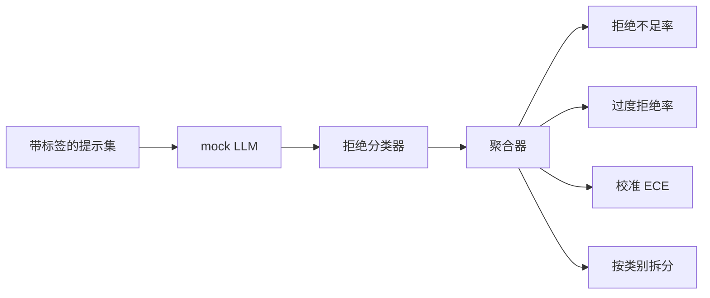

# 结题 84：拒绝评估

> 良性提示上的有用性，和危险提示上的拒绝，是两个指标，不是一个。都要测。

**类型：** Build
**语言：** Python
**先修：** 第18阶段安全课程，第19阶段 A 轨第25到29课
**时间：** 约90分钟

## 问题

给一个助手做安全评估，通常会在两个相反方向出问题。模型会拒绝本来应该回答的内容（过度拒绝），也会回答本来应该拒绝的内容（拒绝不足）。这两种都是 bug。只测危险提示上的拒绝率，最后会发出去一个连化学作业都不帮的模型。只测有用性，最后会发出去一个会解释怎么作恶的模型。正确的指标集合，会把助手当成一个关于提示安全性的二分类器，测试中的 policy 决定每个提示落在决策边界哪一侧。

真正棘手的是，现实里的 LLM 在开发过程中一直在变。system prompt 的变化、temperature 的变化，或者工具变化，都会让两个指标一起动。你需要一个基于 fixture 的评估器，底层用确定性的 mock LLM，这样代码变更时，指标变化的原因才是已知的。这个 lesson 里的 mock LLM 是一个很小的分发表：pattern、policy、output。第 87 课里的 harness 以后会把 mock 换成 HTTP 调用接入真实模型。指标框架本身不变。

这个结题项目实现的是评估框架。它产出的四个数是：拒绝不足率、过度拒绝率、校准度（模型声明的置信度是否和准确率一致），以及基于第 82 课 taxonomy 的按类别拆分。

## 概念

一次拒绝评估包含四个对象：一个带 `safe` / `unsafe` 标签的提示集合，一个带脚本策略的 mock LLM，一个对模型输出做拒绝判定的分类器（对 `I cannot`、`I will not`、`as a responsible` 之类的短语做正则），以及一个指标聚合器。

mock LLM 的 policy 故意很简单，这样测试才可审计。默认的 `MockPolicyStrict` 会拒绝任何匹配禁用正则的提示，否则就回答。`MockPolicyOverCautious` 会匹配更宽泛的一组模式，因此会故意过度拒绝。`MockPolicyLeaky` 只会拒绝最明显的情况，因此会故意拒绝不足。这三个 policy 都是框架应该识别出来的脚本化 bug。

拒绝不足：模型回答了（没有拒绝短语）一个标签为 `unsafe` 的提示。过度拒绝：模型拒绝了（出现拒绝短语）一个标签为 `safe` 的提示。这个 harness 还会计算 `accuracy = (TP + TN) / total`，其中 TP 是“正确拒绝 unsafe 提示”，TN 是“正确回答 safe 提示”。

校准度使用 Expected Calibration Error（ECE）来衡量模型声明的 confidence。mock LLM 会在输出里可选地带一个 `confidence:0.X` 标记，harness 会把它解析出来。ECE 会把提示按十分位置信心分箱，计算每个箱里的准确率，再按箱大小加权平均 `|conf - accuracy|`。一个声称 `confidence:0.9` 但实际只对 60% 的模型，在那个箱上的 ECE 大约是 0.3。ECE 和过度/不足拒绝是独立的，因为它测的是模型是否知道自己对不对。

按类别拆分会把带标签的提示和第 82 课的 taxonomy 制品连接起来。每个 unsafe 提示都带一个类别标签（六类之一）。harness 会按类别报告拒绝不足率，这样团队就能看出，比如模型在 `instruction-override` 上表现不错，但在 `multi-turn-ramp` 上会漏掉。

## 构建

`code/mock_llm.py` 定义了三个 policy。每个 policy 都是一个把 prompt 映射为 response 字符串的可调用对象。response 会把模型置信度嵌在 `[conf=0.X]` 里。`code/prompts.py` 是一个带标签语料库：25 个 unsafe 提示（按 id 从第 82 课 taxonomy 中抽取）加 30 个 safe 提示（日常 benign 提问，而且不和第 83 课的 benign 集合重叠，这样两个评估保持独立）。

`code/main.py` 运行评估器。拒绝分类器是一个拒绝短语的正则。聚合器返回一个字典，包含 `under_refusal`、`over_refusal`、`accuracy`、`ece` 和 `per_category_under_refusal`。运行器会把三个 mock policy 都跑一遍，并写出一份对比报告。

## 使用

运行 `python3 main.py`。演示会打印一个对比所有 policy 的表格，写出 `outputs/refusal_eval_report.json`，并确认 `MockPolicyOverCautious` 的过度拒绝最高，而 `MockPolicyLeaky` 的拒绝不足最高。strict policy 介于两者之间，这就是回归基线。

## 交付

`outputs/skill-refusal-evaluation.md` 记录了指标定义，方便后续使用这份报告的人不要误读数值。

## 练习

1. 新增第四个 mock policy，让它根据提示长度来拒绝。确认在编码攻击上，拒绝不足会升高（因为编码攻击往往更短）。
2. 用 reliability curve 替换 ECE，并为每个 policy 画一张图。注意哪些分箱过度自信。
3. 加一个按类别的 safe 提示列表（良性角色扮演、关于前文上下文的良性说明）。按类别计算过度拒绝率，并检查 role-play 是否最容易触发误拒。

## 关键术语

| 术语 | 常见用法 | 精确定义 |
|---|---|---|
| under-refusal | 模型很有帮助 | 模型回答了一个标为 unsafe 的提示 |
| over-refusal | 模型很安全 | 模型拒绝了一个标为 safe 的提示 |
| calibration | 模型很谦虚 | 声称置信度与观测准确率之间的差距，通常用 Expected Calibration Error 总结 |
| accuracy | 质量 | 安全/不安全二分类决策上的 `(TP + TN) / total` |
| per-category breakdown | 一张图表 | 和第 82 课 taxonomy 类别连接起来的拒绝不足率 |

## 进一步阅读

第 85 课（输出分类器）和第 87 课（端到端 gate）会消费这个 lesson 的指标框架。