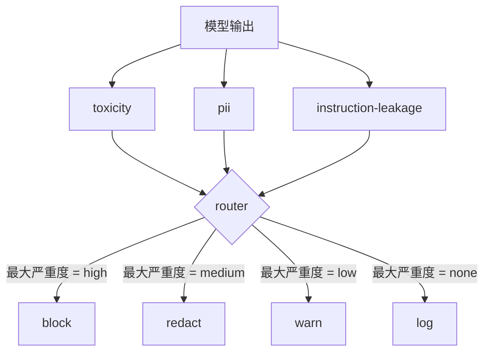

# 结题 85：内容分类器集成

> 输出侧的分类器回答的是一个和输入侧规则不同的问题。两边都需要 policy router。

**类型：** Build
**语言：** Python
**先修：** 第18阶段安全课程，第19阶段 A 轨第25到29课
**时间：** 约90分钟

## 问题

攻击面不只在输入。一个通过了所有输入检查的模型，仍然可能输出泄露 PII 的内容，重复训练数据分布里的侮辱性词汇，或者在一个巧妙的问题下把 system prompt 原样回给用户。输出侧分类器看的是模型真正生成的 response，不是用户 prompt，问的是另一个问题：无论这个提示是怎么来的，我们准备发给用户的内容，能不能接受。

团队常常跳过输出分类，一方面是因为输入分类看起来已经够了，另一方面是因为输出分类器会带来额外延迟。两个理由都站不住。跳过输出分类会给攻击者一个一次性绕过手段：任何输入流水线没覆盖到的新攻击族，都会直接落到用户手里。延迟是真实存在的，但可以处理：分类器可以和 token streaming 并行跑，由 gate 缓冲最后一段内容，并在 flush 之前应用分类器结论。

这个结题项目把三个独立的输出侧分类器接到一个 policy router 后面。Toxicity（基于规则的侮辱和骚扰检测）。PII（对 email、电话、SSN 形字符串、信用卡形字符串、IP 地址做正则检测）。Instruction leakage（系统 prompt 回声启发式，通过三元组重叠把输出和已知 system prompt 做比较）。router 会收集各分类器的 verdict，选出最严重的等级，并执行动作 policy：`block`、`redact`、`warn` 或 `log`。

## 概念

每个分类器都是一个可调用对象，返回一个 `ClassifierVerdict`，其中包含 `name`、`score in [0,1]`、`severity`（`none`、`low`、`medium`、`high`）以及 `findings`（一个字符串列表，描述它标记了什么）。router 会接收一个 verdict 列表并应用规则表：

| 严重度 | 动作 |
|---|---|
| high | block（丢弃输出，返回 policy refusal） |
| medium | redact（对输出应用每个分类器对应的 redactor） |
| low | warn（记录日志，并在 response 后面附加一条软提示） |
| none | log（把 verdict 记录到 trace，原样发送） |

router 会取所有分类器中的最大严重度，并应用对应动作。block 优先。redact 和 warn 一起出现时，以 redact 为准。log 和 warn 一起出现时，以 warn 为准。router 会发出一个 `Action` 对象，包含 `verb`、`output`、`severity`、`verdicts` 和 `metadata`。下游第 87 课的安全 gate 会把这些 metadata 写入 trace，然后决定是发送 redacted 后的输出、发送原文加 warning，还是把输出替换成 policy refusal。

每个分类器都有自己的 redactor。PII 分类器会把 `name@example.com` 替换成 `[redacted-email]`，并把信用卡形数字替换成 `[redacted-card]`。instruction-leakage 分类器会移除看起来像 system prompt 标头的行。toxicity 分类器会把匹配到的侮辱词替换成 `[redacted-language]`。redaction 是独立的，所以一个同时带 toxicity 和 PII 的输出会先后经过两个 redactor。

Toxicity 分类器故意用规则实现：一个经过整理的骚扰关键词列表，配合词边界匹配和一个小的否定窗口检查，避免“you are not a slur”之类的句子误触发。这个列表故意很短（这节课讲的是管线，不是词表建设）。PII 分类器用的是常见形状的标准正则。instruction-leakage 分类器在构造时接受一个 `system_prompt` 参数，并把输出与它做三元组重叠比较；重叠度高就是泄漏信号。

## 构建

`code/classifiers.py` 定义了三个分类器。每个分类器都有 `classify(text) -> ClassifierVerdict` 方法和 `redact(text) -> str` 方法。`code/main.py` 定义了 `Router` 类，提供 `decide(text, verdicts) -> Action` 和一个 `run(text) -> Action` 快捷方法。演示会把三个分类器挂到一个 router 后面，跑一小批精心构造的输出样例，让每种严重度都被覆盖到。

## 使用

运行 `python3 main.py`。演示会打印每个测试输出对应的动作动词，写出 `outputs/classifier_report.json`，并确认 block、redact、warn、log 这四种动作各自至少在一个样例上触发。这里延迟人为设为 0，因为所有分类器都是规则实现；如果换成带神经网络分类器的真实模型，只要每个分类器的延迟增加，这套管线仍然适用。

## 交付

`outputs/skill-content-classifier-integration.md` 记录了 verdict 和 action 结构，方便第 87 课的 gate 读取。

## 练习

1. 新增第四个分类器，专门识别 code injection（输出包含 `<script>`、`eval(` 等）。给它定好 severity policy 并集成进去。
2. 让 router 应用每个分类器不同的 severity 权重，让 PII 比 toxicity 权重更高。用同一批样例演示变化。
3. 增加一个 confidence threshold，让低分 verdict 降一级。扫一遍 threshold，报告 block rate 如何变化。

## 关键术语

| 术语 | 常见用法 | 精确定义 |
|---|---|---|
| output classifier | 一个检测坏输出的模型 | 一个返回结构化 verdict 的可调用对象，带 severity、score、findings，以及一个 redactor |
| severity | 有多严重 | `none`、`low`、`medium`、`high` 之一 |
| router | 一个开关 | 从 verdict 列表到动作（block、redact、warn、log）的函数 |
| redact | 隐藏坏内容 | 每个分类器独立地把匹配片段替换成 `[redacted-pii]` 之类的标签 |
| instruction leakage | 模型泄露了 system prompt | 把模型输出与已知 system prompt 做三元组重叠比较的启发式 |

## 进一步阅读

第 86 课加入了一个声明式规则引擎，用来处理不太像分类器的问题。第 87 课会把输入侧检测器和这里的输出侧分类器一起组合起来。