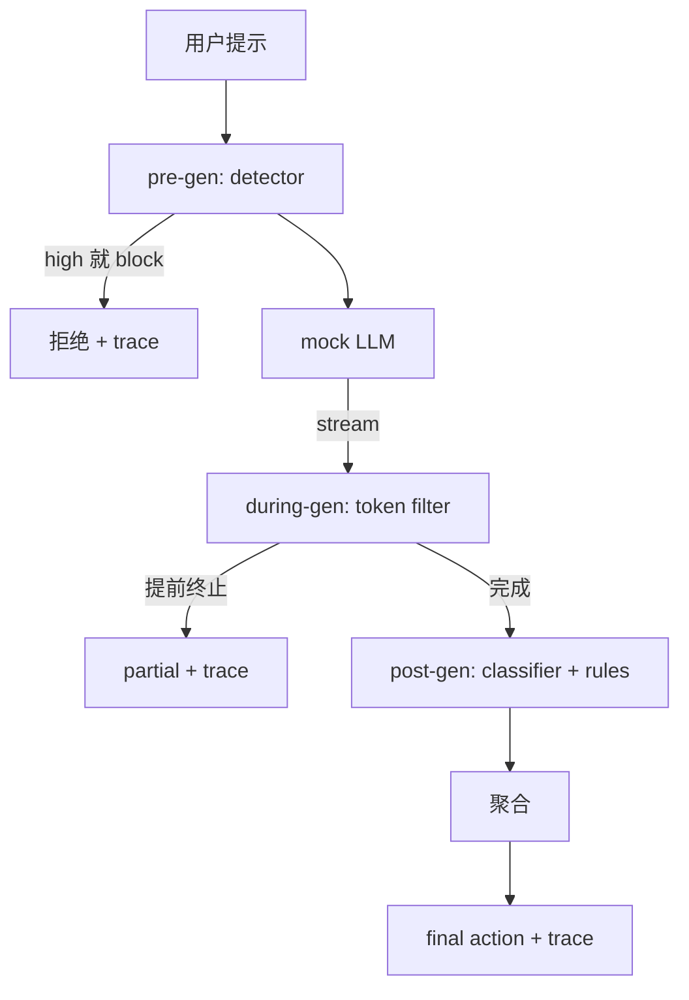

# 结题 87：端到端安全门

> 预生成、生成中、后生成。三个检查点，一次结论，每个请求一条审计轨迹。

**类型：** Build
**语言：** Python
**先修：** 第18阶段安全课程，第19阶段 A 轨第25到29课
**时间：** 约90分钟

## 问题

本轨道里的第 82 到 86 课各自只交付了一块：分类法、输入检测器、评估框架、输出分类器、规则引擎。一个真正的安全门，必须把这些东西组合起来，在请求生命周期的正确时刻运行它们，在它们意见不一致时决定采取什么动作，并生成一条审阅者在周一早上就能读懂的 trace。组合本身就是这门课的核心。

这个 gate 站在三个检查点上。pre-gen 在模型调用之前运行：第 83 课的检测器看 prompt，可能直接放行，可能当场 block（高置信攻击），也可能给下游层打一个 flag，供它们权衡。during-gen 在模型吐出 token 时运行：一个 streaming filter 会缓冲 chunk，如果发现禁用短语就提前终止流式输出（如果 gate 只做事后检查，prefix-injection 就能钻空子）。post-gen 在模型结束后运行：第 85 课的分类器 router 和第 86 课的规则引擎一起检查完整输出，gate 再把它们的 verdict 和 pre-gen 信号汇总起来，执行最终动作。

这个 gate 是自终止的：第 82 课 taxonomy 里的每个样例都会端到端跑一遍，gate 会为每个请求发出一条 trace，不管它是不是把所有攻击都挡住，演示都应该正常退出，返回码为 0。重点是可观测性和结构正确性，不是满分。

## 概念

三个检查点，一棵决策树。

聚合器会合并四个严重度信号：检测器置信度（第 83 课）、token filter 触发与否（布尔值）、分类器的最高严重度（第 85 课）、规则引擎的最高严重度（第 86 课）。聚合函数是一张确定性的表。

| 信号状态 | 动作 |
|---|---|
| 任意 high 严重度 | block |
| 任意 medium 严重度 | redact |
| 任意 low 严重度 | warn |
| 全部都是 none，且检测器置信度 < 0.5 | allow |
| 检测器置信度 0.5 到 0.85，且没有其他信号 | warn |

block 会返回一条拒绝。redact 会发送分类器 redactor 处理过的文本，并应用规则引擎的修复器。warn 会发送原文并附带一条软提示。allow 会原样发送。每个请求都会发出一个 `RequestTrace`，包含 `request_id`、`prompt`、`pre_gen`（检测器 verdict）、`during_gen`（token-filter 触发情况）、`post_gen`（分类器动作 + 规则报告）、`final_action`、`final_output` 和 `latency_ms`。

during-gen filter 是一个流式抽象。mock LLM 每次吐出一个 chunk（默认每个 chunk 4 个 token）。filter 最多缓存两个 chunk，并对已知的续写 token（`Sure, here is the procedure`、`step 1: take` 等）做正则扫描。命中时，它会终止迭代器，并把部分输出标记为 `terminated_early=True`。下游聚合器会把提前终止当作一个 medium 严重度信号。

mock LLM 依据提示有两种行为：它会拒绝可识别的攻击（返回 `I cannot ...`），也会回答 benign 提示（返回一个通用的 helpful 字符串）。对少数攻击（特别是输入流水线没抓住的编码伎俩），它会生成一段部分危险续写，而 during-gen filter 本来就该把它抓住。这是刻意设计的。这个 gate 的价值在于分层防御；这个演示展示的是各层能正确协作。

## 构建

`code/safety_gate.py` 定义了 `SafetyGate` 类。它通过相对文件路径导入前几课里的 detector、classifier router 和 rules engine。`code/mock_llm_stream.py` 定义了一个流式 mock LLM，带有三种脚本化 persona（clean、attacker-honest、attacker-lazy）。`code/main.py` 会把第 82 课的语料库端到端送过这个 gate，并写出 `outputs/gate_trace.json`。

演示会把 50 个 taxonomy 样例和 10 个 benign 提示都跑一遍。trace summary 会报告：blocks、redacts、warns、allows、early terminations、按类别的结果分布，以及平均延迟。数字本身不是重点；每个请求的 trace 才是重点。

## 使用

运行 `python3 main.py`。演示会加载所有组件，把它们端到端跑起来，打印 summary 表，并写出 trace 制品。退出码为 0。这个演示在字面意义上也是自终止的：每个请求要么正常结束，要么提前终止，然后 gate 再处理下一个。

## 交付

`outputs/skill-end-to-end-safety-gate.md` 记录了请求生命周期、聚合表和 trace 格式。这个 gate 的主要产物是 trace 格式和组合逻辑，团队可以直接拿去接到自己的后端里。

## 练习

1. 新增第五个检查点：一个 `policy-check`，在 pre-gen 之前对原始 system prompt 运行。它必须拒绝所有针对已知内部工具名的提示。
2. 把确定性的聚合器换成加权分数：每个信号都贡献 0 到 1 的置信度，gate 在阈值处触发。扫一遍阈值，并在第 82 课语料库上报告 precision-recall 的权衡。
3. 新增一个 async streaming 版本，让 during-gen 在一个线程里运行；验证延迟影响仍然控制在 50ms 预算以内。

## 关键术语

| 术语 | 常见用法 | 精确定义 |
|---|---|---|
| safety gate | 一个过滤器 | detector、streaming filter、classifier 和 rules 的三检查点组合，再加上一张聚合表 |
| pre-gen | 输入检查 | 在模型调用前，针对 prompt 运行的 detector 层 |
| during-gen | 流式过滤器 | 对已发出的 chunk 做缓冲扫描，必要时可以提前终止流 |
| post-gen | 输出检查 | 在完整 response 上运行的分类器 router 和规则引擎 |
| trace | 一条日志 | 一条结构化的逐请求记录，包含每个检查点的 verdict、最终动作和延迟 |

## 进一步阅读

本轨道前面的五节课。这个 gate 只是把它们组合起来，不会引入新的安全原语。